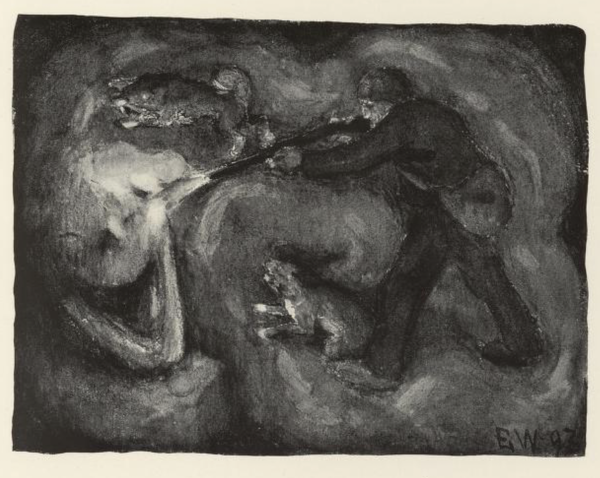
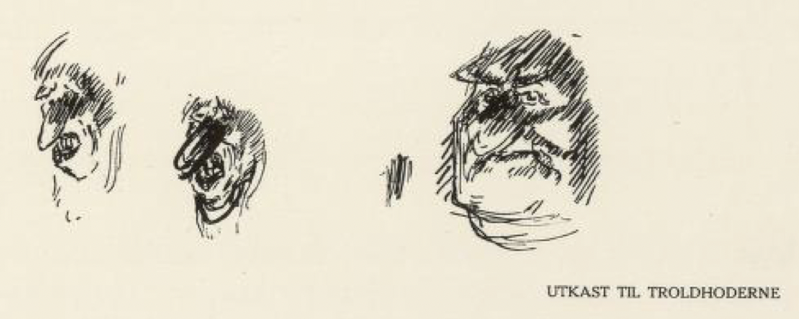
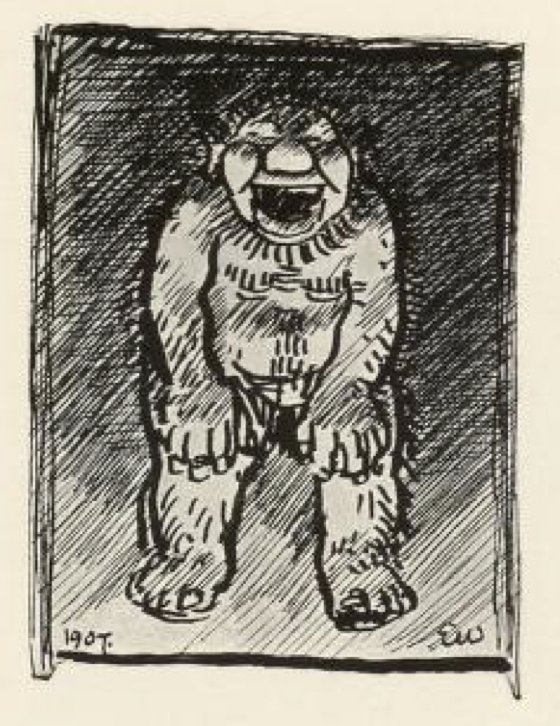
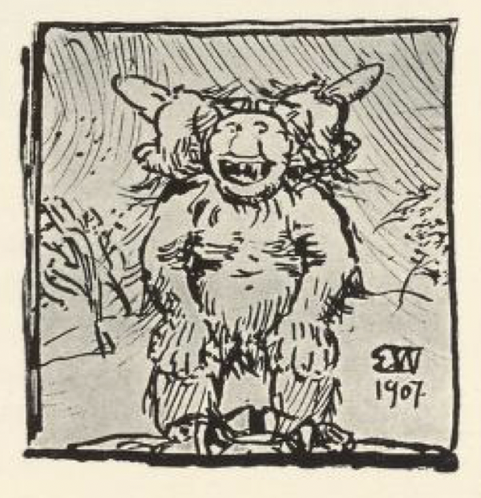
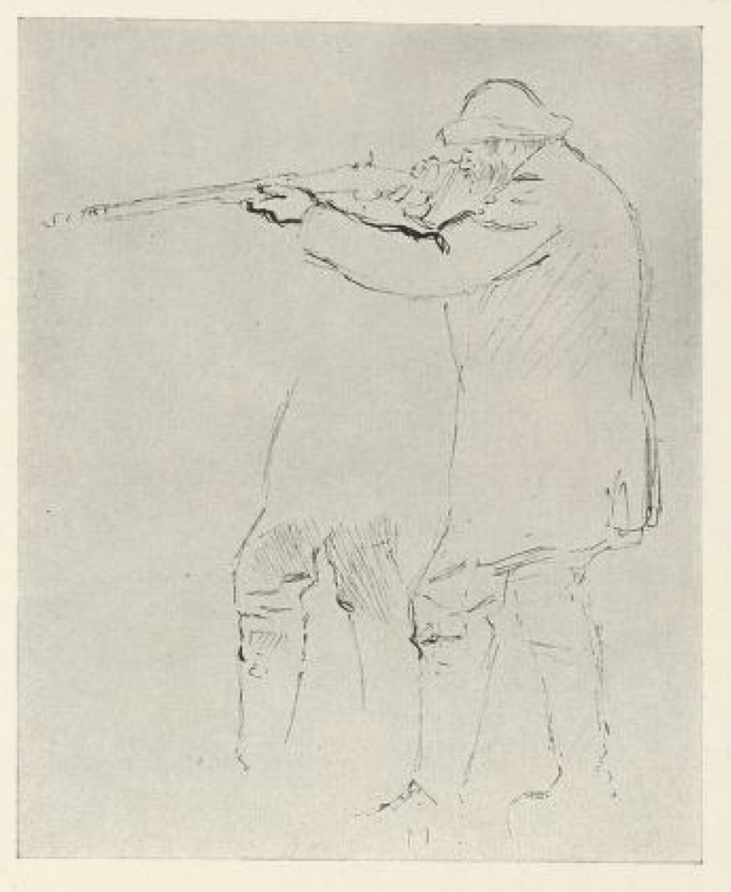
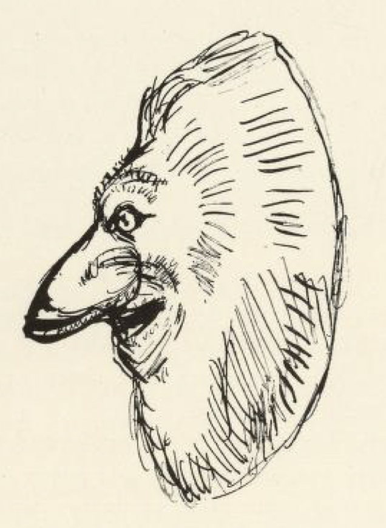

# Per Gynt

Det var en skytter i Kvam i gamle dager, og han het Per Gynt. Han lå støtt oppe i fjellet, og der skjøt han bjørn og elgsdyr — for den tid var det mer skog på fjellet, og i den holdt de til, slike uhyrskjer[^1]. Så var det engang sent på høsten, lenge etter busetningstiden, at Per skulle til fjelds. Alle folkene var reist hjem fra fjellet, så nær som tre budeier. Da han kom opp imot Høvringen, for der skulle han være i en seter om natten, var det så mørkt at han ikke kunne se en neve for seg, og hundene tok til å skoggjø, så det var rent spøkelig. Rett som det var, kom han inn på noe, og da han tok bort på det, var det både kaldt og sleip og stort, og han syntes ikke han var kommet av veien heller, så han ikke kunne vite hva det var for noe; men underlig var det.

«Hvem er det?» sa han Per, for han kjente det levet på seg.

«Å, det er han Bøig,» svarte det.

Dermed var Per Gynt like klok; men han gikk utmed det et stykke, for «ensteds må jeg vel komme frem,» tenkte han. Rett som det var, kom han innpå noe igjen, og da han tok bort på det, var det også både stort og kaldt og sleip.

«Hvem er det?» sa Per Gynt.

«Å, det er Bøigen,» svarte det igjen.

«Ja, enten du er rett eller gal, så får du slippe meg fram,» sa Per; for han skjønte at han gikk i rund ring, og at Bøigen hadde ringet seg omkring seteren. Dermed så levet den litt på seg, så vidt Per kom frem til selet.

Da han kom inn, var det ikke lysere der enn det var ute, og han for og fumlet omkring veggene og skulle sette fra seg børsen og legge av skreppen; men rett som han gikk og trevlet seg fram, kjente han igjen dette kalde og store og sleipe.

«Hvem er det da?» ropte Per.

«Å, det er den store Bøigen,» svarte det.

Og hvor han tok, og hvor han bød til å gå, så kjente han ringen av Bøigen. «Det er nok ikke godt å være her,» tenkte Per, «siden denne Bøigen er både ute og inne; men jeg skal vel klare på denne tverbleien.» Så tok han børsen og gikk ut igjen, og fumlet seg frem, til han fant skallen på den.

«Hva er du for en?» sa Per.

«Å, jeg er den store Bøig Etnedalen,» sa stor-trollet. Så gjorde Per Gynt bråfang og skjøt tre skudd midt i hodet på det.

«Skyt ett til!» sa Bøigen.

Men Per visste bedre; for hadde han skutt ett til, hadde det gått tilbake på ham selv. Da det var gjort, så tok både Per og hundene fatt på stor trollet og drog ut, så de kunne komme vel inn i selet. Imellom skrattet og lo det rundt i alle haugene.

«Per Gynt drog mykje, men hondain drog meir,» sa det.

Om morgenen skulle han ut og veide dyr. Da han kom inn på fjellet, fikk han se en førje som lokket fenein over Tverhø. Men da han kom derop, var jenta borte og fenein også, og han så ikke annet enn en stor flokk bjørner.

«Nå har jeg aldri sett bjørn i flokk før,» tenkte Per ved seg selv; men da han kom nærmere, var de borte allemenn, unntatt en.

Så kauet det i en haug bortved der:

_«Akte galten din_  
_Per Gynt æ ute_  
_mæ svansen sin!»_

«Å, det blir uheldig for han Per, men ikke for galten min, for han har ikke tvådd i dag,» sa det i haugen.

Per vasket nevene sine med det vannet han hadde, og skjøt bjørnen. Det lo og skogret i haugen.

«Du kunne akterge galten din!» ropte det.

«Jeg kom ikke i hug, han har vasskotter mellom foten,» svarte den andre.

Per flådde bjørnen og grov skrotten ned i uren, men skallen og skinnet tok han med. På hjemveien traff han en fjellrakke.

«Se lammet mitt, hvor feitt det går,» sa det i en haug.

«Se svansen hans Per, hvor høgt han står,» sa det i en annen haug, da Per la rifla til øyet og skjøt den.

Den flådde han og tok med, og da han kom til seteren, satte han hodene utafor med gapende kjeft. Så gjorde han opp varme og satte på en suppegryte; men det røyk så forferdelig at han nesten ikke kunne holde øynene oppe, og derfor måtte han lukke opp en glugge som var der.

Rett som det var, kom det et troll og stakk inn gjennom gluggen en nese så lang at den nådde bort i skorsteinen.

«Her skal du få for snytehøvelen!» sa det.

«Her skal du kjenne for suppekjelen!» sa Per Gynt, og øste hele suppegryten over nesa. Trollet avsted og bar seg; men rundt i alle haugene skrattet og lo det og ropte:

_«Gyri Supetryne, Gyri Supetryne!»_

Nå var det stille en stund; men det varte ikke lenge før det ble stokk og larm utafor igjen. Per så ut, og der så han det var en vogn med bjørner for; de veltet opp stortrollet og reiste inn i fjellet med det.

Bedst det var, kom det en vannsauster ned gjennom pipa og slukket varmen, så Per satt i mørket. Da tok det til å skratte og le i alle krokene, og sa:

_«Nå ska det ikke gå bære med om Per,_  
_enn med Valabudeiom.»_

Per gjorde opp varmen igjen, tok hundene, låste att selet, og la nordetter til Valseteren, hvor de tre budeierne lå. Da han kom et stykke nordpå, brente det slik der, som om Valseteren sto i lys lue. Med det samme møtte han en flokk ulver, og noen av dem skjøt han, og noen av dem slo han ihjel.

Da han kom til Valseteren, var det kolmørkt der, og ingen ildebrand; men der var fire fremmede karer inne, som holdt på med budeierne, og det var fire haugetrold, og de het Gust i Være, Tron Valfjeldet, Tjøstøl Åbakken og Rolf Eldførpungen. Gust i Være sto utafor døra og skulle holde vakt, mens de andre var hos budeierne og fridde. Per skjøt etter ham, men traff ikke, og så reiste Gust i Være. Da han kom inn, var de slemt i ferd med budeierne, og to av jentene var rent falne og bad Gud bevare seg, men den tredje, som het Gaijn-Kari, var ikke redd; hun sa de kunne gjerne komme, hun kunne nok ha lyst å se om det var tonen i slike karer.

Men da trollene skjønte at Per var inne, begynte de å jamre seg, og sa til Eldførpungen at han måtte gjøre på varmen. I det samme satte hundene på Tjøstøl og rev ham overende i åren, så aske og ildmørje gløv omkring ham.

«Så du slangene mine, du Per?» sa Tron Valfjeldet — så kalte han ulvene.

«Nå ska du se mest veien om slangene dine,» sa Per, og skjøt ham. Så slo han Åbakken ihjel med børsekolven; men Eldførpungen var reist opp gjennom pipa. Da han hadde gjort det, fulgte han budeierne til bygds, for de torde ikke bli der lenger.

Men da det led mot julekvelden, var Per Gynt ute igjen. Han hadde hørt om en gård på Dovre, hvor det kom så fullt av trold hver julekveld, at folkene måtte rømme ut og reise til andre gårder; dit hadde han lyst å gå, for han var hoven på trollene. Han kledde seg fælt ut, og så tok han med en tam kvitbjørn han hadde, og en syl og bek og en butsleiv. Da han kom dit, gikk han inn i stua og bad om hus.

«Gud hjelpe oss,» sa mannen, «vi kan ikke låne deg hus, vi lyt reise til gårder sjøl, for hver evige julekveld kommer det så fullt med trold her.»

Men Per Gynt han mente han nok skulle renske huset for trollene, og så fikk han lov å bli, og fikk et purkeskinn attå. Så la bjørnen seg bak skorsteinen, og Per tok frem bek og syl og butsleiven, og satte seg til å gjøre en stor sko av hele purkeskinnet. Han satte i et sterkt rep til trekkeband, så han kunne snurpe sammen hele skoen rundt omkring; et par handspaker hadde han også ferdig.

Rett som det var, så kom de, med fela og spillemann, og noen danset, og noen åt av julekosten som sto på bordet; noen stekte flesk, og noen stekte frosk og padder og andre ofyselige ting — den julekosten hadde de med selv. Imellom fikk noen se skoen Per hadde gjort. De syntes den var til en stor fot; så skulle de prøve den, og da de hadde satt en fot oppi, hver av dem, så reipte Per til og satte den ene handspaken i og bendte til, så de satt fast i skoen allemenn. Men så stakk bjørnen nesa frem og luktet på steken.

«Vil du ha kårg, kvitpus?» sa et av trollene, og kastet en gløstekt myrlopp lige i gapet på den.

«Klor og slå, bamse,» sa Per Gynt. Så ble bjørnen så arg og sint, at den for opp og slo og klorte dem allemenn, og Per Gynt slo i flokken med den andre handspaken, som om han ville slå skallen inn på dem — den spaken hadde han firkløvd, for at de ikke skulle telle slagene av seg.

Da måtte trollene rømme, og Per ble der og levde vel av julekosten hele helga, og de hørte ikke til trollene på mange år. Men mannen hadde en lys-lett hoppe, og den rådet Per ham til å sette på føl av, som for og kalvet seg omkring haugene der.

Så var det ved juletider mange år etter — mannen var i skogen og hogg ved til helga — der kom til ham et trold og ropte: «Har du den store kviteputsen din ennå du?»

«Ja han ligg heime bak omn,» sa mannen, «å nå ha han fått syv unger, mykje større og argere enn han æ sjøl.»

«Så kjøm oss aldri meir att de,» ropte trollet.

[^1]: Uhyrskjer: gamle norske ord for monstre eller farlige skapninger

