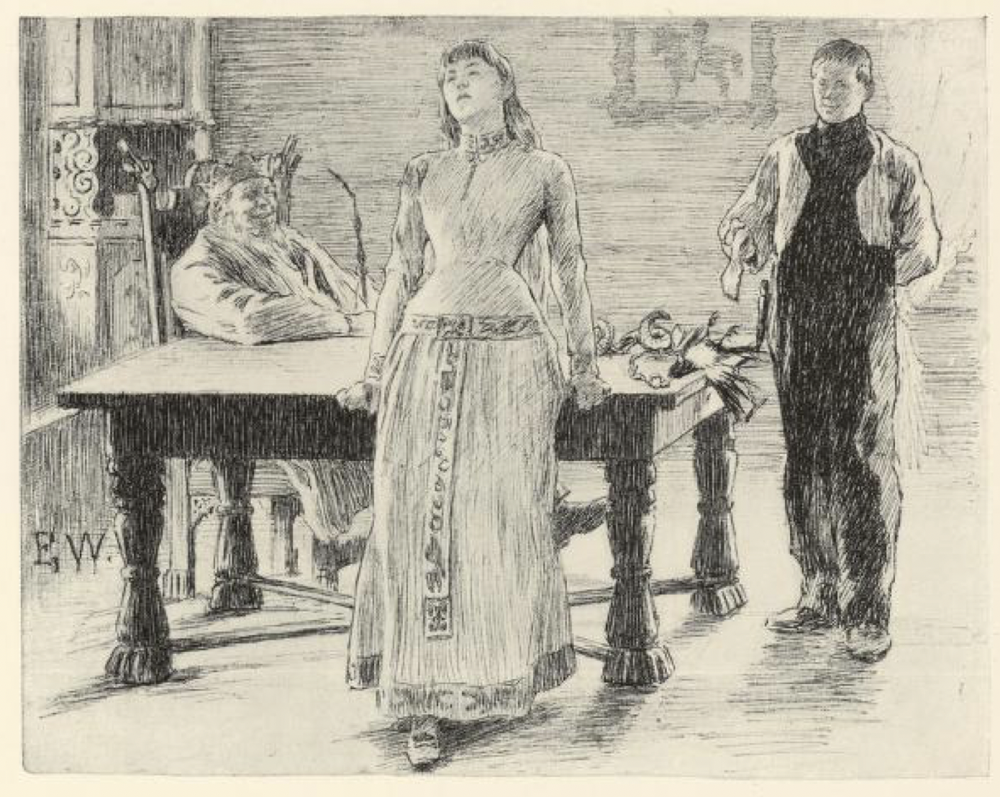
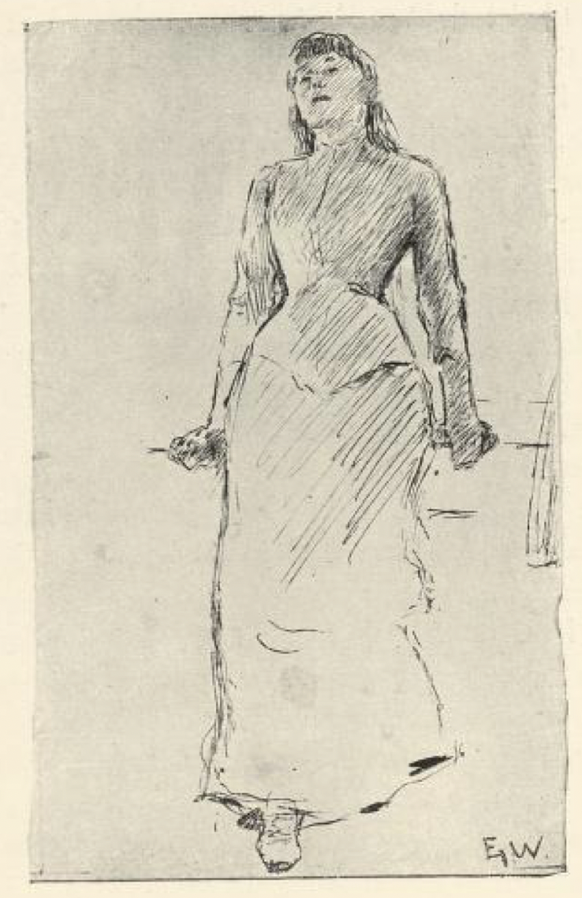

# Prinsessen som ingen kunne målbinde

Det var engang en konge; han hadde en datter som var så vrien og vrang i ord, at ingen kunne målbinde henne, og derfor lovte han ut at den som kunne gjøre det, skulle få prinsessen til ekte, og halve kongeriket til.

Det var nok av dem som ville prøve seg, skal jeg tro, for det er ikke hver dag en kan få en kongsdatter og et halvt rike til giveendes[^*]. Grinden til kongsgården sto ikke noen stund, de kom i flokk og følge fra øst og vest, både ridende og gående. Men det var ingen som kunne ordbinde prinsessen. Til sist satte kongen ut, at de som prøvde seg, men ikke kunne, de skulle sviemerkes på begge ørene med det store sviejernet hans — han ville ikke ha det rennet[^**] i gården sin til ingenting.

Så var det tre brødre også som hadde fått spurt om prinsessen, og da de ikke hadde det for rart hjemme, ville de ut og friste lykka, og se om de kunne vinne kongsdatteren og det halve riket. De var venner og nokså vel forlikte, og derfor gikk de sammen alle tre.

Da de var kommet et stykke på veien, fant Askeladden en død skjærunge[^***].

«Jeg fant, jeg fant!» ropte han.

«Hva fant du?» spurte brødrene.

«Jeg fant en død skjærunge,» sa han.

«Fy, kast den! Hva gjør du med den?» sa de to, som alltid trodde at de var de klokeste.

«Å, jeg har slikt å gjøre, jeg har slikt å føre, jeg fører vel den,» sa Askeladden.

Da de hadde gått et stykke til, fant Askeladden en gammel vidjespending; den tok han opp.

«Jeg fant, jeg fant!» ropte han.

«Hva fant du nå?» sa brødrene.

«Jeg fant en vidjespending,» svarte han.

«Pøh! Hva skal du med den? Kast den!» sa de to.

«Jeg har slikt å gjøre, jeg har slikt å føre, jeg fører vel den,» sa Askeladden.

Da de hadde gått litt til, fant han et skålsbrot; det tok han også opp.

«Gutter, jeg fant, jeg fant!» sa han.

«Nå, hva fant du nå?» spurte brødrene.

«Et skålsbrot,» sa han.

«Sj! Det var også noe å dra på! Kast det!» sa de.

«Å, jeg har slikt å gjøre, jeg har slikt å føre, så fører jeg vel det,» svarte Askeladden.

Da de var kommet litt lengre, fant han et kroket bukkehorn, og like efter fant han make til det.

«Jeg fant, jeg fant, gutter!» ropte han.

«Hva fant du nå da?» sa de andre.

«To bukkehorn,» svarte Askeladden.

«Sj! Kast dem, hva gjør du med dem?» sa de.

«Nei, jeg har slikt å gjøre, jeg har slikt å føre, så fører jeg vel dem,» sa Askeladden.

Om litt igjen fant han en bleie.

«Nei, gutter, jeg fant, jeg fant!» ropte han.

«Det var svare til finding på deg! Hva fant du nå igjen?» sa de to eldste.

«Jeg fant en bleie,» svarte han.

«Å kast den! Hva gjør du med den?» sa de.

«Jeg har slikt å gjøre, jeg har slikt å føre, jeg fører vel den,» sa Askeladden.

Da han så gikk over jordene ved kongsgården — der hadde de nylig bredt gjødsel — bukket han seg og tok opp en utgått skosåle.

«Nei, nei, gutter, jeg fant, jeg fant!» sa han.

«Gud gi du fant litt vett, til du kom frem!» sa de to. «Hva var det nå du fant igjen da?»

«En utgått skosåle,» svarte han.

«Isj da! Det var noe å ta opp også! Kast den! Hva gjør du med den?» sa brødrene.

«Å, jeg har slikt å gjøre, jeg har slikt å føre, så fører jeg vel den, skal jeg vinne prinsessen og halve riket,» sa Askeladden.

«Ja du ser ut til det du!» sa de to.

Så la de inn til kongsdatteren. Først den eldste.

«God dag,» sa han.

«God dag igjen,» svarte hun og vred på seg.

«Det er fælt varmt her,» sa han.

«Det er varmere i glohaugen,» svarte prinsessen; der lå sviejernet ferdig og ventet. Da han så det, gikk det i stå for ham med én gang, og så var det ute med ham.

Det gikk ikke likere med den mellomste.

«God dag,» sa han.

«God dag igjen,» sa hun og vrikket på seg.

«Det er fælt heit her,» sa han.

«Det er heidere i glohaugen,» svarte hun. Dermed mistet han også mål og mele, — og så var det frem med jernet igjen.

Så kom Askeladden.

«God dag,» sa han.

«God dag igjen,» svarte hun og vrikket og vred på seg.

«Det var da godt og varmt her,» sa Askeladden.

«Det er varmere i glohaugen,» svarte hun; hun ble ikke blidere for det den tredje kom.

«Det var råd å få stekt skjæren min der da?» spurte han.

«Jeg er redd hun sprekker,» sa kongsdatteren.

«Å det har ingen nød, jeg slår om denne vidjespendingen,» svarte gutten.

«Den er for rum,» sa hun.

«Jeg driver en bleie,» sa gutten, og tok frem bleien.

«Fettet renner av henne,» sa kongsdatteren.

«Jeg holder under dette,» svarte gutten, han syntes frem skålsbrottet.

«Du er så kroket i ord du,» sa prinsessen.

«Nei, jeg er ikke kroket, men dette er kroket det,» svarte gutten, og tok opp det ene bukkehornet.

«Nei! Nå har jeg aldri sett maken!» ropte prinsessen.

«Her ser du maken,» sa han, og tok opp det andre.

«Jeg mener du er utgått for å målbinde meg du, jeg?» sa hun.

«Nei, jeg er ikke utgått, men den er utgått den,» svarte gutten, og drog frem skosålen.

Så var prinsessen målbundet.

«Nå er du min,» sa Askeladden, og så fikk han henne og det halve land og rike attpå.

[^*]: Giveendes: gratis

[^**]: Rennet: løpt omkring

[^***]: Skjærunge: skjære (fugl)
