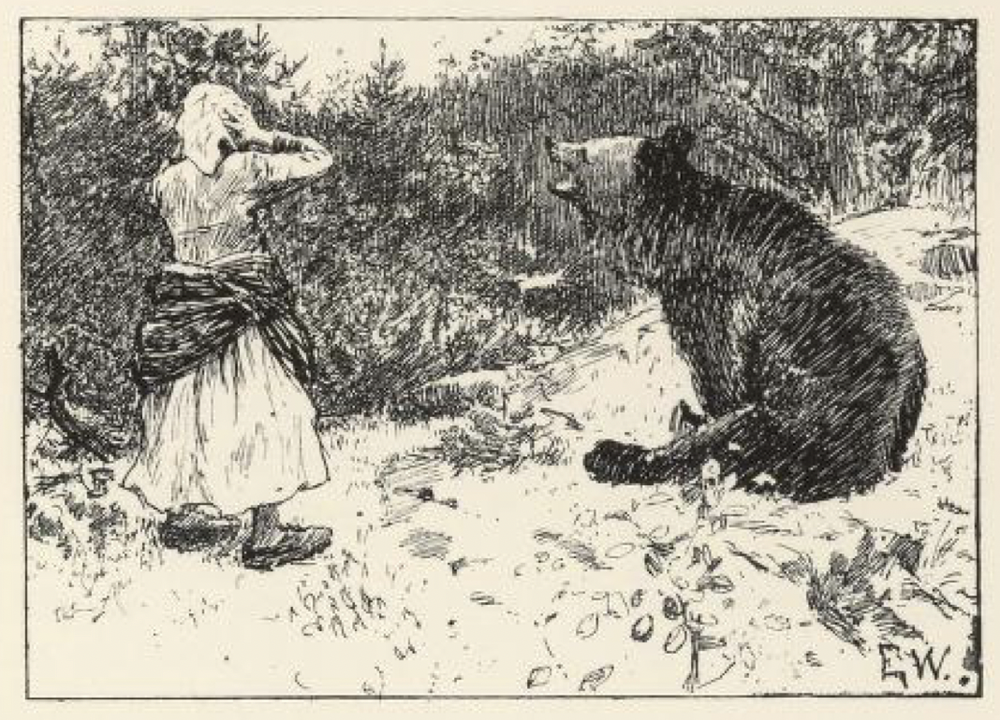
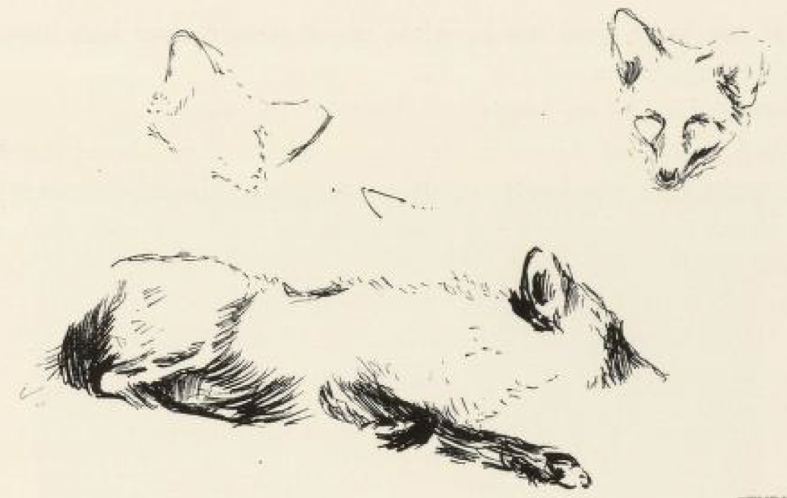
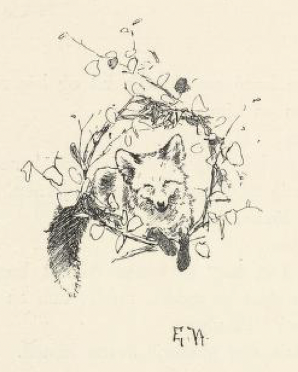

# Reven som gjeter

Det var en gang en kone som skulle ut og leie seg gjeter.

Så møtte hun en bjørn.

«Hvor skal du hen?» sa bjørnen.

«Å jeg skal ut og leie meg gjeter,» svarte kona.

«Vil du ikke ha meg til gjeter?» spurte bjørnen.

«Jo, bare du kan lokke, så —,» sa kona.

«Hø—i!» sa bjørnen.

«Nei, deg vil jeg ikke ha,» sa kona, da hun hørte det, og gikk sin vei.

Da hun så hadde gått et stykke, møtte hun en ulv.

«Hvor skal du hen?» sa ulven.

«Jeg skal ut og leie meg gjeter,» svarte kona.

«Vil du ikke ha meg til gjeter?» spurte ulven.

«Ja, kan du lokke, så —,» sa kona.

«Uh—uh!» sa ulven.

«Nei, deg vil jeg ikke ha,» sa kona.

Da hun hadde gått et stykke til, så møtte hun en rev.

«Hvor skal du hen?» sa reven.

«Å jeg skal ut og leie meg gjeter,» sa kona.

«Vil du ikke ha meg til gjeter?» spurte reven.

«Ja, bare du kan lokke, så —,» sa kona.

«Dill—dall—holom!» sa reven, så grant og fint.

«Ja, deg vil jeg ha til gjeter,» sa kona, og så satte hun reven til å gjete kreaturene sine. Den første dagen reven gjette, spiste han opp alle geitene til kona; den andre dagen gjorde han ende på alle sauene hennes, og den tredje dagen spiste han opp alle kyrne[^1].

Da han så kom hjem om kvelden, spurte kona hvor han hadde gjort av alle kreaturene hennes.

«Skallen, skallen er i åa og kroppen i holtet[^2],» sa reven.

Hun sto nettopp og kjerna; men hun syntes at hun likevel måtte se etter dem, og mens hun var borte, smatt reven ned i kjerna og spiste opp fløten.

Da så kona kom igjen og fikk se det, ble hun så sint, at hun tok det vesle fløtegrandet som var igjen, og slo etter reven, så den fikk en skvett på enden av halen. Derav kommer det at reven har hvit rovetipp[^3].

[^1]: Kyr - hunn av storfe

[^2]: En gammelt uttrykk som betyr at dyrene er døde - skallen ligger i elva og kroppen i skogen

[^3]: Hvit tupp på halen
