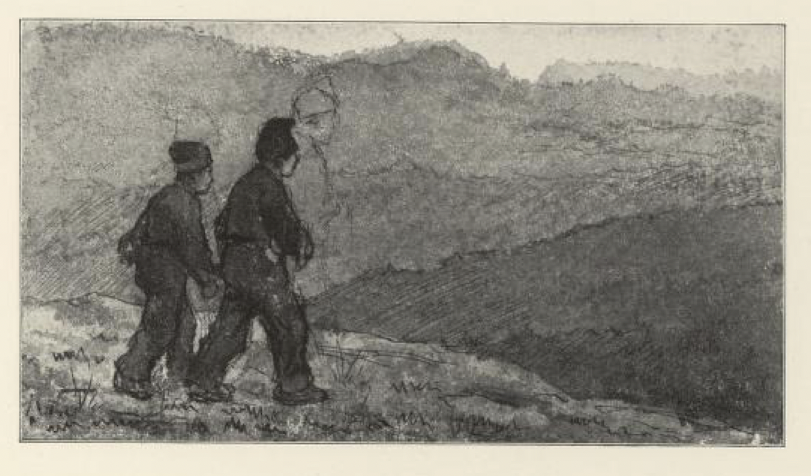
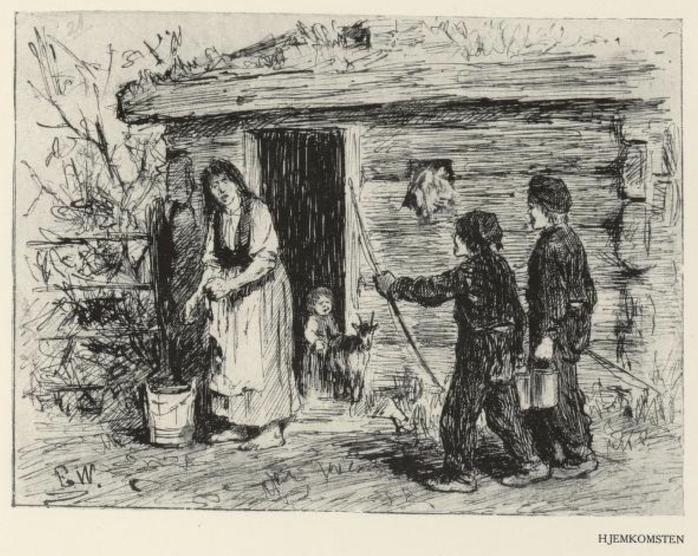
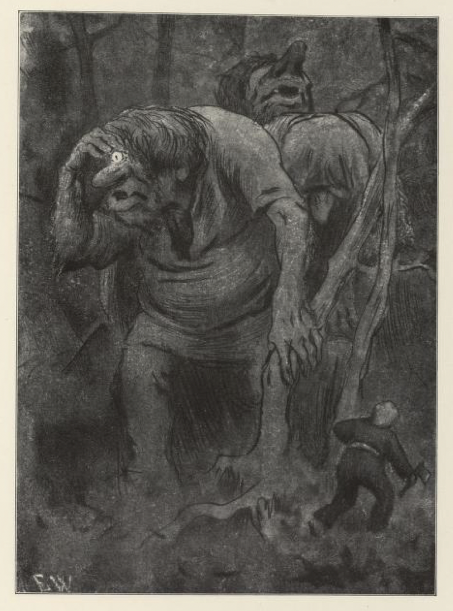
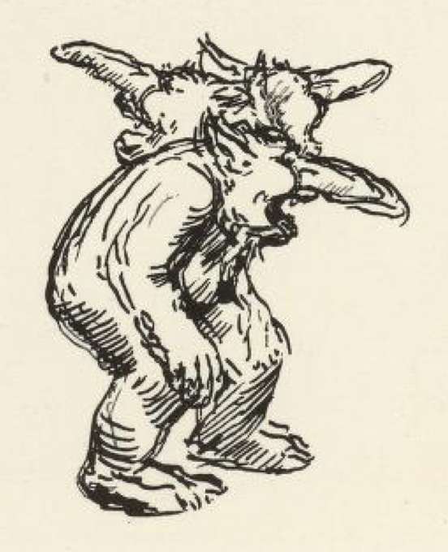

# Småguttene som traff trollene på Hedalsskogen

På en plass oppe i Vågå i Gudbrandsdalen bodde det engang i gamle dager et par fattige folk. De hadde mange barn, og to av sønnene, som var så om lag halvvokse, måtte støtt reise omkring på bygda og tigge. Derfor var de vel kjent med alle veier og stier, og de visste også snarveien til Hedalen.

En gang ville de gå dit. Men de hadde hørt at noen falkefangere hadde bygget seg en hytte ved Mæla; der ville de gå innom med det samme og se fuglene, og hvordan de fanget dem, og derfor tok de snarveien over Langmyrene. Men det led alt så langt på høsten at budeierne var reist hjem fra setrene; derfor kunne de ingensteds få hus og ikke mat heller.

De måtte da holde ved veien til Hedalen; men den var bare en grunn råk, og da mørket kom på dem, tapte de råken, og ikke fant de fuglefangerhytta heller, og før de visste ordet av det, var de midt i tykkeste Bjølstadskogen. Da de skjønte at de ikke kunne komme frem, gav de seg til å kviste bar, gjorde opp varme, og bygget seg en barhytte; for de hadde med vesleøksa. Og så rev de opp lyng og mose, som de gjorde et leie av. En stund etter de hadde lagt seg, fikk de høre noen som snøftet og veide[^1] sterkt med nesa. Guttene la øret til, og lyttet vel etter, om det skulle være dyr eller skogtroll de hørte. Men så drog det veiret enda sterkere og sa:

«Det lukter kristent blod her!»

Så hørte de det trampa så hardt at jorda skalv under det, og så kunne de vite at trollene var ute.

«Gud hjelpe oss, hva skal vi nå gjøre?» sa den yngste gutten til bror sin.

«Å, du får bli stående under fura, der du står, og være klar til å ta posene og stryke din kos, når nå ser de kommer, så skal jeg ta vesleøksa,» sa den andre.

I det samme så de trollene komme settende, og de var så store og digre, at hodene på dem var jevnhøye med furutoppene. Men de hadde bare ett øye på deling alle tre, og det byttet de på å bruke; de hadde et hull i panna, som de la det i, og styrte det med hånda; den som gikk foran, han måtte ha det, og de andre gikk etter og holdt seg i den første.

«Ta beina fatt!» sa den eldste av guttene; «men fly ikke for langt, før du ser hvordan det går; siden de har øyet så høyt, har de vondt for å se meg, når jeg kommer bak på dem.»

Ja, broren rant foran og trollene dro etter. Imellom kom den eldste gutten bak på dem og hogg til det bakerste trollet i ankelen, så det slo opp et gryselig skrik, og det første trollet ble så redd at det skvatt og slapp øyet, og gutten var ikke sen til å snappe det. Det var større enn om en hadde lagt ihop to potteskåler, og så klart var det, at enda det var kullmørk natt, ble det som lys dag, da han så gjennom det.

Da trollene merket at han hadde tatt øyet fra dem, og at han hadde gjort skade på en av dem, begynte de å true med alt det vonde som var, om han ikke straks gav dem øyet igjen.

«Jeg er ikke redd for troll og trugsmål,» sa gutten. «Nå har jeg tre øyne alene, og dere tre har ikke noe øye, og enda må to bære den tredje.»

«Får vi ikke øyet vårt igjen på timen, skal du bli til stokk og stein!» skreik trollene.

Men gutten mente, det gikk ikke så fort; han var ikke redd hverken for skryt eller trollskap, sa han; fikk han ikke være i fred, skulle han hugge til dem alle tre, så de skulle få krabbe på jorda, som kryp og krek.

Da trollene hørte dette, ble de redde og begynte å si gode ord. De ba nok så vakkert at han ville gi dem øyet igjen, så skulle han få både gull og sølv og alt han ville ha. Ja, det syntes gutten var nok så bra, men han ville ha gullet og sølvet først, og så sa han, at hvis en av dem ville gå hjem og hente så mye gull og sølv at han og broren fikk posene sine fulle, og gi dem to gode stålbuer attåt, så skulle de få øyet, men enn så lenge ville han ha det.

Trollene bar seg ille, og sa at ingen av dem kunne gå, når de ikke hadde øyet å se med, men så ga en av dem seg til å skrike på kjerringa, for de hadde én kjerring ihop alle tre også. Om en stund svarte det i en kamp langt nordpå. Så sa trollene, at hun skulle komme med to stålbuer og to spann, fulle av gull og sølv, og det varte da ikke lenge før hun var der, skal jeg tro; da hun så fikk høre hvordan det var gått, begynte hun også å true med troldskap. Men trollene ble redde, og bad, hun skulle ta seg i akt for den vesle vepsen, hun kunne ikke være sikker på at han ikke tok hennes øye også. Så kastet hun spannene og gullet og sølvet og buene til dem, og strøk hjem i kampen med trollene, og siden den tid har ingen hørt at trollene har gått på Hedalsskogen og luktet etter kristent blod.

[^1]: Veide: puste tungt, stønne
