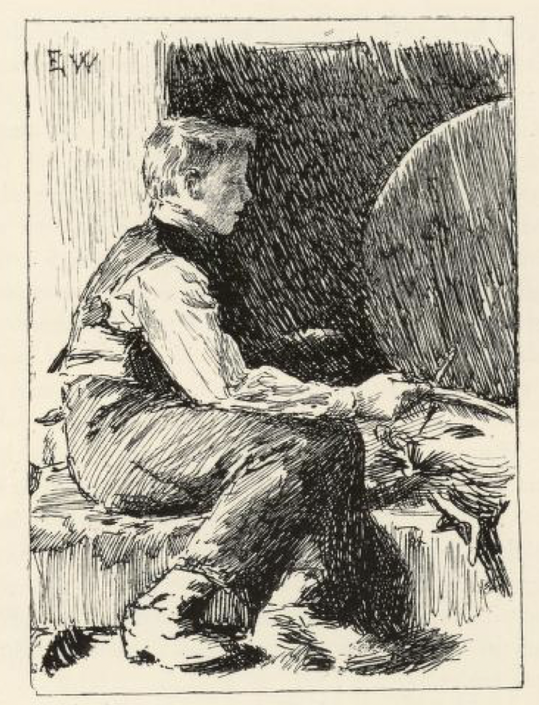
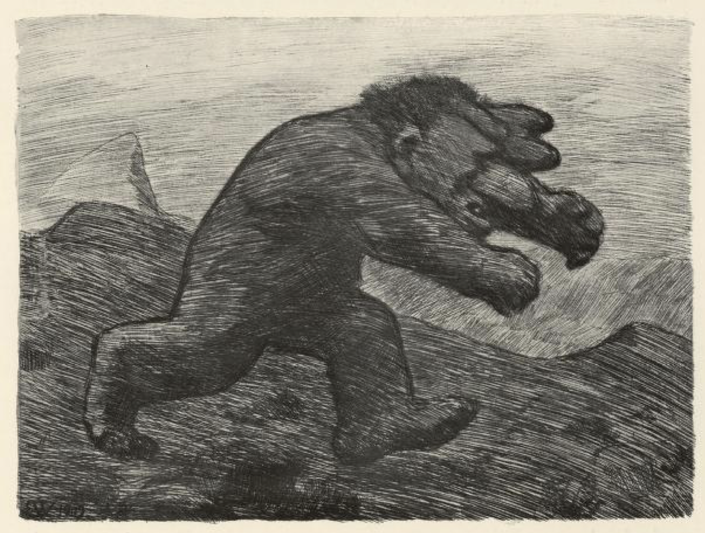
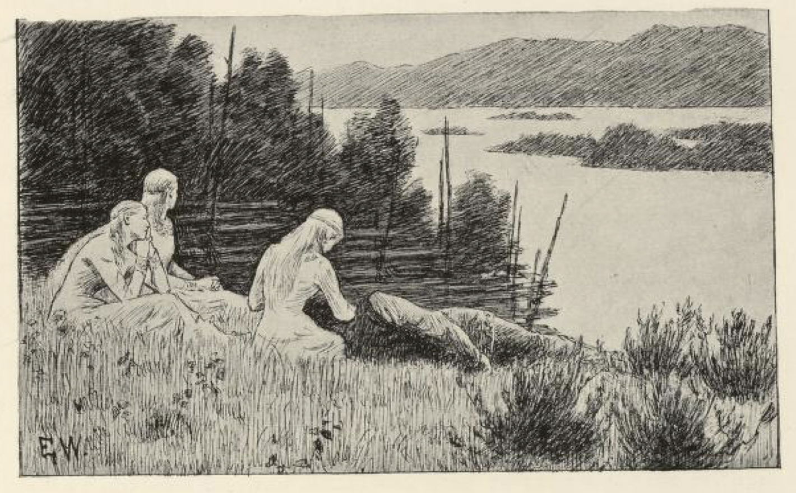
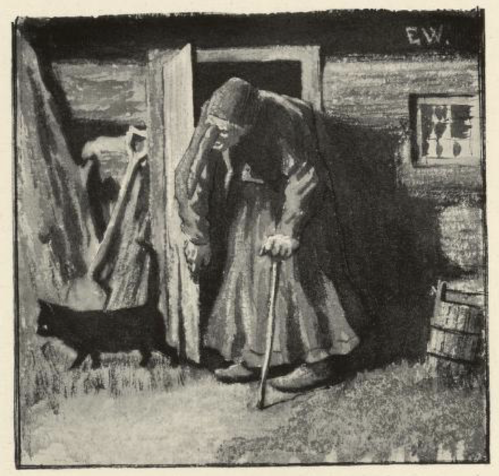

# Soria Moria slott

Det var engang et par folk som hadde en sønn, og han het Halvor. Like fra han var liten gutt, ville han aldri gjøre noe, men satt bare og rotet i asken. Foreldrene satte ham bort til å lære mange ting; men Halvor stanset ingensteds, for når han hadde vært borte i noen dager, rømte han fra læren, løp hjem og satte seg i grua til å grave i asken igjen. Men så kom det engang en skipper og spurte Halvor om han ikke hadde lyst til å være med ham og fare til sjøs og se fremmede land. Jo, det hadde Halvor lyst til, da var han ikke lenge ufedig.

Hvor lenge de seilte, vet jeg ikke noe om; men langt om lenge kom det en sterk storm, og da den var forbi og det ble stille igjen, visste de ikke hvor de var; de var drevet hen til en fremmed kyst, som ingen av dem var kjent på.

Da det var så stille at det ikke rørte seg en fjær, ble de liggende her, og Halvor bad skipperen om han fikk lov å gå i land og se seg om, for han ville heller gå enn ligge og sove. « Synes du du kan vise deg for folk, » sa skipperen, « du har jo ikke annet til klær enn de fillene du står og går i. » Halvor ble ved sitt han, og så fikk han endelig lov; men han skulle komme tilbake igjen, når det begynte å blåse. Han gikk da, og det var et vakkert land; overalt der han kom frem, var det store sletter med åkrer og enger, men folk så han ingen av. Så tok det på å blåse, men Halvor syntes ikke han hadde sett nok enda, og han ville gjerne gå litt lenger, for å se om han ikke kunne finne folk. Om en stund kom han på en stor vei, som var så jevn at en gjerne kunne trille et egg på den. Denne gikk nå Halvor etter, og da det led mot kvelden, så han et stort slott langt borte, og det lyste det ut av alle vinduene på. Da han hadde gått hele dagen og ikke hatt noe videre til niste med seg, var han dyktig sulten; men dess nærmere han kom til slottet, dess mer redd ble han også.

I slottet brente det på varmen, og Halvor gikk inn i kjøkkenet, som var så gildt at han aldri hadde sett så gildt et kjøkken; der var kjøkkeld både av gull og sølv, men folk var der ingen av. Da Halvor hadde stått der en stund, og ingen kom ut, gikk han bort og lukket på en dør; der inne satt en prinsesse og spant på en rokk.

« Nei, nei da! » ropte hun, « tør det komme kristne folk hit? Men det er nok best at du går igjen, dersom ikke trollet skal sluke deg; for her bor et troll med tre hoder. »

« Jeg er like glad om han hadde fire og, så skulle jeg ha lyst til å se den karen, » sa gutten, « og jeg går ikke, jeg har ikke noe vondt gjort, men mat får du gi meg, for jeg er fælt sulten. »

Da Halvor hadde spist seg mett, sa prinsessen til ham, at han fikk prøve om han kunne svinge sverdet som hang på veggen; nei, han kunne ikke svinge det, han kunne ikke løfte det engang.

« Ja, » sa prinsessen, « så får du ta deg en slurk av den flaska som henger ved siden, for det gjør trollet, når han skal ut og bruke sverdet. »

Halvor tok seg en slurk, og straks kunne han svinge sverdet som ingenting. Nå, mente han, skulle trollet komme tidsnok.

Rett som det var, kom trollet susende; Halvor bak om døra.

« Huttetu! her lukter så kristen manns blod! » sa trollet, og satte hodet inn gjennom døra.

« Ja, det skal du bli var, » sa Halvor, og hogg alle hodene av det.

Prinsessen ble så glad fordi hun var frelst, at hun både danset og sang; men så kom hun til å tenke på søstrene sine, og så sa hun: « Gid nå søstrene mine også var frelst! »

« Hvor er de? » spurte Halvor.

Ja, så fortalte hun ham det: den ene var inntatt av et troll på et slott som var seks mil borte, og den andre var inntatt på et slott som var ni mil bortenfor det igjen.

« Men nå, » sa hun, « må du først hjelpe meg å få ut dette skrovet her. »

Ja, Halvor var så sterk han subbet alt bort og gjorde det ryddelig og rent i en ruff.

Så levde han godt og vel, og neste morgen la han avsted i grålysningen; han hadde ingen ro på seg, han gikk og han sprang hele dagen. Da han fikk se slottet, ble han litt redd igjen; det var mye gildere enn det andre; men her var det heller ikke et menneske å se. Så gikk Halvor inn i kjøkkenet, og han stanset ikke der heller, men gikk like inn.

« Nei, tør der komme kristne folk hit da? » ropte prinsessen. « Jeg vet ikke hvor lenge det er siden jeg kom hit; men i all den tiden har jeg ikke sett et kristent menneske. Det er nok best du ser å komme avsted igjen, for her bor et troll som har seks hoder. »

« Nei, jeg går ikke, » sa Halvor, « om han så hadde seks til. »

« Han tar og sluger deg levende, » sa prinsessen.

Men det hjalp ikke: Halvor ville ikke gå, han var ikke redd for trollet, men mat og drikke ville han ha, for han var sulten etter reisen.

Ja, han fikk så mye han ville ha; men så ville prinsessen ha ham til å gå igjen.

« Nei, » sa Halvor, « jeg går ikke, for jeg har ikke noe vondt gjort, og jeg har ikke noe å være redd for. »

« Han spør ikke etter det, » sa prinsessen, « for han tar deg uten både lov og rett; men siden du ikke vil gå, så prøv om du kan svinge det sverdet som trollet bruker i krigen. »

Han kunne ikke svinge sverdet; men så sa prinsessen, at han skulle ta seg en slurk av flaska som hang ved siden av det, og da han hadde gjort det, kunne han svinge det.

Rett som det var, så kom trollet; det var så stort og digert at det måtte gå på siden for å komme inn gjennom døra. Da trollet fikk det første hodet inn, så ropte det: « Huttetu! her lukter så kristen manns blod! » Idet hogg Halvor av det første hodet, og så alle de andre. Prinsessen ble så glad at hun ikke visste hva ben hun skulle stå på; men så kom hun til å tenke på søstrene sine, og så ønsket hun at de også var frelst. Halvor mente der nok kunne bli råd til det, og ville avsted straks; men først måtte han nå hjelpe prinsessen med å få bort kroppen av trollet, og så gav han seg på veien den andre morgen.

Der var langt til slottet, og han både gikk og sprang for å komme frem i tide. Mot kvelden fikk han se slottet, og det var mye gildere enn begge de andre. Nå var han nesten ikke det minste redd, men gikk gjennom kjøkkenet og like inn. Der satt en prinsesse, som var så vakker at det ikke var måde på det.

Hun sa nå like ens som de andre, at det ikke hadde vært kristne folk siden hun kom der, og bad ham gå igjen, for ellers slugte trollet ham levende; det hadde ni hoder, sa hun.

« Ja, om det har ni til de ni, og enda ni til, så går ikke jeg, » sa Halvor, og gav seg til å stå ved ovnen.

Prinsessen bad ham så vakkert at han skulle gå, for at trollet ikke skulle spise ham; men Halvor sa: « La ham komme, når han vil. »

Så gav hun ham trollsverdet, og bad ham ta seg en slurk av flaska, så han kunne svinge det.

Rett som det var, kom trollet, så det suste av det; det var enda større og digrere enn begge de andre to, og det måtte også gå på siden for å komme inn gjennom døra. « Huttetu! her lukter så kristen manns blod, » sa det. Idet hogg Halvor av det første hodet, og siden alle de andre, men det siste var det seigeste av dem alle, og det var det tyngste arbeidet Halvor hadde gjort, å få det av, enda han nok syntes han skulle ha krefter også.

Nå kom da alle prinsessene sammen på det slottet, og de var så glade som de aldri hadde vært i all sin tid, og de var glad i Halvor og han i dem, og han kunne få den han best kunne like; men den yngste var mest glad i ham av alle tre.

Halvor gikk der og var så rar av seg; han var så stille og sture; så spurte prinsessen ham hva det var han stuntet etter, og om han ikke likte å være hos dem. Jo, det likte han nok, for de hadde jo nok å leve av, og han hadde det godt der, men han stuntet så hjem, for han hadde foreldre i live, og dem hadde han stor lyst til å se igjen. Det mente de vel kunne la seg gjøre; « Du skal komme uskadd både frem og tilbake igjen, dersom du vil lyde vårt råd, » sa prinsessene. Ja, han skulle ikke gjøre annet enn hva de ville. Så kledde de ham opp, så han ble så gild som en kongssønn, og så satte de en ring på fingeren hans, og den var slik at han kunne ønske seg både frem og tilbake med den; men de sa at han måtte ikke kaste den bort, og ikke nevne navnet på dem, for så var det slutt med hele herligheta; og da fikk han aldri se dem mer.

« Gid jeg nå var hjemme, og hjemmet var her! » sa Halvor, og så som han hadde ønsket, gikk det også: han sto utenfor stua hos foreldrene sine, før han visste ord av det. Det var i mørkningen om kvelden, og da de så der kom inn sådan en gild, staselig fremmed fant, ble de så rent forfjamet, og begynte både å bukke og neie.

Halvor spurte om han ikke kunne bli der og få hus natten over.

« Nei, det kunne han slett ikke; vi har det ikke slik, » sa de, « vi har hverken det ene eller det andre, som en sådan herre kan være tjent med; men det er best han går opp på gården; det er ikke lange stykket, han kan se skorsteinspipa herfra — der har de fullt opp av alt. »

Halvor var ikke mye for det, han ville bli; men folkene ble ved sitt, at han skulle gå opp til gården, for der kunne han få både mat og drikke, mens de ikke engang hadde en stol å by ham å sitte på.

« Nei, » sa Halvor, « der opp vil jeg ikke før i morgen tidlig; la meg nå få være her i natt, jeg kan jo sitte i peisa. »

Det kunne de da ikke si noe imot, og så satte Halvor seg i peisa til å grave i asken, slik som han gjorde, da han lå hjemme og latet seg.

De snakket om mang og mye, og fortalte Halvor både om det ene og det andre, og så spurte han dem om de aldri hadde hatt noe barn.

« Jo, » de hadde hatt en gutt som het Halvor, men de visste ikke hvor han vandret, og ikke visste de enten han var død eller levende heller.

« Kunne det ikke være meg da? » sa Halvor.

« Det vet jeg visst, » sa kjerringa og rettet på seg; « han Halvor var så lat og doven at han aldri gjorde noe ting, og så var han så fillet at den ene fillen slo den andre i svime på ham; det kunne aldri bli slik kar av ham, som du er, far. »

Om litt skulle kjerringa bort til peisa og rake i varmen, og da gloskinnet lyste på Halvor, likesom da han var hjemme og kavet i asken, så kjente kjerringa ham igjen.

« Ja men er det du da, Halvor! » sa hun, og der ble slik glede på de gamle foreldrene, at det ikke var måde på det, og han måtte nå fortelle hvorledes det hadde gått ham, og kjerringa ble så glad i ham, at hun ville ha ham opp på gården straks på timen og vise ham frem for jentene, som alltid hadde vært så kaute på det.

Hun gikk da foran og Halvor etter. Da hun kom der opp, fortalte hun at Halvor var kommet hjem igjen, og nå skulle de bare se hvor gild han var; han så ut som en prins, sa hun.

« Det vet jeg visst, » sa jentene og slo på nakken, « han er vel den samme fillefanten han alltid har vært. »

I det samme kom Halvor inn, og så ble jentene så forfjamet at de glemte igjen skjorta i peisa, hvor de satt og loppet seg, og fløy ut i bare stakken[^*]. Da de så kom inn igjen, var de så skamfulle at de nesten ikke torde se på Halvor, som de alltid hadde vært så store og kaute imot før.

« Ja, dere har nå alltid syntes dere var så fine og vakre, dere, at ingen kunne være liken deres; men dere skulle bare se den eldste prinsessen som jeg har frelst, » sa Halvor; « mot henne ser dere ut som gjæterjenter, og den mellomste er enda vakrere; men den yngste, som er kjæresten min, er vakrere enn både sol og måne; gid de bare var her, så skulle dere se! » sa Halvor.

Han hadde ikke før sagt det, før de sto der; men da ble han så ille ved, for nå kom han i hug hva de hadde sagt. På gården ble det både holdt gjestebud for prinsessene og gjort stas av dem; men de ville ikke stanse der. « Vi vil ned til foreldrene dine, » sa de til Halvor, « og så vil vi ut og se oss om. » Han fulgte da med dem. Så kom de til et stort vann utenfor gården. Tett ved det vannet var slik en deilig grønn bakke; der ville prinsessene sitte og hvile en stund, for de syntes det var så vakkert å sitte og se ut over vannet, sa de.

De satte seg der, og da de hadde sittet en stund, sa den yngste prinsessen: « Jeg får vel lyse deg litt jeg, Halvor. » Ja, Halvor la hodet i fanget hennes, så lyste hun ham, og det varte ikke lenge før Halvor sov. Så tok hun ringen av ham og satte en annen i stedet, og så sa hun: « Hold nå i meg, som jeg holder i dere, — og gid vi så var på Soria Moria slott! »

Da Halvor våknet, kunne han nok skjønne at han hadde mistet prinsessene, og begynte å gråte og bære seg, og han var så rent mistrøstig at de slett ikke kunne stagge ham. Alt det foreldrene bad ham, ville han ikke stanse, men tok farvel, og sa at han visst aldri fikk se dem mer, for fant han ikke prinsessene igjen, syntes han ikke det var verd å leve.

Tre hundre daler hadde han igjen; dem tok han i lomma og gav seg på veien. Da han hadde gått et stykke, møtte han en mann med en skikkelig hest; den ville han kjøpe, og begynte å tinge med mannen.

« Ja, jeg har rigtignok ikke tenkt å selge den, » sa mannen, « men når vi kunne bli forlikt, så — . »

Halvor spurte da hva han ville ha for den.

« Ikke mye har jeg gitt for den, og ikke mye er den verd; det er bra hest å ri på, men til å dra duger den ikke stort, men alltid så orker den nok matsekken din og deg også, når du går stykke om til, » sa mannen.

Til sist ble de da forlikt om prisen, og Halvor la sekken sin på hesten, og så gikk han stykke om til, og stykke om til red han. Om kvelden kom han til en grønn voll, og der sto et stort tre, som han satte seg ved. Der slapp han hesten, og han la seg ikke til å sove, men tok frem matsekken sin. Da det lyste av dagen, drog han avsted igjen, for han syntes ikke han hadde noen ro på seg. Så gikk han og red han hele dagen bortigjennom en stor skog, hvor det var mange grønne flekker, som lyste så vakkert bortimellem trærne. Ikke visste han hvor han var henne, og ikke visste han hvor det bar hen, men han gav seg ikke mer tid til å hvile, enn hver gang hesten fikk litt i seg, og han selv fikk opp skreppa si, når han kom til en av de grønne flekkene. Han gikk og han red, og aldri syntes han der ble noen ende på skogen.

Men i mørkningen den andre dagen så han det lyste mellom trærne. « Gid der nå var folk oppe, så jeg kunne få varmet meg og få litt å leve av! » tenkte Halvor.

Da han kom dit, så var det en liten ussel stue, og gjennom ruta så han et par gamle folk der inne; de var så gamle og grå i hodet som en due, og kjerringa hadde en nese så lang at hun satt ved peisa og brukte den til glorake.

« God kveld! » sa Halvor.

« God kveld! » sa kjerringa. « Men hva i all verden har du da, som kommer hit? » sa hun; « her har ikke vært kristne folk på over hundre år. »

Ja, Halvor fortalte da at han skulle til Soria Moria slott, og spurte om hun visste veien dit.

« Nei, » sa kjerringa, « men rett nå kommer månen, så skal jeg spørre ham, og han vet det nok, han må vel se det, for han skinner jo på alt. »

Da så månen sto lys og blank over tretopper, gikk kjerringa ut. « Du måne! du måne! » skreik hun, « kan du si meg veien til Soria Moria slott? »

« Nei, » sa månen, « det kan jeg ikke, for den gangen jeg skinte der, sto det en sky foran meg. »

« Vent litt enda, » sa kjerringa til Halvor, « rett nå kommer vestenvinden; han vet det visst, for han guster og blåser i hver krok. »

« Nei! nei! har du hest også du? » sa kjerringa, da hun kom inn igjen; « å slipp det stakkars kreaturet ut i havnehagen, og la det ikke stå her ved døra og sulte! Men vil du ikke bytte bort den til meg? » sa hun; « vi har et par støvler her, som du kan ta femten fjerdinger[^**] i hvert steg med; dem skal du få for hesten, så kommer du før til Soria Moria slott. »

Det var Halvor straks villig til, og kjerringa var så glad i hesten at hun var ferdig til å danse, « for nå kan jeg komme til å ri til kirka, jeg også, » sa hun.

Halvor hadde ingen ro på seg og ville avsted straks, men kjerringa sa det hadde ingen hast. « Legg deg på krakken du, og sov litt, for noen seng har vi ikke til deg, » sa kjerringa; « jeg skal nok passe på når vestenvinden kommer. »

Rett som det var, så kom vestenvinden durende, så det pep og knaget i veggen. Kjerringa ut.

« Du vestenvind! du vestenvind! kan du si meg veien til Soria Moria slott? Her er en som skal dit. »

« Ja, den vet jeg vel, » sa vestenvinden, « nå skal jeg nettopp dit og tørke klær til bryllupet som skal stå; er han rask til bens, kan han være med meg. »

Halvor ut.

« Du får skynde deg, vil du ha følge, » sa vestenvinden, og avsted bar det langt bort både over heier og åser og fjell og fjære, og Halvor hadde nok med å følge.

« Ja, nå har ikke jeg tid å være med deg lenger, » sa vestenvinden, « for jeg skal bort og rive ned et stykke granskog først, før jeg kommer til bleikeivollen og tørker klærne. Men når du går langs med åskanten, så kommer du til noen jenter som står og vasker klær, og da har du ikke langt igjen til Soria Moria slott. »

En stund etter kom Halvor til jentene som sto og vasket, og de spurte om han ikke hadde sett noe til vestenvinden; han skulle komme dit og tørke klær til bryllupet. « Jo, » sa Halvor, « han er bare borte og bryter ned et stykke granskog, det varer ikke lenge før han er her, » og så spurte han dem om veien til Soria Moria slott. De satte ham da på den, og da han kom frem mot slottet, var der så fullt av hester og folk at det yrte. Men Halvor var så fillet og sundreven, av det han hadde fulgt vestenvinden både gjennom busker og kjær, at han holdt seg avsides og ikke ville gå frem før siste dagen, da de skulle spise middag.

Da de nå, som skikk og bruk var, skulle drikke bruden av jentelaget[^***], og skjenkeren skulle drikke dem til allesammen, både brud og brudgom og riddere og svende, så kom han da også langt om lenge til Halvor. Han drakk skålen, slapp ringen, som prinsessen hadde satt på fingeren hans da han lå ved vannet, ned i glasset, og bad skjenkeren skulle hilse bruden og bære den frem til henne. Da sto prinsessen straks opp fra bordet. « Hvem har vel best fortjent å få en av oss, » sa hun, « enten den som har frelst oss, eller den som sitter brudgom? »

Det kunne det ikke være mer enn én mening om, mente alle, og da Halvor hørte det, var han ikke lenge om å få fantefillene av seg og pynte seg til brudgom.

« Ja, der er den rette! » ropte den yngste prinsessen, da hun fikk se ham, og så skjøv hun den andre for glugg og holdt bryllup med Halvor.

[^*]: Stakk: underskjørt

[^**]: Fjerding: gammel lengdemål, ca. 20-30 centimeter

[^***]: Drikke bruden av jentelaget: gammel bryllupsskikk hvor man skålte for bruden

