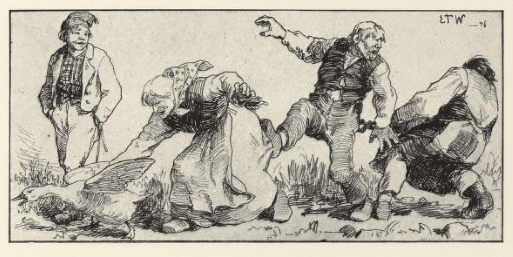
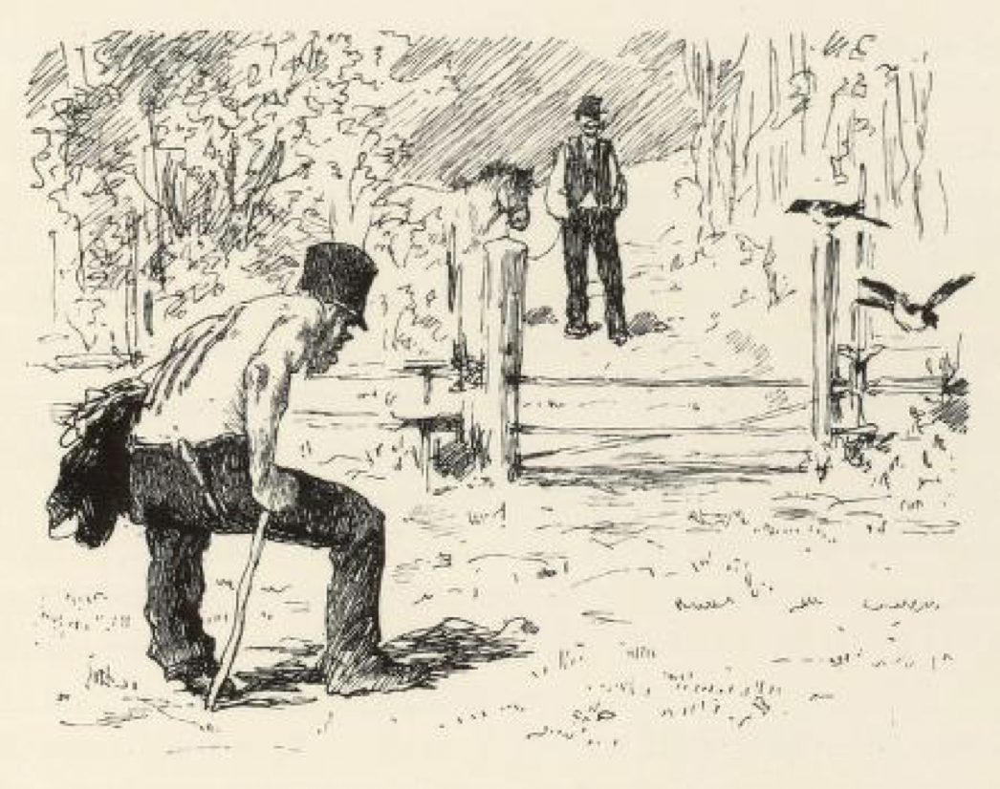

# Tyrihans som fikk kongsdatteren til å le

Det var engang en konge som hadde en datter, og hun var så deilig at hun var navnspurt[^1] både vidt og bredt; men hun var så alvorlig av seg, at hun aldri kunne le, og så var hun så stor på det, at hun sa nei til alle dem som kom og fridde til henne, og ikke ville hun ha noen, om de var aldri så gilde, enten det var prinser eller herremenn. Kongen var kjed av dette for lenge siden og syntes, at hun kunne gifte seg, hun som andre; hun hadde ikke noe å vente etter; hun var gammel nok, og rikere ble hun ikke heller, for halve riket skulle hun ha, det var morsarven hennes.

Så lot han lyse opp på kirkebakken både fort og snart, at den som kunne få hans datter til å le, han skulle ha henne og det halve kongerike. Men var det noen som prøvde seg og ikke kunne få henne til, skulle de skjære tre røde remmer av ryggen hans og strø salt i, og det er sikkert at det ble mange såre rygger i det kongerike. Det kom farende friere både fra syd og fra nord og fra øst og fra vest, og trodde det var ingen sak å få en kongsdatter til å le. Og rare karger var det også som kom. Men alle de abefanter[^2] der var, og alle de abefynter[^3] de gjorde, så var kongsdatteren lige stø og alvorlig, hun.

Tett ved kongsgården bodde det en mann som hadde tre sønner. De fikk også spurt at kongen hadde lyst opp, at den som kunne få kongsdatteren til å le, skulle få henne og halve kongeriket.

Den eldste ville i veien først; så strøk han av gårde, og da han kom til kongsgården, sa han til kongen, han ville nok friste å få kongsdatteren til å le.

«Ja, det er vel nok,» sa kongen, «men det kan visst lite nytte, min mann, for her har vært så mange som har prøvd seg; min datter er så sorgfull at det ikke nytter, og jeg ville nødig at flere skulle komme i ulykke.»

Men han mente det nok skulle nytte. Det kunne ikke være noen farlig sag å få en kongsdatter til å le for ham, for de hadde ledd så mange ganger av ham, både fornemme og simple, da han tjente soldat og ekserserte under Nils fløymann[^4]. — Så la han ut på tråkken, utenfor vinduet til kongsdatteren, og begynte å eksersere etter Nils fløymann. Men det hjalp ikke. Kongsdatteren var lige stø og alvorlig. Så tok de ham og skar tre brede, røde remmer av ryggen hans, og sendte ham hjem.

Da han vel var kommet hjem, ville den andre sønnen i veien. Han var skolemelster, og en underlig figur til kar var det. Han var lavhalt, og det så det forslog. Et øyeblikk var han liten som en gutunge, men når han reiste seg på det lange beinet sitt, ble han stor og lang som et troll. Og til å legge ut var han riktig svær.

Da han kom til kongsgården og sa han ville ha kongsdatteren til å le, syntes kongen at det ikke kunne være så ulik enda; «men Gud trøste deg, får du henne ikke til,» sa kongen; «remmene skjærer vi bredere for hver som prøver seg.»

Skoleholderen strøk ut på tråkken; der stilte han seg opp utenfor vinduet til kongsdatteren, og han preikde og messet etter syv prester og leste og sang etter syv klokkere, som hadde vært i bygda der. Kongen lo av skolemesteren, så han måtte holde seg i svalstolpen, og kongsdatteren ville til å dra på smilet, men så var hun lige stø og alvorlig igjen, og så gikk det ikke bedre med Pål skolemester enn det var gått med Per soldat — for Per og Pål het de, må vite. — De tok ham og skar tre røde remmer av ryggen hans, strødde salt i, og så sendte de ham hjem igjen.

Så ville den yngste i veien, og det var Tyrihans. Men brødrene lo og gjønet av ham og viste ham de såre ryggene sine, og faren ville ikke gi ham lov, for han sa, det kunne da ikke nytte for ham som ikke hadde noe vett; han kunne jo ingenting, og han gjorde ingenting, han satt bare i peisen som en katte, og grov i aska og spikket tyristikker[^5]. Men Tyrihans gav seg ikke, han gnålte og gnog så lenge, til de ble kjed av gnålet hans, og til sist fikk han lov å gå til kongsgården og friste lykken.

Da han kom til kongsgården, sa han ikke det at han ville få kongsdatteren til å le, men han bad om han kunne få tjeneste der. Nei, de hadde ikke noen tjeneste for ham, men Tyrihans gav seg ikke for det; de kunne visst behøve en til å bære ved og vann til kokkej[^6] enten i slik en stor gård, sa han; ja, det syntes kongen ikke kunne være så ulik, og han var vel kjed av gnålet hans, han og; så skulle Tyrihans få lov å være der og bære ved og vann til kokkej enten til sist.

Da han skulle hente vann i bekken en dag, fikk han se en stor fisk, som sto under en gammel fururod, som vannet hadde skåret jorda bort fra; han satte bøtta si så sakte under fisken. Men da han skulle gå hjem til kongsgården, møtte han en gammel kjærring, som ledet en gullgås.

«God dag, bestemor!» sa Tyrihans. «Det var en ven fugl I har; og så gilde fjær da! — det lyser lang vei av den, — hadde en slik fjær, kunne en slippe å spikke tyrilyser,» sa han.

Kjærringen syntes vel så godt om fisken hans hadde i bøtta si, og sa, at ville hans gi henne fisken, skulle han få gullgåsa, og den var slik, at når noen rørte ved den, ble han hengende fast, bare han sa: «Vil du være med, så heng på!»

«Ja, det byttet ville Tyrihans gjerne gjøre. Fugl er vel så bra som fisk,» sa han ved seg selv; «er den slik som du sier, kan jeg gjerne bruke den til fiskekrok,» sa han til kjærringen og var vel fornøyd med gåsa. Han hadde ikke gått langt, før han møtte en gammel kjærring. Da hun så den deilige gullgåsa, måtte hun bort og kramse på den. Hun gjorde seg så søt og lekker, og så bad hun Tyrihans om hun fikk lov å klappe den deilige gullgåsa hans.

«Kan så,» sa Tyrihans, «men du får ikke nappe fjærene av den!»

I det samme hun klappet på fuglen, sa han:

«Vil du være med, så heng på!» Kjærringen slet og rev, men hun måtte henge med, enten hun ville eller ikke, og Tyrihans gikk framover, som om han var alene med gullgåsa. Da han hadde gått et stykke til, traff han en mann som hadde et horn i siden til kjærringen for et puds hun hadde gjort ham. Da han så det at hun stred så hardt for å bli fri, og skjønte hun satt så vel fast, syntes han at han trygt kunne gi henne en dult til takk for sist, og så spente han til kjærringen med den ene foten.

«Vil du være med, så heng på!» sa Tyrihans, og mannen måtte følge med og hinke på ett bein, enten han ville eller ikke, og når han nappet og slet og ville løs, var det enda verre for ham, for da var han ferdig til å dumpe baglængs, rett som det var.

Nå gikk de et godt stykke, til de kom borti mot kongsgården. Der møtte de smeden til kongen; han skulle gå til smidja og hadde en stor smidjetang i hånda. Denne smeden var en lystig fyr, som alltid var full av galskap og skjelmsstykker, og da han så dette følget komme hoppende og hinkende, lo han først, så han sto tvekroket, men så sa han:

«Det er nok en ny gåseflokk prinsessen skal ha, det; skal tro hvem det er gasse, og hvem der er gås av dem? Det må vel være gassen han som rugger i forveien. Gås, gås, gås, gås, gås!» lokket han og kastet med hånda, som om han strødde korn for gjessene.

Men flokken stanset ikke — kjærringen og mannen så bare argt på smeden, fordi han gjorde narr av dem. — Så sa smeden: «Det skulle være artig å holde hele gåseflokken, så mange de er;» for han var en sterk mann, og så tok han tak med smidjetanga bak i enden på den gamle mannen, og mannen både skreik og vred seg, men Tyrihans sa:

«Vil du være med, så heng på!»

Så måtte smeden også med. Han slo nok bukt på ryggen, tok spente tak i bakken og ville løs, men det hjalp ikke, han satt så fast, som han var skrudd inn i det store skrustedet i smidja, og enten han ville eller ikke, måtte han danse med.

Da de kom fram i mot kongsgården, for gårdshunden i mot dem og gjødde, som det var skrup[^7] eller langfant, og da kongsdatteren skulle se ut gjennom vinduet, hva der var på ferde, og fikk øye på dette fantefølget, satte hun i å le. Men Tyrihans var ikke fornøyd med det. «Bi litt, skal hun nok få latterdøra bedre opp!» sa han og gjorde en vending bak om kongsgården med følget sitt.

Da de kom forbi kjøkkenet, sto døra åpen, og kokken holdt på å stampe grøten, men da hun fikk se Tyrihans og flokken, kom hun farende ut i døra med tvaren[^8] i den ene hånda og en kokkeslev full av røykende grøt i den andre, og lo så hun ryste, og da hun fikk se at smeden var med, slo hun seg på låret og satte så i å storle. Men da hun hadde ledd riktig ut, syntes hun også at gullgåsa var så deilig at hun måtte klappe den.

«Tyrihans, Tyrihans!» skreik hun og kom løpende etter med grøtsleva i neven, «får jeg lov å klappe den vene fuglen du har?»

«La henne heller klappe meg!» sa smeden.

«Kan så!» sa Tyrihans.

Men da kokken hørte det, ble hun sint. «Hva er det du sier!» skreik hun, og drev til smeden med grøtsleva.

«Vil du være med, så heng på!» sa Tyrihans; så satt hun fast, hun og så, og alt hun skjente, og alt hun slet og rev, og så vill hun var, måtte hun hinke med. Men da de kom utenfor vinduet til kongsdatteren, sto hun og ventet på dem, og da hun så de hadde fått kokken med, både med grøtslev og tvare, slo hun opp hele latterdøra og lo, så kongen måtte støtte henne. Så fikk Tyrihans prinsessen og det halve kongerike, og bryllup holdt de, så det både hørtes og spurtes.

[^1]: navnspurt = berømt, kjent

[^2]: abefanter = aper, tulling

[^3]: abefynter = apestrek, tullete oppførsel

[^4]: fløymann = korporaл, underofficer

[^5]: tyristikker = tynne vedpinner

[^6]: kokkej = kjøkken

[^7]: skrup = tyv

[^8]: tvaren = sleiven, suppeskeia
