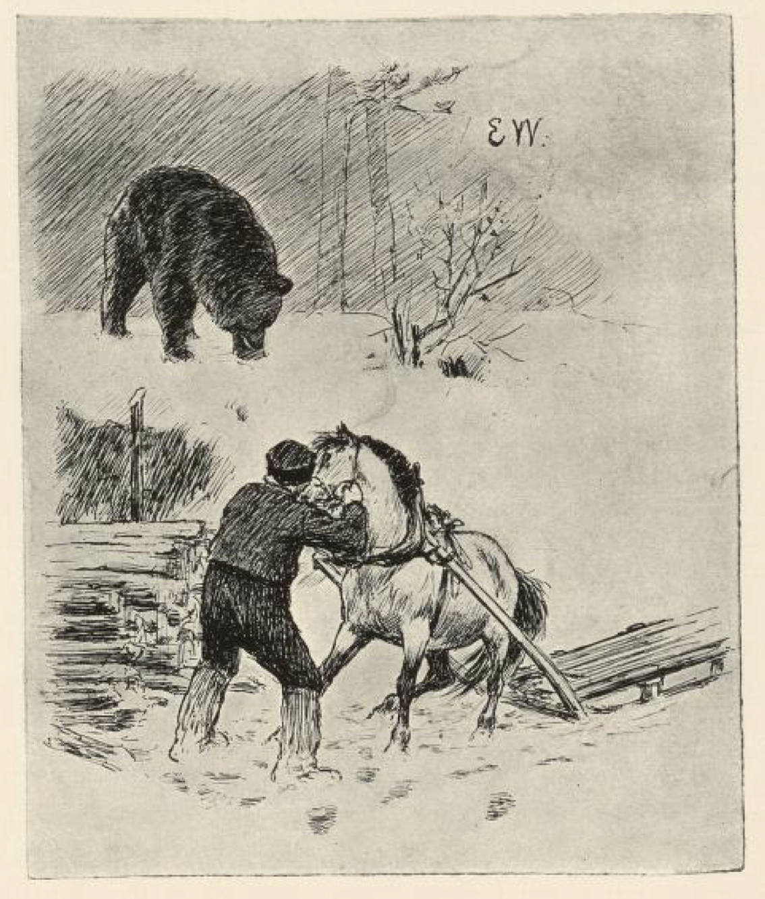
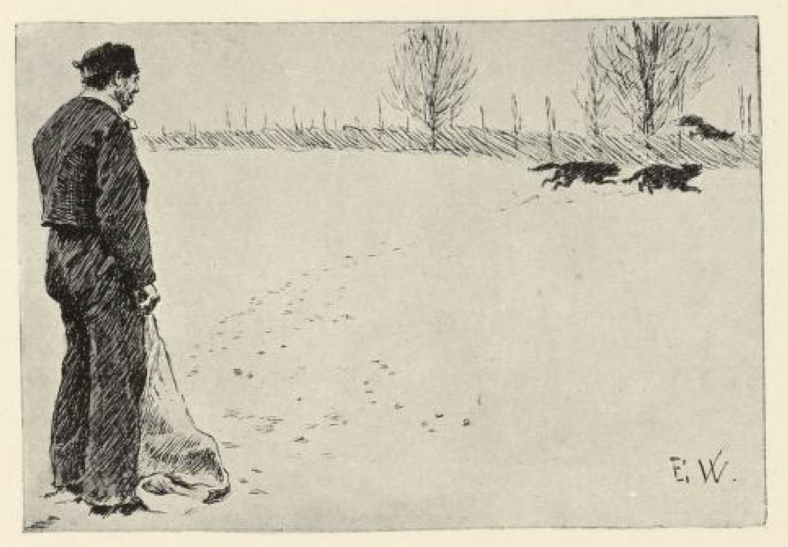

# Vel gjort og ille lønnet

Det var engang en mann som skulle reise til skogs etter ved. Så møtte han en bjørn.

« Kom med hesten, ellers slår jeg i hjel alle sauene dine til sommeren, » sa bjørnen.

« Å trøste og bære meg heller! » sa mannen, « der finnes ikke vedpinnen hjemme; du får da la meg kjøre hjem et lass ved, ellers fryser vi rent i hjel; jeg skal komme igjen med hesten til deg i morgen. »

Ja, det skulle han få lov til, det ble de forlikt om, men dersom han ikke kom igjen, så skulle han miste alle sauene sine til sommeren, sa bjørnen.

Mannen fikk veden på og ruslet hjemetter, men han var ikke mye glad i det forliket, det kan en nok vite. Så møtte han en rev.

« Hva er det du er så stur for? » spurte reven.

« Å, jeg møtte en bjørn oppe her, » sa mannen, « og ham måtte jeg love han skulle få hesten min i morgen ved dette leit, for fikk han ikke den, sa han, så ville han rive i hjel alle sauene mine til sommeren. »

« Pyt! ikke verre, » sa reven. « Vil du gi meg den feteste bukken din, skal jeg nok fri deg for det jeg. »

Ja, det lovte han, og det skulle han holde også, sa mannen.

« Når du kommer til bjørnen med hesten i morgen, » sa reven, « så skal jeg kaue[^*] oppe i ura her jeg, og når så bjørnen spør hva det er, skal du si det er Per skytter, som er den beste skytteren i verden, — og siden får du hjelpe deg selv. »

Den neste dagen reiste mannen ut, og da han traff bjørnen, begynte det å kaue oppe i ura.

« Tsju, hva er det? » sa bjørnen.

« Å, det er han Per skytter, som er den beste skytteren i verden, » sa mannen; « jeg kjenner ham på målet[^**], » sa han.

« Har du sett noen bjørn her, Erik? » ropte det borti skogen.

« Si nei! » sa bjørnen.

« Nei, jeg har ikke sett noen bjørn », sa Erik.

« Hva er det som står ved sleda di da? » ropte det borti skogen.

« Si det er en gammel tyrilåg[^***], » hvisket bjørnen.

« Å, det er bare en gammel tyrilåg, » sa Erik.

« Slike tyristubber pleier vi å ta og velte på sleda hos oss, » ropte det borti skogen; « orker du ikke, skal jeg komme og hjelpe deg. »

« Si, du hjelper deg selv, og velt meg på sleda, » sa bjørnen.

« Nei takk, jeg hjelper meg nok selv jeg, » sa mannen, og veltet bjørnen på sleda.

« Slike tyristubber pleier vi å gjøre på hos oss, » ropte det borti skogen. « Vil du ha hjelp? » spurte det.

« Si du hjelper deg selv, og gjør meg fast du, » sa bjørnen.

« Nei takk, jeg hjelper meg nok selv, » sa mannen, og gav seg til å gjøre bjørnen fast med alle de repene han hadde, så den ikke kunne bevege på en labb engang.

« Slike tyristubber pleier vi hugge øksa i hos oss, når vi har gjort dem fast, » ropte det borti skogen; « for så styrer vi bedre i de store bakkene, » sa det.

« La som du hugger øksa i meg, du, » hvisket bjørnen.

Da tok mannen øksa og kløvde skallen på bjørnen, så den lå død idet samme, og han og reven var venner og vel forlikt; men da de kom borti mot gården, sa reven:

« Jeg skulle nok ha lyst til å følge deg inn, men jeg liker ikke bikkjene dine. Jeg skal bie her, til du kommer med bukken; ta bare en som er bra fet. »

Ja, det lovte mannen, og takket til for hjelpa. Da han hadde satt inn hesten, gikk han bortover til sauehuset.

« Hvor skal du hen? » sa kjerringa hans.

« Å, jeg skal bort i sauehuset og hente en fet bukk til den snille reven som frelste hesten vår, » sa mannen, « for jeg har lovt ham det. »

« Det skulle pokker gi den tyvereven noen bukk, » sa kjerringa. « Hesten har vi jo, og bjørnen attåpå, og reven har visst stjålet flere gjess fra oss enn bukken er verd, og har han ikke gjort det, så kan han gjøre det, » sa hun. « Nei, ta et par av de sinteste bikkjene i sekken din og slipp etter ham du, så blir vi kanskje kvitt den tyveradden, » sa kjerringa.

Det syntes mannen var et godt råd, og tok to sinte røde hunder, puttet dem i sekken, og drog avsted med dem.

« Har du bukken? » sa reven.

« Ja, kom og ta den! » sa mannen, han løste opp sekkebåndet og slapp hundene på den.

« Huff! » sa reven og gjorde et hopp; « det er sant, som de sier for et gammelt ord, at vel gjort blir ille lønnet, og nå ser jeg det er sant også, at frende er frende verst, » sa han, — han så at de røde hundene satte etter ham.

[^*]: Kaue: rope, skrike

[^**]: Målet: stemmen, måten å snakke på

[^***]: Tyrilåg: gammel trevirke, tømmerstokk
