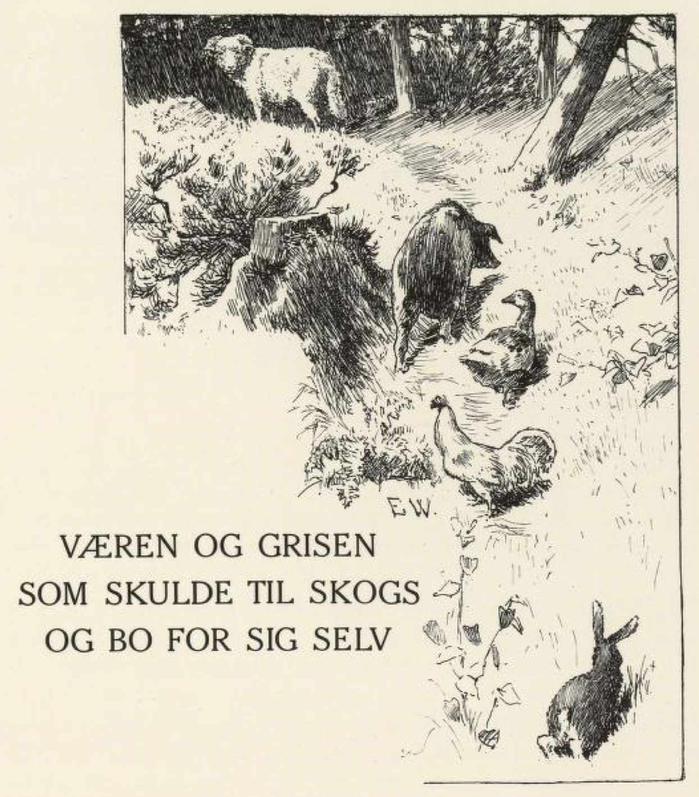
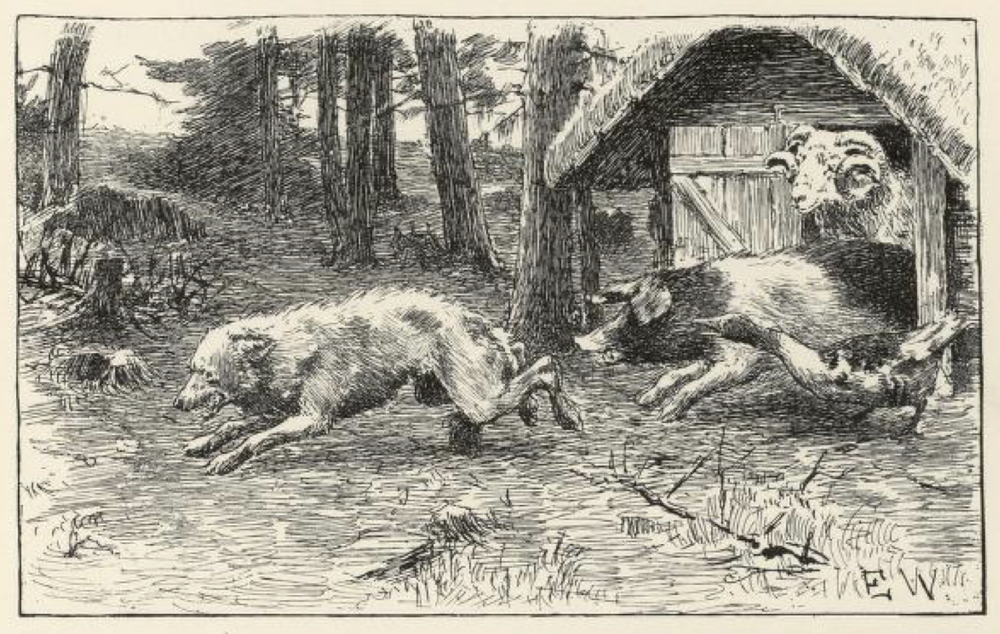
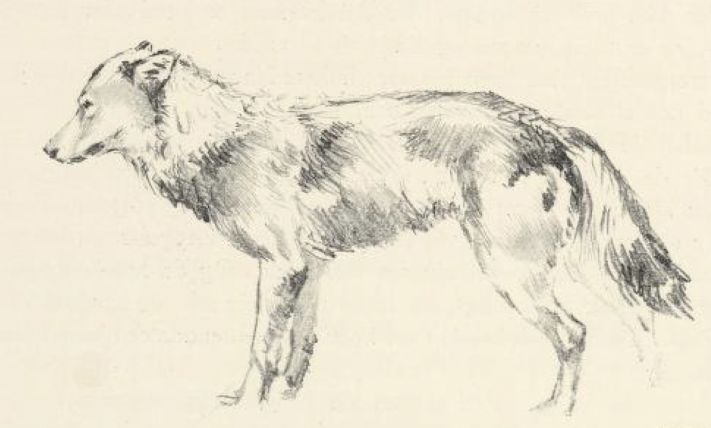

# Væren og grisen som skulle til skogs for å bo for seg selv

Det var en gang en vær som sto på gjødsti og skulle gjøre seg feit; derfor levde han vel og ble både met og stinn av alt det som godt var. Rett som det var, kom budeie og gav ham mer: «Spis nu, vær; du skal ikke være lenge her, i morgen skal vi slakte deg,» sa hun.

«Det er et gammelt ord, at kjerringeråd skal ingen forsmå, og råd og drikke gis det for alt, så nær som for døden; men kanskje det skal bli råd for den også denne gangen,» tenkte væren ved seg selv.

Så spiste han tett, og da han var god og mett, stanga han ut døra og strøk sin vei bort i grannegården; der gikk han til grisehuset, til en gris han var blitt så vel kjent med i marka, og siden hadde de alltid vært venner og vel forlikt. «God dag, og takk for sist,» sa væren til grisen.

«God dag, og selv takk for sist,» sa grisen.

«Vet du hvorfor du har det så godt og de gjør og steller deg så vel?» sa væren.

«Nei, nei,» sa grisen.

«Mange munner tømmer snart en tønne, må vite; de vil slakte deg og spise deg,» sa væren.

«Vil de det?» sa grisen; «signe maten, når de har spist!» sa han.

«Vil du som jeg, farer vi bort i skogen, bygger hus og bor for oss selv; en sitter alltid best på sin egen benk,» sa væren.

Ja, det ville grisen også; «det er fagnad til fint følge,» sa han. Og så la de i veien.

Da de hadde fart et stykke, møtte de en gås.

«God dag, godtfolk, og takk for sist,» sa gåsa; «hvor skal det folket hen, som farer så fort i dag?» sa hun.

«God dag igjen, og selv takk for sist,» sa væren. «Hjemme hadde vi det altfor vel, derfor vil vi til skogs og bo for oss selv; i eget hjem er hver mann herre,» sa han.

«Ja, jeg har det også vel nok, der jeg er,» sa gåsa; «kunne jeg ikke få være med, jeg og; godt lag gjør kortere dag,» sa hun.

«Med sladder og snadder bygger en verken hus eller hytte,» sa grisen; «hva skulle du gjøre da?»

«Med råd og lempe kommer en kryp så langt som en kjempe,» sa gåsa; «jeg kan nappe mose og dytte i veggefarene, så huset blir tett og varmt.»

Ja, så skulle hun få lov å være med; for grisen ville gjerne ha det godt og varmt.

Da de hadde gått et stykke til — gåsa kunne ikke fare så fort hun — så møtte de en harekatt[^1], som kom hoppende ut av skogen.

«God dag, godtfolk, og takk for sist!» sa haren; «hvor langt skal De labbe i dag?» sa han.

«God dag igjen, og selv takk for sist,» sa væren; «hjemme hadde vi det altfor vel, derfor vil vi til skogs og bygge hus og være for oss selv; når borte er fristet, er hjemme best,» sa han.

«Nu har jeg hus i hver busk, hus i hver busk,» sa haren; «men jeg har så ofte sagt om vinteren, at lever jeg til sommeren, så bygger jeg meg et hus —, så jeg mest kunne ha lyst til å være med og tømre opp et til slutt, jeg og,» sa han.

«Ja, skulle vi komme riktig i klemme, så måtte vi vel ta deg med til bikkjeskremme[^2],» sa grisen; «for du kunne jo ikke hjelpe oss å bygge på huset.»

«Den som i verden skal være, får alltid noe å gjøre,» sa haren; «jeg har tenner til å gnage plugger, og labber til å slå dem i veggen med, så jeg kan gjøre vel rett for en tømmermann; for god redskap gjør godt arbeid, sa mannen, han fladde merra med navaren,» sa haren.

Ja, så skulle han få lov å være med og bygge på huset, det var ikke spørsmål om, det.

Da de kom et stykke lenger fram, møtte de en hane.

«God dag, god dag, godtfolk, og takk for sist!» sa hanen; «hvor skal det folket fare hen i dag?» sa han.

«God dag igjen, og selv takk for sist,» sa væren. «Hjemme hadde vi det altfor vel, derfor skal vi til skogs og bygge hus og være for oss selv; for den som ute skal bake, mister både kull og kake,» sa han.

«Ja jeg har det vel nok, der jeg er,» sa hanen; «men bedre å bygge sitt eget bo enn sitte på fremmed pinne og glo; og hjemme er hane rikest,» sa han. «Kunne jeg komme i så fint følge, skulle jeg også ha hug til å fare til skogs og bygge hus.»

«Ja, flakse og gale, det hjelper til å smale; men en kjeft på et skaft hugger ikke noe laft,» sa grisen. «Du kan jo ikke hjelpe oss å bygge huset,» sa de.

«Det er ikke godt å stoppe, der det verken er hund eller topp,» sa hanen; «jeg er tidlig våken og tidlig til å vekke.»

«Ja, morgenstund har gull i munn; la ham få være med!» sa grisen; han var alltid den strideste storsoveren han. «Søvnen er en stor tyv; han vil alltid stjele halve tida,» sa han.

Så for de til skogs i flokk og i følge og bygde huset: grisen hugg tømmer, og væren kjørte det hjem; haren var tømmermann, gnog plugger og hamra i vegger og tak; gåsa nappa mose og dytta i veggefarene; hanen gol, og passa at de ikke forsov seg om morgenen. Og da huset var ferdig, og taket neverdekt og torvlagt, så levde de for seg selv, og hadde det både godt og vel. «Det er godt både i øst og vest, men enda er hjemme best,» sa væren.

Men et stykke lenger borti skogen var en gråbein-kule[^3], som det bodde to gråtasser[^4] i. Da de fikk se det var kommet opp et nytt hus i nabolaget, ville de vite hva det var for folk de hadde fått til granner; for de tenkte som så: «en god granne er bedre enn bror i fremmed land; og bedre er det å bo i en god grend enn være vidt kjent.»

Så gav den ene seg et ærend, gikk inn og ville låne varme til pipa si. Med det samme han kom inn igjennom døra, klemte væren til ham, så han stupta på hodet bort i peisen; grisen til å hugge og bite, gåsa til å hvese og klype; hanen opp på hanebjelken til å gale og smale; og haren ble så rent forskrekket at han for både høyt og lavt og trampa og trakka i alle røer.

Langt om lenge kom ulven ut igjen.

«Nå, grannskap gjør kjennskap,» sa han som sto igjen utenfor; «du kom vel til paradis på slette marka, siden du ble så lenge? — Men hvordan gikk det med varmen, du har jo verken røyk eller pipe?» sa han.

«Ja, det var en artig pipevarme og et artig selskap,» sa han som hadde vært inne; «slikt folkeferd har jeg aldri vært ute for før. Men som en søker lag til, så får en ære til, og uventa gjest får uvant kost,» sa ulven.

«Da jeg kom innenfor døra, drev skomakeren til meg med læstesekken, så jeg røyk på hodet lige fram i smieøvla; der satt to smeder; de blåste og de hveste med belgen, og klypa og slo med glødende tenner og stenger, så det og kjøttstykker ut av skrotta på meg. Skytteren han for og ramla og leita etter børsa si, men lykken var at han ikke fant den. Og så satt det én opp under taket og flaksa og gol: 'Hekt krokene i ham, dra ham hit, dra ham hit!' skreg han; men hadde han fått tak i meg, hadde jeg visst aldri kommet levende ut.»

[^1]: Hare

[^2]: Skremme bort rovdyr og bikkjer (hunder)

[^3]: En berghule hvor det bodde ulver («gråbein» er et gammelt navn på ulv)

[^4]: Ulver (gråtass = ulv)
