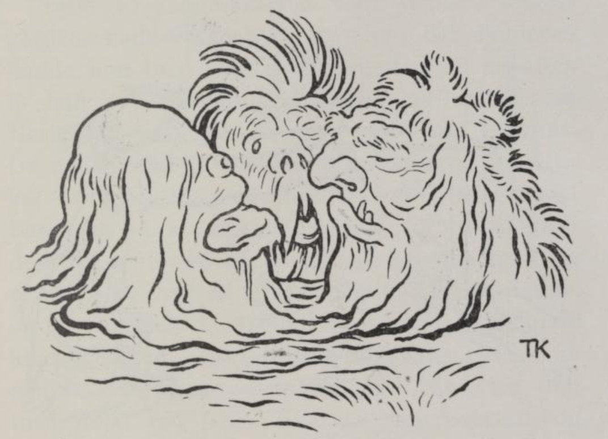
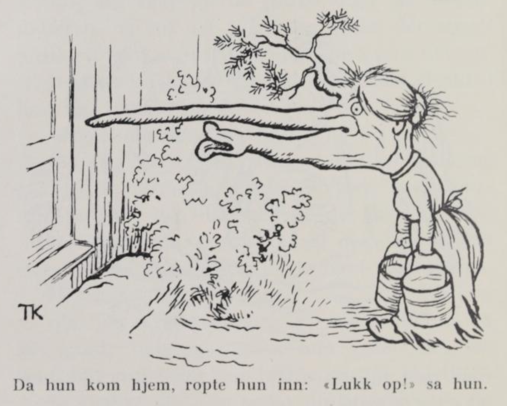

# Buskebrura

Det var en gang en enkemann som hadde en sønn og en datter efter den første konen sin. Begge var de snilde barn, og begge holdt de hjertelig av hverandre.

Om en tid giftet mannen sig igjen. Da fikk han en enke, som hadde en datter efter den første mannen; hun var både stygg og slem, og det var moren også. Fra den stund den nye konen kom i huset, var det ikke fred å få for mannsbarna i noen ro eller krok, og så tenkte gutten det var best å dra ut i verden og prøve å tjene sitt brød selv. Da han hadde gått en tid, kom han til kongsgården; der fikk han tjeneste hos stallmesteren, og kjekk og hendig var han, så hestene han stelte, var så feite og blanke at det skinte i dem.

Men søsteren som var igjen hjemme, hadde det verre enn vondt. Både stemoren og kjerringdatteren var efter henne, hvor hun gikk og stod, og skjelte og smelte, og aldri hadde hun en times fred; alt det tyngste arbeidet måtte hun gjøre, vondord fikk hun seint og tidlig, og lite mat til.

En dag hadde de sendt henne til bekken efter vann. Så kom det et stygt, fælt hode op av vannskorpa.

«Vask mig du!» sa hodet.

«Ja, jeg skal gjerne vaske dig,» sa mannsdatteren, og tok på å gni og vaske det stygge ansiktet; men et fælt arbeide syntes hun det var.

Da hun vel hadde gjort det, kom det et annet hode op i vannskorpa, det var enda fælere.

«Børst mig du!» sa hodet.

«Ja, jeg skal gjerne børste dig,» sa jenta, og gav sig i kast med hårtustene, men noe morsomt arbeide kan du nok vite det ikke var.

Da hun hadde gjort fra sig det, kom det et enda fælere og styggere hode op i vannskorpa.

«Kyss mig du!» sa hodet.

«Ja, jeg skal kysse dig,» sa mannsdatteren, og det gjorde hun også; men hun syntes det var det verste arbeidet hun hadde gjort i sitt liv.

Så snakket det ene hodet til det andre, og de spurte hverandre hva de skulde gjøre med den som var så godvis.

«At hun blir den fineste jente som til er, og så kvitlett som den lyse dag,» sa det første hodet.

«At det drysser gull av håret hver gang hun børster sig,» sa det andre.

«At det faller gull av munnen hver gang hun taler,» sa det tredje hodet.

Da stemordatteren kom hjem, og stemoren så at hun var så vakker og så kvitlett som den lyse dagen, og at det falt gullpenger av munnen hennes når hun talte, blev hun rent gal. Hun jagde manndatteren til grisehuset. Der skulle hun være med gullstasen sin, men inn i stua fikk hun ikke sette sin fot.

Det varte ikke lenge før moren ville ha rettedatteren til bekken etter vann. Da hun kom der med bøttene sine, kom det første hodet op. «Vask mig du!» sa det.

«Rakkeren vaske dig!» sa rettedatteren.

Så kom det andre hodet op. «Børst mig du!» sa det.

«Rakkeren børste dig!» sa rettedatteren.

Så kom det tredje hodet op. «Kyss mig du!» sa det.

«Rakkeren kysse dig, din muletrut!» sa jenta.

Så snakket hodene igjen til hverandre, og spurte hva de skulde gjøre ved den som var så vrangvis; og så blev de samrådd om at hun skulde ha fire alens nese og tre alens trut og ei tollbuske midt i skallen, og hver gang hun snakket, skulde det falle aske ut av munnen på henne.

Da hun kom hjem til stuedøra med vannbøttene, ropte hun inn til moren: «Lukk op!» sa hun.

«Lukk op sjøl, rettedatter mi!» sa moren.

«Jeg når ikke fram for nesa!» sa datteren.

Da moren kom ut og fikk se henne, kan en nok vite hvordan hun blev til mote, og hvordan hun skrek og bar sig; men nesa og truten blev ikke mindre for det.

Bror til manndatteren som tjente i kongsgården, hadde tegnet av søsteren; det skilderiet hadde han med sig, og hver morgen og aften lå han på kne foran skilderiet og bad til vår Herre for søsteren, så glad var han i henne.

De andre stallguttene hadde hørt dette; så kikket de gjennem nøkkelhullet inn i kammerset hans, og så at han lå på kne for et skilderi der. Så satte de ut at gutten hver morgen og aften lå og bad til et avgudsbillede han hadde, og til sist gikk de til kongen, og bad han skulde kike gjennem nøkkelhullet inn til gutten, så skulde han få se. Kongen vilde ikke tro det; men langt om lenge fikk de ham overtalt, og han lurte sig på tærne bort til døren og kiket. Jo, han så gutten ligge på kne, og billedet hang på veggen, og hendene hadde han kneppt ihop.

«Lukk op!» ropte kongen.

Men gutten hørte ikke.

Så ropte kongen andre gangen; men gutten bad så hjertelig at han ikke hørte det enda.

«Lukk op, sier jeg!» ropte kongen igjen, «det er jeg som vil inn.»

Ja, så sprang gutten til døren og låste op, og i skyndingen glemte han å gjemme skilderiet.

Da kongen kom inn og fikk se det, blev han stående som fjetret, og kunde ikke røre sig av flekken, så vakkert syntes han billedet var.

«Så vakkert et kvinnfolk finnes ikke i verden,» sa kongen.

Men gutten fortalte at det var søster hans, som han hadde tegnet av, og var hun ikke vakrere, så var hun slett ikke styggere, sa han.

«Ja, er hun så vakker, så vil jeg ha henne til dronning,» sa kongen, og befalte gutten at han skulde reise hjem efter henne på flygende timen, og endelig ikke være lenge om veien. Gutten lovte han skulde skynde sig alt han kunde, og reiste avsted fra kongsgården.

Da broren kom hjem og skulde hente søster si, vilde stemoren og rettedatteren hennes også være med. De reiste da allesammen, og manndatteren hadde med sig et skrin, som hun hadde gullet sitt i, og en hund som hette Lille Kaværn; de to tingene var hele morsarven hennes.

Da de hadde reist en stund, skulde de over sjøen, og broren satte sig bak ved roret, og moren og begge stesøstrene satt fremme i båten, og så seilte de både langt og lenge.

Om en tid kunde de se en strand. «Der dere ser den hvite stranden, skal vi i land,» sa broren og pekte utover sjøen.

«Hva er det bror min sier?» spurte manndatteren.

«Han sier du skal kaste skrinet ditt uti,» sa stemoren.

«Ja, når bror min sier det, så får jeg vel gjøre det,» sa manndatteren, og kastet skrinet.

Da de hadde seilt en stund igjen, pekte broren på land igjen. «Der ser dere slottet vi skal til,» sa han.

«Hva er det bror min sier?» spurte manndatteren.

«Nå sier han du skal kaste Lille Kaværn uti,» svarte stemoren.

Manndatteren gråt, for Lille Kaværn var det kjæreste hun eide, men endelig måtte hun, og kastet den på sjøen.

Da de hadde seilt et stykke igjen, pekte broren på land. «Der ser du kongen som kommer imot oss,» sa han.

«Hva er det bror min sier?» spurte søsteren igjen.

«Nå sier han du skal kaste dig selv uti,» sa stemoren. Hun gråt og bar sig, men broren visste ikke av det, og hun måtte gjøre som stemoren sa, og kastet sig i sjøen.

Men da de kom til kongsgården, og kongen fikk se den fæle buskebrura med fire alens nese og tre alens trut og ei buske midt i skallen, blev han rent fælen; men bryllupet var ferdig, både med brygg og med bakst, og bryllupsfolkene satt og ventet, og så måtte kongen ta henne, slik hun var. Men vond og vill var han, det kan ikke noen fortenke ham i, og derfor lot han gutten kaste i ormegården.

Første torsdagskvelden efter kom det en vakker jomfru inn på kjøkkenet i kongsgården, og bad kokkejenta som lå der, så vakkert om å få låne en børste. Det fikk hun, og så børstet hun håret sitt så gullet dryppet. En liten hund fulgte med henne, og til den sa hun: «Gå ut, Lille Kaværn, og se om det snart er dagen!» Det sa hun tre ganger, og den tredje gangen hun sendte ut hunden, var det ved de tider det tok til å gråne. Da måtte hun bort, men med det samme hun gikk, sa hun:

> «Hutt! du stygge buskebrur,
> som skal ligge i kongens arm!
> Jeg i grus og sand,
> og min bror i ormegården, foruten gråt!

«Nå kommer jeg igjen to ganger til og så aldri mer,» sa hun.

Om morgenen fortalte kokkejenta det hun hadde sett og hørt, og så sa kongen at neste torsdagskvelden vilde han selv våke i kjøkkenet om det var sant, og da det vel hadde tatt til å mørkne, så kom han ut i kjøkkenet til jenta. Men alt han gned øinene og prøvde å holde sig våken, så hjalp det ikke; for buskebrura trallet og sang, så øinene hans seg ihop, og da den vakre jomfruen kom, sov han så han snorket. Likesom første gangen fikk hun lånt en børste og børstet håret sitt med den så gullet dryppet, og så sendte hun ut hunden tre ganger, og da det lysnet gikk hun. Med det samme hun gikk, sa hun de samme ordene som gangen før:

> «Hutt! du stygge buskebrura,
> som skal ligge i kongens arm!
> Jeg i grus og sand,
> og min bror i ormegården, foruten gråt!

«Nå kommer jeg igjen én gang, og så aldri mer,» sa hun.

Den tredje torsdagskvelden vilde kongen våke igjen. Da satte han to mann til å holde sig, en under hver arm, de skulde riste ham og nappe i ham hver gang han vilde til å sovne, og to mann satte han til vakt over buskebrura. Men da det led utpå kvelden, tok buskebrura igjen på å tralle og synge, så øinene hans holdt på å lukke sig, og hodet hang ned til den ene siden. Så kom den vakre jomfruen og fikk børsten og børstet håret sitt så gullet dryppet, og så sendte hun ut Lille Kaværn, for å se om det snart var dagen, og det gjorde hun tre ganger. Tredje gangen tok det til å lysne, da sa hun:

> «Hutt! du stygge buskebrura,
> som skal ligge i kongens arm!
> Jeg i grus og sand,
> og min bror i ormegården, foruten gråt!»

«Nå kommer jeg aldri igjen mere,» sa hun, og så vilde hun gå. Men de to mann som holdt kongen under armene, grep over hendene hans og klemte kniven inn i neven på ham, og så fikk han skåret henne i veslefingeren, så mye at hun blev blodvekt.

Da var rette bruden frelst, og kongen våknet; hun fortalte ham hvordan alt hadde gått til, og hvordan stemoren og kjerringdatteren hadde sveket henne. Straks blev bror hennes tatt ut av ormegården — ham hadde ormene ikke gjort minste skade — og stemoren og rettedatteren hennes blev kastet der ned i steden. Men ingen kan si så glad kongen var, da han blev av med den stygge buskebrura, og fikk igjen en dronning som var så vakker og lys som selve dagen. Nå blev det rette bryllupet gjort, og det så det blev hørt og spurt over sju kongeriker; kongen og bruden hans kjørte til kirke, og Lille Kaværn satt også i vognen. Da vielsen var over, kjørte de hjem igjen, men siden var ikke jeg med dem lenger.
