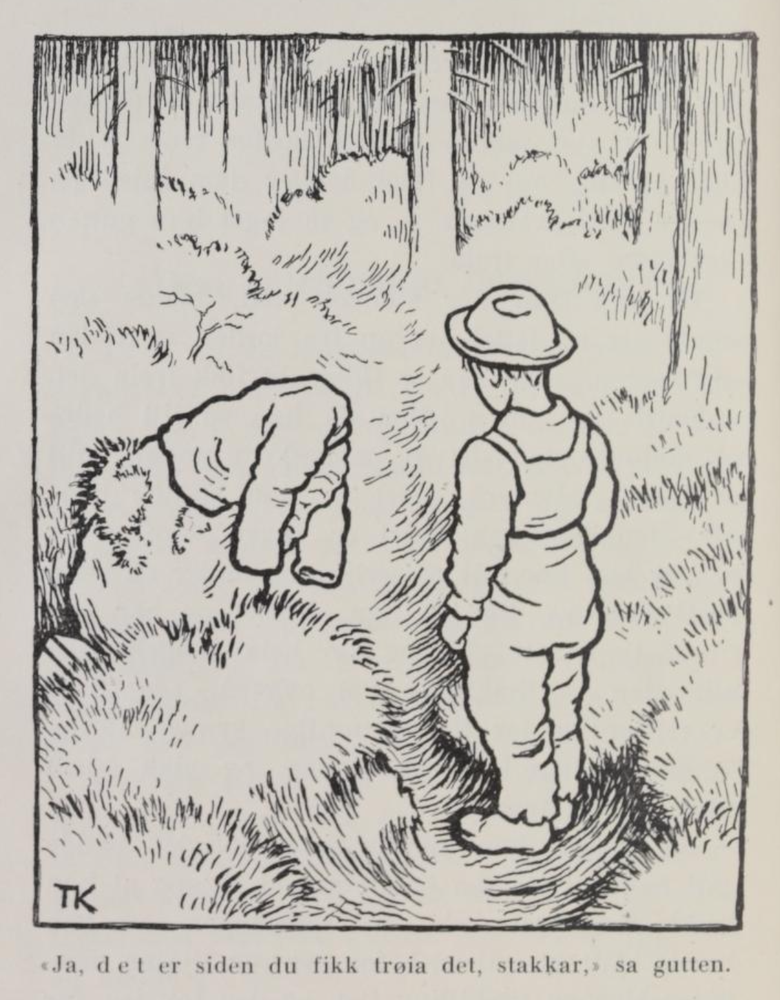
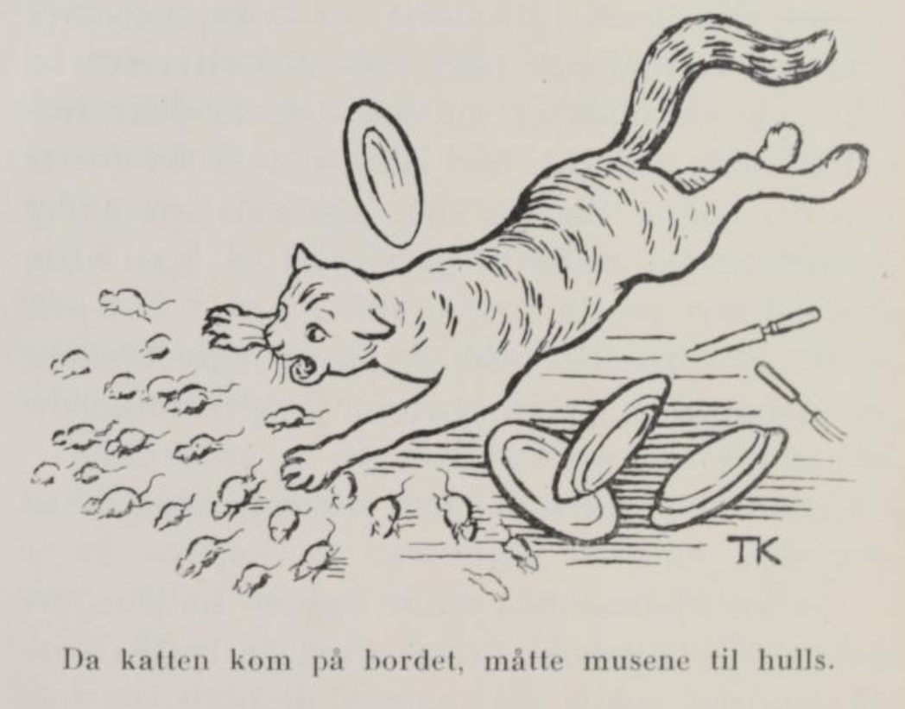
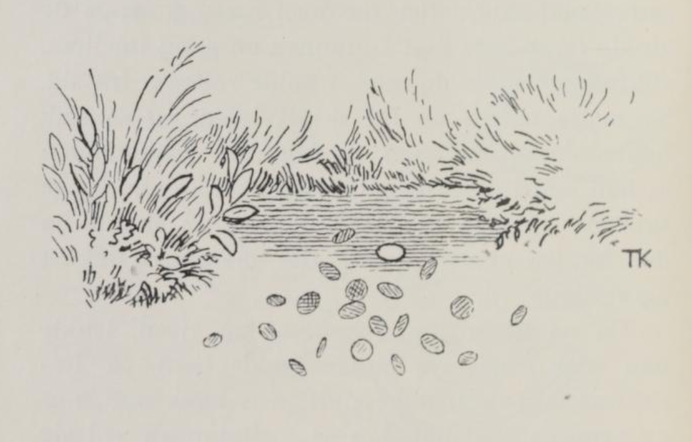

# Den rettferdige firskilling

Det var en gang en fattig kone som bodde i en ussel stue langt borte fra bygda. Lite hadde hun å bite og ingenting å brenne, og derfor sendte hun en liten gutt hun hadde, til skogs for å sanke ved. Han hoppet og sprang, og sprang og hoppet, for å holde sig varm, for det var en kald gråkostdag; og hver gang han hadde sanket en kvist eller en rot i vedbøra si, måtte han slå armene om hinannen mot herdebladene, for nevene var røde som tyttebærtuene han gikk over, av bare kulde.

Da han hadde fått vedbøra full og skulde hjem igjen, kom han over en stubbebråte. Der så han en hvit krokete stein. «Å, din stakkars gamle stein, så hvit og så bleik du er, du fryser nok fælt!» sa gutten. Han tok av sig trøia og la den på steinen.

Da han nå kom bærende med vedbøra, spurte moren hvad det skulde være til at han gikk i skjorteermene i kostkulda. Han fortalte da at han hadde sett en gammal krokete stein som var rent hvit og bleik av frost, den hadde han gitt trøia si.

«Din tull!» sa kjerringa, «tenker du stein fryser? Men om den frøs så den skalv, så er en hver sig sjøl nærmest. Det koster nok å få klær på dig, om du ikke henger dem igjen på steiner borti bråtane,» -- og så jaget hun gutten bort igjen efter trøia. Da han kom der steinen stod, hadde den snudd sig og lettet sig opp fra jorden med den ene kanten. «Ja, det er siden du fikk trøia det, stakkar!» sa gutten.

Men da han så litt bedre på steinen, stod det et pengeskrin under, fullt av blank sølvmynt. «Det er visst stjålne penger,» tenkte gutten; «det er ingen som setter penger han har fått på ærlig vis, under en stein borti skogen.» Så tok han skrinet og bar ned til et tjern tett ved, og slo hele pengehaugen uti. Men en firskilling fløt ovenpå. «Ja, den er rettferdig; for det rettferdige synker aldri,» sa gutten, han tok firskillingen, og gikk hjem med den og trøia.

Så fortalte han moren hvordan det hadde gått ham, at steinen hadde snudd sig, og at han hadde funnet et skrin med sølvpenger, som han hadde slått ut i tjernet, for det var stjålne penger. «Men en firskilling fløt, og den tok jeg, for den var rettferdig,» sa gutten.

«Du er en tosk,» sa moren — hun var rent arg — «var ikke annet rettferdig enn det som flyter på vann, så var det ikke stor rettferdighet i verden. Men om så pengene var stjålne ti ganger, så hadde du funnet dem, og enhver er sig sjøl nærmest. Hadde du tatt pengene, kunde vi levd godt og vel i all vår tid. Men en tulling er du, og en tulling blir du, og nå vil jeg ikke lenger gå her og slite og dras med dig. Nå får du ut og tjene for ditt brød.»

Gutten måtte da ut i den vide verden, og han gikk både langt og lenge og spurte efter tjeneste. Men hvor han kom, syntes folkene han var for liten og for veik, og så de kunde ikke bruke ham til noe. Endelig kom han til en kjøpmann; der fikk han være i kjøkkenet, og skulde bære ved og vann til kokka.

Da han hadde vært der i lang tid, skulde kjøpmannen engang reise til fremmede land, og så spurte han alle tjenerne sine, hvad han skulde kjøpe, med sig hjem til hver av dem. Da nå alle hadde sagt hvad de vilde ha, kom også raden til gutten som bar ved og vann til kokka. Han rakte frem firskillingen sin.

«Ja, hvad skal jeg kjøpe for den da?» spurte kjøpmannen. «Det blir nok ikke store handelen.»

«Kjøp det jeg kan få for den, den er rettferdig, det vet jeg,» sa gutten.

Det lovte husbonden, og så seilte han.

Da nå kjøpmannen hadde losset og ladet i det fremmede landet, og kjøpt det han hadde lovt tjenerne sine, kom han ned til skibet igjen, og skulde til å legge fra bryggen. Da først kom han i hug at kokkedrengen hadde sendt med ham en firskilling, han skulde kjøpe noe for.

«Skal jeg nå opp i byen igjen for den firskillingens skyld? En har da heller ikke annet enn ugagn av å ta til sig slikt herk,» tenkte kjøpmannen.

I det samme kom det ei kjerring gåendes med en pose på ryggen.

«Hvad er det du har i posen din, mor?» spurte kjøpmannen.

«Å, det er ikke annet enn en katt; jeg har ikke råd å fø på den lenger, så jeg har tenkt å kaste den på sjøen og gjøre det av med den,» svarte kjerringa.

«Gutten sa jo, jeg skulde kjøpe det jeg kunde få for firskillingen,» sa kjøpmannen ved sig sjøl, og så spurte han kjerringa, om hun vilde ha fire skilling for katten sin.

Ja, kjerringa var ikke sein om å slå til, og så var handelen gjort.

Da nå kjøpmannen hadde seilt et stykke, kom det et gruelig uvær på ham, med slik en himmels storm at det ikke var noen måte, og han drev og han drev, og visste ikke hvor det bar hen.

Til sist kom han til et land han aldri hadde vært i før, og der gikk han opp i byen. På vertshuset, der han gikk inn, var bordet dekket med et ris til hver som skulde sitte ved det. Dette syntes kjøpmannen var underlig, for han kunde ikke skjønne hvad de skulde med alle risene; men han satte sig, og tenkte han fikk se vel efter hvad de andre gjorde med dem, så kunde han gjøre efter. Jo, da maten kom på bordet, fikk han nok se hvad risene var til: da krydde det frem i tusenvis av mus, og hver som ved bordet satt, malte til med riset sitt og fektet og slo omkring sig, og det var ikke annet å høre enn det ene klasket av ris hardere enn det andre. Somme tider råket de hverandre i ansiktet; da måtte de gi sig tid til å si: «Om forladelse».

«Det er strengt arbeid å spise i dette landet,» sa kjøpmannen. «Men hvorfor holder folk ikke katter her?»

«Katter?» spurte de, det visste de ikke hvad var. Så lot kjøpmannen hente opp den katten, han hadde kjøpt til kokkedrengen, og da katten kom på bordene, måtte vel musene til huls, og folkene hadde ikke hatt så god matro i manns minne. De bad og velsignet kjøpmannen at han måtte selge dem katten sin. Langt om lenge lovte han å overlate den, men hundre daler vilde han ha for den; det gav de, og takk attpå.

Så seilte kjøpmannen igjen; men aldri før var han kommet i rum sjø, så så han katten satt oppi stormasten, og straks efter blev det en storm og et uvær igjen, enda verre enn siste gangen, og han drev og drev, til han kom inn et steds, han aldri hadde vært før.

Kjøpmannen gikk igjen opp i vertshuset, og her var også bordet dekket med ris, men de var mye større og lengere enn der han først var. Og de kunde vel trenges; for her var det enda flere mus. Og alle var de dobbelt så store som dem han før hadde sett.

Så solgte han katten igjen, og den gangen fikk han to hundre for den og det liten profitt.

Da han hadde seilt derfra, og var kommet et stykke utpå havet, satt katten oppi masten igjen; og straks tok uværet til på nytt, og langt om lenge blev han også den gangen drevet inn til et land, han aldri hadde vært i.

Han gikk igjen opp i vertshuset; der var også bordet dekket med ris, men hvert ris var halvannen alen langt og så tykt som en liten lime, og folkene sa, det var den verste onna de hadde, å sitte og ete, for her var det i tusentall med store fæle rotter; det var med nød og neppe de kunde få en bete mat i munnen en gang imellem, slikt strev hadde de med å holde rottene ifra sig.

Så måtte katten opp fra skibet igjen, og så fikk folkene matro. De bad og bønnfalt kjøpmannen at han endelig måtte selge dem katten sin; lenge sa han nei, men til sist lovte han de skulde ha den for tre hundre daler. Det gav de, og takket og velsignet til.

Da nå kjøpmannen kom ut på sjøen, tenkte han efter hvor mye gutten hadde tjent på firskillingen, han hadde sendt med ham. «Ja, noe av pengene skal han få,» sa kjøpmannen ved sig sjøl, «men ikke alt. Det er mig, han har å takke for katten jeg kjøpte, og enhver er sig sjøl nærmest.»

Men med det samme kjøpmannen tenkte det ved sig sjøl, blev det en storm og et uvær, så alle trodde skibet skulde forgå. Så merket kjøpmannen at det ikke var annen råd, og så måtte han love at gutten skulde få altsammen. Aldri før hadde han gjort det løftet, så blev været godt, og han fikk strykende bør like hjem.

Da han var kommet i land, gav han gutten de seks hundre dalerne, og datter si attpå; for nå var kokkedrengen likeså rik som kjøpmannen, og siden levde gutten både i herlighet og glede.

Moren tok han til sig og gjorde vel imot; for «jeg tror ikke på det, at enhver er sig sjøl nærmest,» sa gutten.

