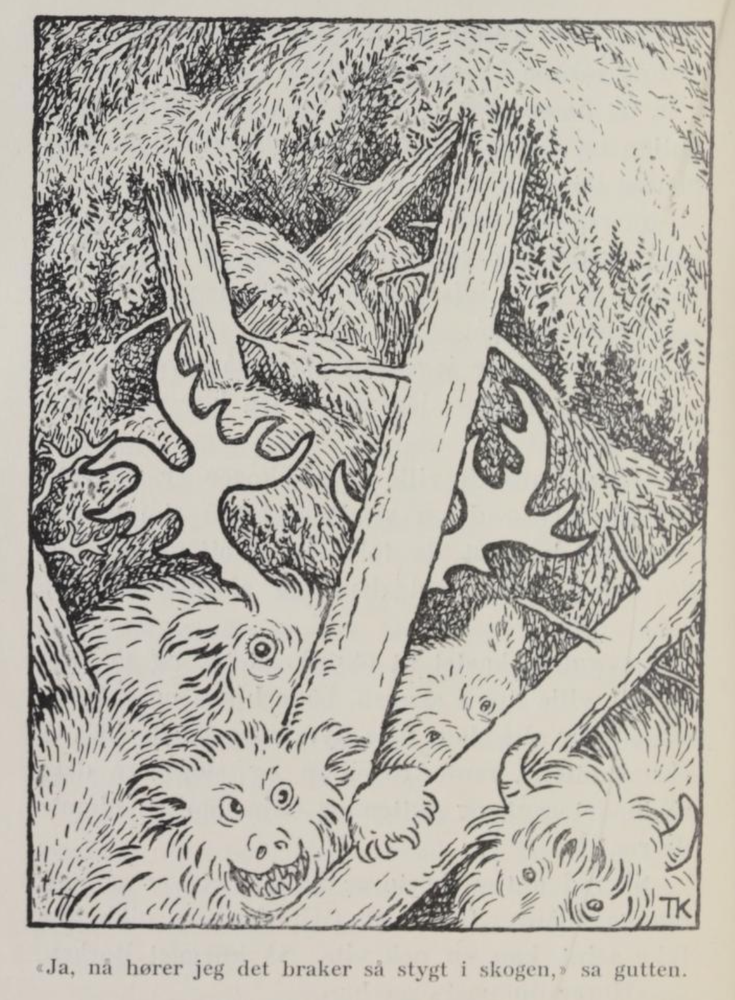

# Grimsborken

Det var en gang et par rike folk som hadde tolv sønner; men den yngste ville ikke være hjemme lenger, da han var blitt voksen; han ville ut og prøve sin lykke i verden. Foreldrene sa de syntes han hadde det godt og vel hjemme, og at han gjerne kunne bli hos dem; men han hadde ingen ro på seg: han ville og han skulle i veien, og så måtte han da få lov. Da han hadde gått en god stund, kom han til en kongsgård. Der ba han om tjeneste, og det fikk han.

Kongsdatteren der i landet var tatt inn i fjellet av et troll, og kongen hadde ikke flere barn; derfor var både han og hele landet i stor sorg, og kongen hadde lovt ut kongsdatteren og halve riket til den som kunne frelse henne; men det var ingen som kunne det, enda det var nok av dem som prøvde på.

Da nå gutten hadde vært der et års tid eller så, ville han hjem igjen og se til foreldrene sine; men da han kom hjem, var foreldrene døde, og brødrene hadde delt alt de eide og hadde, så det var ikke noe igjen til gutten.

«Skal jeg da ikke ha noe?» spurte gutten.

«Hvem kunne vite at du ranglet omkring?» svarte brødrene. «Vi er tolv, og mor og far hadde ikke mer enn tolv deler.»

«Men jeg har vært i kongsgården og tjent kongen,» sa gutten, «og nå vil jeg ha min del.»

«Ja, vil du ha de tolv hoppene som går oppe i heia, så kan du få dem,» sa brødrene.

Ja, det var gutten fornøyd med. Han gikk avsted, og da han kom opp i heia, hadde hver hoppe en folunge, og en av dem hadde en borket[^1] folunge, som var så vakker at det skinte av den.

«Du er vakker du, vesle folungen min!» sa gutten.

«Ja, men vil du gjøre som jeg sier, så skal jeg bli enda vakrere,» sa folen. «Slå ihjel de elleve andre folungene, så jeg kan suge alle hoppene i ett år.»

Ja, det gjorde gutten, og folen sugde alle de tolv hoppene, og den vokste og ble så stor og feit at det glinste i den.

«Ja, det er sant at jeg fikk tilbake for det at jeg lot deg suge alle hoppene mine,» sa gutten til folen; «men nå er du stor nok, nå får du være med meg.»

«Nei, jeg får gå her ett år til,» sa folen; «slå nå ihjel de tolv føllene, så kan jeg suge alle hoppene dette året også; så skal du se jeg skal bli stor og vakker til sommeren!»

Ja, det gjorde gutten igjen. Og da han kom opp i heiene det andre året og skulle se til folen sin og hoppene sine, hadde de hver sin folunge på nytt; men borkefolen var så stor at gutten slett ikke nådde opp, da han ville ta i nakken på den for å kjenne hvor feit den var, og så blank var den at det lyste av den.

«Stor og vakker var du i fjor, folen min, men i år er du enda gildere,» sa gutten; «slik hest finnes ikke i kongens gård. Men nå får du være med meg.»

«Nei,» sa borken igjen, «jeg får gå her enda ett år. Slå nå bare ihjel de tolv folungene igjen, så jeg kan suge hoppene dette året også, så skal du få se meg til sommeren igjen!»

Ja, gutten gjorde det også: han slo ihjel alle folungene, og så gikk han hjem igjen.

Men da han kom igjen neste året og skulle se til borkefolen og hoppene sine, ble han rent fælen. Så stor og grovvoksen hadde han aldri trodd hest kunne bli; for Borken måtte legge seg ned på alle fire, før gutten kunne nå opp på den; han hadde nok med å komme opp på den, enda den lå, og så smekkfeit var den at det glinste og skinte i den som i en speil.

Og den gangen var ikke Borken uvillig til å følge med gutten. Han satte seg da opp på den, og da han kom ridende hjem til brødrene sine, slo de hendene ihop og forkorset seg, for slik hest hadde de hverken sett eller hørt tale om.

«Hvis dere vil skaffe meg så god skoning under hesten, og så gild sål og bissel som gives kan,» sa gutten, «så skal dere få alle tolv hoppene mine, slik som de står og går oppe i heiene, og de tolv folungene deres også,» - det året hadde også hver hoppe fått sin fole.

Det ville brødrene gjerne, og så fikk gutten slik skoning under hesten, at steinsplintrene fløy høyt i luften, når han red bortover fjellheiene, og slik gullsål og slikt gullbissel fikk han, at det lyste og blinket lang vei av det.

«Nå reiser vi til kongsgården!» sa Grimsborken — det var navnet dens; «men kom vel i hug å be kongen om godt stallrom og godt fôr til meg.»

Ja, det lovte gutten han ikke skulle glemme.

Han red avgårde, og en kan nok vite det ikke tok lenge å komme til kongsgården, slik hest som han hadde.

Da han kom der, sto kongen ute på trammen, og han glante og glodde på ham som kom ridende. «Nei, nei!» sa han, «slik kar og slik hest har jeg aldri sett i mitt levende liv før.» Og da gutten spurte om han kunne få tjeneste i kongsgården, ble kongen så glad at han var klar til å danse, der han sto på trammen; det kan vel hende at han skulle få tjeneste.

«Ja, men godt stallrom og forsvarlig fôr vil jeg ha til hesten min,» sa gutten.

Ja, han skulle få vollhøi og havre, så mye Borken ville ha; og alle de andre ridderne måtte ta hestene sine ut av stallen, der skulle Grimsborken stå alene, så den kunne ha riktig godt rom.

Men det varte ikke lenge før de andre i kongsgården ble misunnelige på gutten, og de visste ikke alt det vonde de ville gjøre ham, hvis de bare torde. Til sist fant de på å si til kongen, at han hadde sagt seg god for å redde kongsdatteren, som trollet hadde tatt inn i berget for lang tid siden, når han bare ville. Straks kalte kongen ham frem for seg, og sa at det og det visste han gutten hadde sagt seg god for, og nå skulle han gjøre det; kunne han, så visste han at kongen hadde lovt ut både datteren og halve riket, og det skulle han riktig og redelig få, men kunne han ikke, skulle han drepes. Gutten nektet at han hadde sagt det; men det hjalp ikke, kongen ville ikke høre på det øret, og så var det ikke annen råd, enn at han måtte si at han fikk vel prøve.

Han gikk da ned i stallen, stur og lei seg var han. Så spurte Grimsborken hva han var så sturen for; det fortalte gutten, og sa han ikke visste hvordan han skulle bære seg ad; «for å frelse kongsdatteren, det er vel rent uråd det,» sa gutten.

«Å, det kunne vel la seg gjøre,» sa Grimsborken; «jeg skal hjelpe deg. Men vel skodd må du først få meg. Du må forlange tyve pund jern og tolv pund stål til skoning, og én smed til å smi og én til å legge under.»

Ja, det gjorde gutten, og det ble ikke svaret nei til det: han fikk både jernet og stålet og smedene, og så ble Grimsborken skodd både godt og vel, og gutten ut av kongsgården så gyen sto etter.

Men da han kom til berget som kongsdatteren var tatt inn i, så gjaldt det å komme opp etter bergveggen, og dit han skulle inn i fjellet, for berget sto rett opp og ned, så bratt som en stuevegg og så glatt som en glassrute. Første gangen gutten red, kom han nok et stykke opp fjellveggen, men så gled Borken med begge framføttene, og de falt ned igjen, så det dundret i heia. Andre gangen han red, kom han et stykke lenger opp, men så glapp den ene framfoten, og ned bar det, som du skulle hørt et jordskred. Men tredje gangen sa Borken: «Nå får vi prøve oss!» og så satte han i vei, så steinene sprutet himmellhøyt omkring dem, og da kom de opp. Gutten red inn i trollets hule i fullt firsprang, nappet kongsdatteren opp på salknappen, og var ute igjen, før trollet kom så mye som rakk å reise seg, - og så var kongsdatteren frelst.

Da gutten kom tilbake til kongsgården, var kongen både glad og fornøyd med at han hadde fått igjen datter si, det kan du nok vite; men hvordan det var eller ikke var, så hadde de andre i kongsgården talt og stelt opp kongen, så han var harm på gutten likevel.

«Takk skal du ha, for du har frelst datter mi,» sa han til gutten, da han kom inn på slottet med henne; og så ville han gå sin vei.

«Hun skulle være min like mye som din nå, for du er en ordstø mann,» sa gutten.

«Ja, ja,» sa kongen, «ha henne skal du, siden jeg har sagt det; men først må du få solen til å skinne inn her i kongsgården.» For det var et stort, høyt fjell like utenfor vinduene, som skygget så solen ikke kunne skinne inn.

«Det sto nok ikke i akkorden det,» svarte gutten; «men det hjelper vel ingen bønn, jeg får vel prøve mitt beste; for kongsdatteren vil jeg ha.»

Han gikk ned til Borken igjen, og fortalte hva kongen forlangte, og så mente Grimsborken at det vel var råd; men ny skoning måtte først under ham, og den skulle det tyve pund jern og tolv pund stål til; to smeder måtte det også til, én til å smi og en til å legge under, så skulle de vel la solen til å skinne i kongsgården. Da gutten forlangte dette, fikk han det med en gang; det syntes kongen for skam skyld ikke han kunne nekte ham; og så ble det da lagt ny skoning under Grimsborken, og det skoning som dugde. Gutten satte seg på, og så bar det i vei igjen, og for hvert hopp Grimsborken gjorde, sank fjellet femten alen ned i jorden, og slik holdt de på, til kongen ikke kunne se mer til fjellet.

Da gutten kom ned igjen til kongsgården, spurte han kongen om ikke kongsdatteren skulle være hans nå heller, for nå visste han ikke annet enn at solen skinte i slottet, sa han. Men så hadde de andre i kongsgården stelt opp kongen igjen, og så svarte han at gutten nok skulle få henne, han hadde aldri annet tenkt, men først skulle han skaffe henne en så gild brudehest som han hadde brudgomshest. Gutten sa at det hadde kongen aldri nevnt noe om før, og nå syntes han at han hadde fortjent kongsdatteren; men kongen ble ved sitt, og dersom gutten ikke kunne det, skulle han miste livet, sa kongen.

Gutten gikk ned i stallen igjen, og sturen og ille ved var han, det kan du nok vite. Der fortalte han til Grimsborken at nå hadde kongen forlangt at han skulle skaffe kongsdatteren så gild brudehest som han hadde brudgomshest, ellers skulle han miste livet: «det blir ugreit nok, tenker jeg,» sa han, «for maken din finnes vel ikke i verden.»

«Å jo, der er maken til meg,» svarte Grimsborken; «men lett blir det ikke å få den; den er i helvede den. Men vi får vel prøve. Nå skal du gå opp til kongen og forlange ny skoning under meg, og til den må det tyve pund jern og tolv pund stål igjen, og to smeder, én til å smi og én til å legge under, men se vel til at hakene og grevene blir riktig kvasse; og tolv tønner rug og tolv tønner bygg og tolv okseskrotter må vi ha med oss; og alle tolv oksehudene, med tolv hundre spiker i hver, må du også forlange; alt det må vi ha, og en tjæretønne til med tolv tønner tjære i.»

Gutten gikk opp til kongen og forlangte alt Grimsborken hadde sagt, og kongen syntes nå igjen det var skam å nekte ham det, og så fikk han det alt i hop.

Så satte han seg opp på Grimsborken og red av garde, og da han så hadde ridd langt, langt bort over berg og heier, spurte Borken: «Hører du noe?»

«Ja, det suser fælt oppe i luften; jeg blir rent redd, jeg,» sa gutten.

«Det er alle de ville fugler fra skogen som kommer flygende; de er sendt ut for å stoppe oss,» sa Grimsborken. «Men skjær hull på kornsekkene du, så får de så mye å stime med, at de glemmer oss.»

Ja, det gjorde gutten, han skar hull på kornsekkene, så byggen og rugen rant utover til alle kanter. Så kom alle de ville fuglene fra skogen flygende så tykt at det svartnet for solen; men da de fikk se kornet, så kunne de ikke holde seg, men slo seg ned og tok på å hakke og pikke opp kornet og rugen, og til sist røk de i hop og sloss seg imellom; gutten og Grimsborken gjorde de ikke noe, dem glemte de rent.

Nå red gutten igjen både langt og lenge, over berg og daler, over åser og moer; så la Grimsborken til å lytte igjen, og så spurte den gutten om han hørte noe nå.

«Ja, nå hører jeg det bråker så stygt i skogen på alle kanter; jeg blir rent redd nå,» sa gutten.

«Det er alle de ville dyrene fra skogen, det,» sa Grimsborken; «de er sendt ut for å stoppe oss. Men kast bare ut de tolv okseskrottene, så har de nok å gjøre med dem, og så glemmer de oss.»

Ja, gutten kastet ut okseskrottene, og så kom alle de ville dyrene fra skogen, både bjørn og gråbein og løve og alle slags fæle dyr; men da de fikk se okseskrottene, rant de i hop og sloss om dem så blodet rant, og gutten og Grimsborken glemte de rent.

Så red gutten videre, det var mange, mange blåner, for med Grimsborken gikk det ikke seint, kan en nok vite. Så knegget Borken.

«Hører du noe?» sa han.

«Jo, jeg hørte noe som en folunge som knegget, langt, langt borte,» svarte gutten.

«Det er nok en voksen folunge det,» sa Grimsborken; «det høres så svakt ut fordi den er så langt fra oss.»

Så reiste de et godt stykke, en blåne eller vel så det, igjen.

Så knegget Grimsborken på nytt. «Hører du noe nå?» sa han.

«Ja, nå hørte jeg tydelig det knegget som en voksen hest,» svarte gutten.

«Ja, du får nok høre den én gang til,» sa Grimsborken, «da skal du høre det er mål i den.»

De reiste en blåne eller vel så det igjen, så knegget Grimsborken tredje gangen; men før den fikk spurt gutten om han hørte noe, så knegget det borti heia, så gutten tenkte at både berg og fjell skulle revne.

«Nå er den her,» sa Grimsborken. «Skynd deg nå og kast over meg oksehudene med spikerne i, og tjæretønna kaster du bortetter bakken; klyv så opp i den store grana der. Når den kommer, spruter den varme ut av begge neseborene, og så tar det fatt i tjæretønna. Legg så vel merke: dersom luen stiger, så vinner jeg; men dersom den faller, så taper jeg. Men ser du jeg vinner, så kaster du på den bisslet — det må du ta av meg; og så er den spak.»

Nettop gutten hadde fått kastet spikerhudene over Grimsborken og tjæretønna bortover bakken og vel var kommet oppi grana, så kom det en hest, så varmen sprutet av den, og så fløy det ild i tjæretønna med det samme; og den og Grimsborken til å slåss, så steinen danset himmelshøit. De bet og de slo både med framføttene og med bakføttene, og somme tider så gutten på dem, og somme tider så han på tjæretønna, men til sist steg luen: for hvor den andre hesten bet og hvor den slo, så traff den spikerhudene, og så måtte den gi seg. Da gutten så det, var han ikke sen om å komme ned av treet og få kastet bisslet på den, og da var den så spak, at han kunne styre den med en tvinnetråd. Den hesten var også borket, og så lik Grimsborken at ingen kunne skille den ene fra den andre.

Gutten satte seg opp på den borkete hesten han hadde fanget, og red hjem igjen til kongsgården, og Grimsborken sprang med løs. Da han kom der, sto kongen ute på tunet.

«Kan du nå si meg hva for en hest jeg har fanget, og hva for en jeg hadde før?» sa gutten. «Kan du ikke det, så mener jeg datter di hører meg til.»

Kongen gikk og så på begge Borkene, både høyt og lavt, både framme og bak, men det var ikke et hår annerledes på den ene enn på den andre.

«Nei,» sa kongen, «det kan jeg ikke si deg; og siden du har skaffet datter mi så gild brudehest, skal du ha henne. Men ett må vi prøve først; om det er så laga. Nå skal først kongsdatteren gjemme seg to ganger,» sa han, «og siden skal du gjemme deg to ganger; dersom du kan finne henne de gangene hun har gjemt seg, men ikke hun finne deg i gjemmestedet ditt, så er det så laga, og så skal du ha kongsdatteren.»

«Det står nå ikke i akkorden, det heller,» sa gutten; «men vi får vel prøve, siden det så skal være,» og så skulle kongsdatteren til å gjemme seg først.

Hun skapte seg til en and, og lå og svømte på vannet som var tett utenfor kongsgården. Men gutten gikk bare ned i stallen og spurte Grimsborken hvor hun hadde gjort av seg. «Å, du trenger bare ta børsa di og gå ned til dammen og sikte på den anda som ligger og svømmer der,» sa Grimsborken, «så kommer hun nok frem igjen.»

Gutten nappet børsa og la ned til vannet, han. «Jeg vil nok klemme på denne anda, jeg,» sa han, og gav seg til å sikte på den.

«Nei, nei, kjære vene, skyt ikke! det er meg,» sa kongsdatteren. Så hadde han funnet henne den gangen.

Andre gangen skapte hun seg til et brød, og la seg på bordet mellem fire andre; og så lik var hun de andre brødene, at ingen kunne skille dem fra hverandre. Men gutten gikk ned i stallen til Grimsborken igjen, og sa at nå hadde kongsdatteren gjemt seg, og han visste slett ikke hvor det var blitt av henne. «Å, ta bare og bryn en dyktig brødkniv, og lat som du vil skjære tvert igjennem det tredje brødet fra venstre hånd, av de fem brødene som ligger på kjøkkenbordet i kongsgården, så kommer hun nok frem igjen,» sa Grimsborken.

Ja, gutten opp i kjøkkenet og til å bryne den største brødkniven han kunne finne, grep så det tredje brødet fra venstre hånd og satte kniven på det, som han ville skjære det tvert igjennem. «Jeg vil ha meg en skalk av dette brødet,» sa han.

«Nei, kjære vene, skjær ikke! Det er meg!» sa kongsdatteren igjen, og så hadde han funnet henne andre gangen også.

Så skulle han til å gjemme seg; men ham sa Grimsborken så vel fore, at han ikke var god å finne igjen. Først skapte han seg til en klegg og gjemte seg i det venstre neseboret til Grimsborken; kongsdatteren gikk og lette og snuste allesteds, både høyt og lavt, og så ville hun opp i spiltauet til Grimsborken også; men han til å bite og slå om seg, så hun ikke torde våge seg til, og så kunne hun ikke finne ham.

«Ja, siden jeg ikke kan finne deg, så får du komme frem igjen av deg selv,» sa hun, og straks sto gutten der på stallgulvet.

Andre gangen sa Grimsborken igjen hva han skulle gjøre seg til, og den gang skapte han seg til en jordklump og satte seg mellem hoven og skoen på den venstre framfoten til Borken; kongsdatteren gikk og lette og lette igjen, både ute og inne, og til sist kom hun da i stallen og ville opp i spiltauet til Grimsborken. Ja, denne gangen lot han henne komme opp til seg; og hun snuste både høyt og lavt; men under hovene kunne hun ikke komme, han sto for fast på hælene til det, Grimsborken; og så kunne hun ikke finne gutten.

«Ja, så får du komme frem igjen av deg selv da, siden jeg ikke kan finne deg,» sa kongsdatteren, og i det samme sto gutten ved siden av henne på stallgulvet.

«Ja, nå er du mi,» sa gutten til kongsdatteren, «for nå kan du se det er så laga,» sa han til kongen.

«Ja, er det så laga, så får det så bli,» sa kongen.

Det ble laget til bryllup både vel og snart, og gutten satte seg på Grimsborken, og kongsdatteren på maken hans; så du kan nok vite de ikke var lenge om kirkeveien.

[^1]: På svensk "gulsvartbrun". Grunnfargen er gullig, grålig eller hvit med partier av mørkere hår innimellom; hårfargen på ben, man og hale som regel svart.
