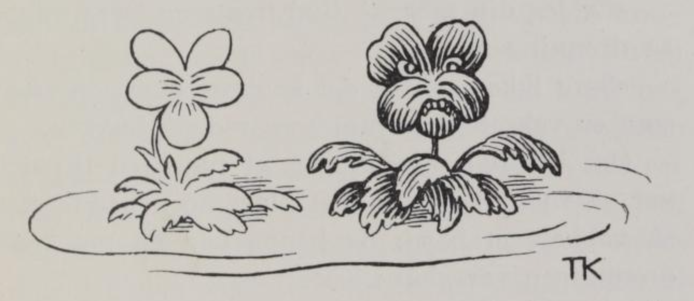
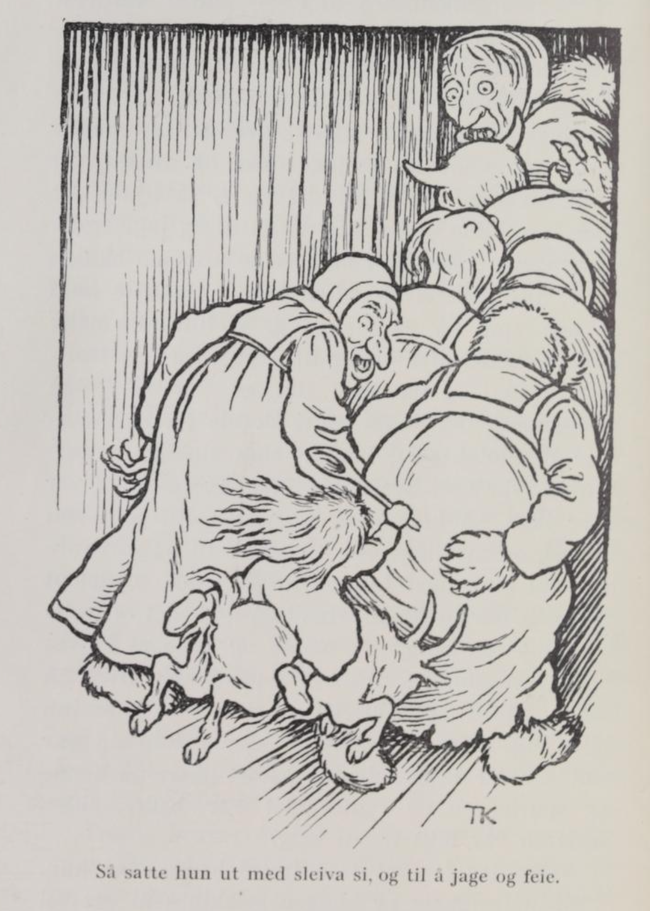
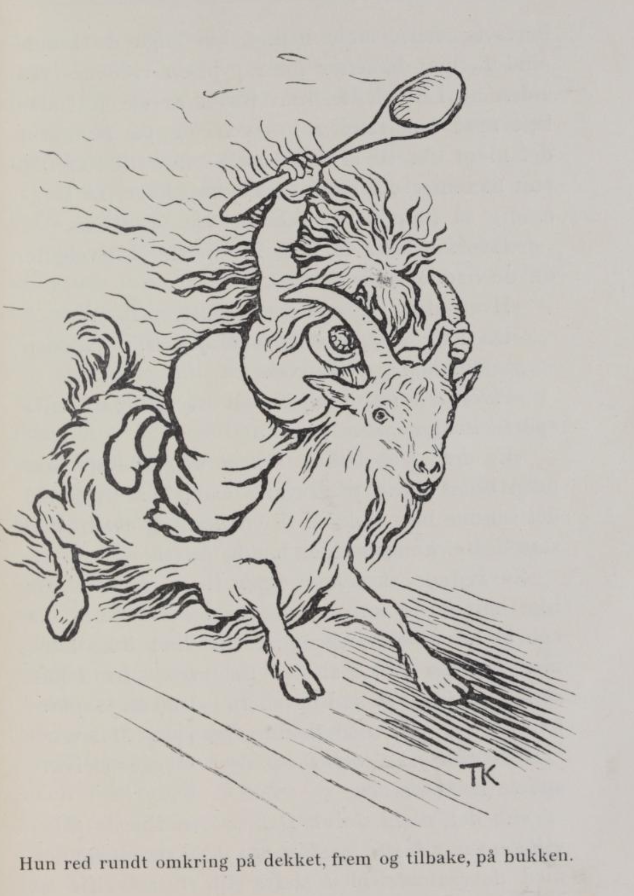

# Lurvehette

Det var en gang en konge og en dronning som ingen barn fikk, og det var dronningen så sorggiven for, at hun nesten ikke hadde en glad time. Støtt og stadig klaget hun, for det det var så ødslig og stilt i kongsgården; «hadde vi bare barn, så blev her nok liv,» sa hun. Hvor hun reiste i hele sitt rike, så fantes det Guds velsignelse av barn, selv i den fattigste stua; og hvor hun kom, så hørte hun kjerringa i huset skjente på ungene, og sa at nå hadde de gjort det og det gale igjen; dette syntes dronningen var morosamt, og det hadde hun lyst til å gjøre eller.

Til sist tok kongen og dronningen til sig et fremmed lite pikebarn; henne vilde de ha hos sig i kongsgården og oppdra, og henne vilde de skjenne på som sitt eget.

En dag sprang den lille jomfruen de hadde tatt til sig, nede i gården fremmenfor slottet og lekte med et gulleple. Så kom det ei fattig kjerring rekende; hun hadde også ei lita jente med sig, og det varte ikke lenge, så var jentungen og den lille jomfruen gode venner og gav sig til å leke sammen og trille gulleplet imellem sig. Dette så dronningen, som satt oppi vinduet på slottet; så pikket hun på ruten, at fosterdatteren skulde komme opp. Hun gjorde det, men fattigjenta blev med, og da de kom inn i salen til dronningen, holdt de hverandre i hånden. Dronningen skjente på den lille jomfruen; «det er ikke for dig å springe og leke med en fillete tiggerunge,» sa hun, og vilde jage jentungen ned igjen.

«Visste dronningen hvad mor mi kunde, så jaget hun ikke mig,» sa den vesle jenta, og da nå dronningen spurte henne nøiere ut, fortalte hun at mor hennes kunde skaffe dronningen barn. Det vilde ikke dronningen tro, men jenta blev ved sitt, og sa at det var sant hvert ord, og at dronningen bare skulde prøve å la mor hennes til.

Så lot dronningen den vesle jenta gå ned efter henne.

«Vet du hvad datter di sier?» spurte hun kjerringa, da hun kom innenfor døren.

«Nei,» det visste tiggerkjerringa ikke.

«Hun sier du kan skaffe mig barn, om du vil,» sa dronningen.

«Det er ikke for dronningen å høre efter det en fattigunge finner på,» sa kjerringa og strøk ut igjen.

Dronningen blev vond og vilde til å jage ned den vesle jenta igjen, men hun stod på sitt, at det var sant hvert ord hun hadde sagt.

«Dronningen skulde bare skjenke mor mi, så hun blev lystig, så visste hun nok råd,» sa jentungen.

Det vilde dronningen prøve; fattigkjerringa blev hentet opp én gang til og blev traktert både med vin og mjød, så mye hun vilde ha, og da varte det ikke lenge før hun fikk tungen på glid. Så kom dronningen igjen frem med spørsmålet sitt.

«En råd torde jeg vel vite,» sa fattigkjerringa. «Dronningen skal la bære inn to kar med vann, en kveld hun vil legge sig. I dem skal hun vaske sig og siden slå dem inn under sengen. Når hun ser under den om morgenen, så er det vokset opp to blomster, en vakker og en stygg. Den vakre skal hun spise, den stygge skal hun la stå. Men glem ikke det siste!» sa fattigkjerringa.

Ja, dronningen gjorde som kjerringa hadde rådet henne; hun lot vannet bære opp i to kar, vasket sig i vannet og slo det under sengen, og da hun så efter om morgenen, stod det to blomster; den ene var stygg og fæl og hadde svarte blad, men den andre var så lyslett og vakker at hun aldri hadde sett maken til den, og den spiste hun straks. Men den vakre blommen smakte så godt at hun ikke kunde bare sig; hun spiste den andre også. — «Det kan vel ikke gjøre noe fra eller til,» tenkte hun.

Om en tid kom dronningen i barselseng. Først fødte hun et pikebarn som hadde en sleiv i hånden og red på en bukk; stygg og fæl var hun, og med det samme hun kom til verden, ropte hun: «Mor!»

«Er jeg din mor, så Gud trøste og bære mig!» sa dronningen.

«Sorg ikke for det, det kommer snart én efter som er vakrere,» sa hun som red på bukken.

Om litt fikk dronningen et pikebarn til; det var så vakkert og vent, at aldri noen hadde sett så vakkert et barn; og henne kan en nok vite dronningen var glad i.

Den eldste kalte de Lurvehette, av det hun var så fæl og lurvete, og hadde en hette som hang i tafser kring hodet; henne vilde dronningen nødig se, og jentene prøvde stenge henne inn i et annet rum; men det nyttet ikke, der den yngste var, der vilde hun også være, og aldri kunde de få skilt dem fra hverandre.

Da de begge var halvvoksne, var det en julekveld det blev slikt forferdelig ståk og styr på svalen utenfor stuen til dronningen. Lurvehette spurte hvad det var som knartet og ramlet så ute på svalgangen. «Å det er aldri verdt å spørre om det,» svarte dronningen; men Lurvehette gav sig ikke, hun vilde endelig ha greie på det, og så fortalte da dronningen, at det var trollkjerringene som holdt juleleik der ute. Lurvehette sa at hun vilde ut og jage dem, og alt de bad henne at hun skulde la det være, så hjalp det ikke, hun vilde ut og hun måtte ut og jage trollkjerringene; men hun bad at dronningen skulde holde alle dørene stengt, så ikke en eneste kom så mye som på gløtt engang, sa hun. Så satte hun ut med sleiva si, og til å jage og feie trollkjerringene, og da blev det en rammel utpå svalgangen, slik at du aldri skulde ha hørt maken; det knaket og braket, som stokkehvarvene skulde ryke av i hvert laft. Men hvordan det var eller ikke, så kom den ene døren litt på klem likevel, og så vilde søsteren gløtte ut og se hvordan det gikk med Lurvehette, og stakk hodet ut gjennem dørsprekken. Husj! så kom det ei trollkjerring, tok hodet av henne og satte et kalvehode i steden, og straks tok prinsessen til å gå innpå gulvet og raute. Da Lurvehette kom inn igjen og fikk se søsteren, skjente hun og var sint, for det de ikke hadde passet likere på henne og spurte om de syntes det var bedre, siden søsteren var blitt til en kalv.

«Men jeg får vel se å frelse henne,» sa hun.

Hun forlangte av kongen et skib som var vel rustet og fullt ferdig; men styrmann og mannskap vilde hun ikke ha, hun vilde seile avsted med søsteren alene, og det måtte de tilsist la henne få lov til.

Lurvehette seilte bort og styrte like under det landet trollkjerringene bodde i, og da hun hadde kommet til bryggen, sa hun til søsteren at hun skulde bli på skibet og holde sig ganske stille der; men selv red Lurvehette på bukken opp til trollkjerringslottet. Da hun kom der, var det ene salsvinduet åpent, og der så hun hodet til søsteren stod i vinduskarmen; så red hun i fullt sprang inn i svalgangen og nappet hodet og satte avsted med det. Trollkjerringene efter og vilde ta igjen hodet, og de var om henne så tykt at de yrte og krydde; men bukken puffet og stanget med hornene, og selv slo og dasket hun med sleiva, og så måtte trollkjerringflokken gi sig. Og Lurvehette kom ned på skibet igjen, tok kalvehodet av søsteren og satte hennes eget hode på i steden, så søsteren blev til menneske som før; og så seilte hun langt, langt bort til et fremmed kongerike.

Kongen i det riket var enkemann og hadde bare en eneste sønn.

Da han fikk se det fremmede skibet, sendte han bud ned til stranden for å få vite hvor det var fra, og hvem det var som eide det; men da kongens folk kom derned, så de ikke en levende sjel på skibet uten Lurvehette — hun red rundt omkring på dekket, frem og tilbake på bukken, så hårtafsene stod om hodet på henne. Folkene fra kongsgården var rent opp i under over dette synet, og spurte om det ikke var fler ombord. «Å jo, hun hadde en søster med sig,» sa Lurvehette. Henne vilde da folkene se, men Lurvehette sa nei; «henne får ingen se, uten kongen kommer sjøl,» sa hun, og red omkring på bukken så det dundret i dekket.

Da nå tjenerne kom tilbake til kongsgården og fortalte om det de hadde sett og hørt nedpå skibet, vilde kongen straks i veien og se henne som red på bukken. Da han kom, leide Lurvehette ut søsteren, og hun var så vakker og så ven, at kongen blev rent forgapt i henne, der han stod. Han tok dem begge med sig opp på slottet, og søsteren vilde han ha til dronning, men Lurvehette svarte nei, henne kunde kongen ikke få på noen måte, uten kongssønnen vilde ha Lurvehette. Det kan du vite kongssønnen nødig vilde, så stygt et troll som Lurvehette var; men så lenge talte kongen og alle i kongsgården for ham, til han endelig gav sig, og lovte han skulde ta henne til dronning, men nødig gjorde han det, og sturen var han.

Så blev det laget til bryllup både med brygg og med bakst, og da alt var ferdig, skulde de reise til kirke; men prinsen syntes det var den tyngste kirkevei han hadde reist i hele sitt liv. Først kjørte nå kongen med bruden sin; hun var så vakker og så gild, at alle folk stanset og så efter henne; men da kongssønnen kom ridende med Lurvehette, var han så sturen og sorgmodig at han ikke talte et ord.

Om litt spurte Lurvehette hvorfor han ikke talte. «Hvorfor skal jeg tale?» svarte prinsen. «Du er så stygg at jeg ikke kan tale til dig.» «Du kan jo spørre hvorfor jeg rir på den stygge bukken,» sa Lurvehette. «Hvorfor rir du på den stygge bukken?» spurte kongssønnen. «Er det stygg bukk? Det er jo den gildeste hest en brud vil ride på,» sa Lurvehette, og med det samme blev bukken til en hest, den gildeste kongssønnen hadde sett i sine dager. Så red de et stykke igjen, men prinsen var like sturen og sa ikke et ord. Så spurte Lurvehette igjen hvorfor han ikke talte, og bad ham spørre hvorfor hun hadde den stygge sleiva i neven. «Hvorfor har du den stygge sleiva?» spurte kongssønnen. «Er det stygg sleiv? Det er jo den blankeste sølvvifte en brud vil vifte med,» sa Lurvehette, og med det samme var det det.

Så red de enda et stykke, men kongssønnen var like sturen og sa ikke et ord. Om litt spurte Lurvehette igjen hvorfor han ikke talte, og denne gangen sa hun at han skulde spørre, hvorfor hun hadde den stygge grå hetta på hodet. «Hvorfor har du den stygge grå hetta på hodet?» spurte kongssønnen. «Er det stygg hette? Det er jo den blankeste gullkrone noen brud vil bære,» svarte Lurvehette, og med det samme var den det.

Nå red de en lang stund igjen, og prinsen var sturen og satt der uten mål og mæle likesom før; så spurte bruden hans igjen hvorfor han ikke talte, og bad ham spørre hvorfor hun var så grå og stygg i ansiktet. «Ja, hvorfor er du så grå og stygg i ansiktet?» spurte kongssønnen. «Er jeg stygg? Du synes søster mi er vakker, men jeg er ti ganger vakrere,» sa bruden, og da kongssønnen så på henne, var hun så vakker, at han syntes det ikke kunde være så vakker en jomfru til i verden.

Da kan det vel hende at prinsen fikk munnen på gli, og ikke lenger red og hengte med hodet. Så drakk de bryllup både vel og lenge, og siden reiste både kongen og prinsen, hver med sin brud, til far til kongsdøtrene, og der drakk de bryllup på nytt lag, så det ingen ende vilde ta. Skynder du dig til kongsgården, så er det kanskje igjen en dråpe av bryllupsølet enda.
