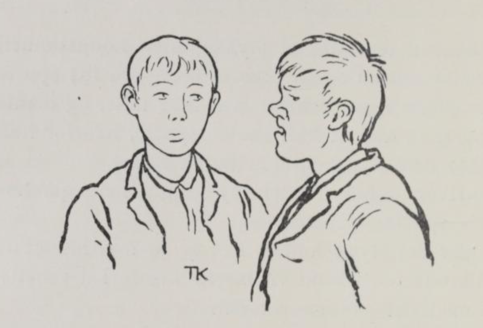
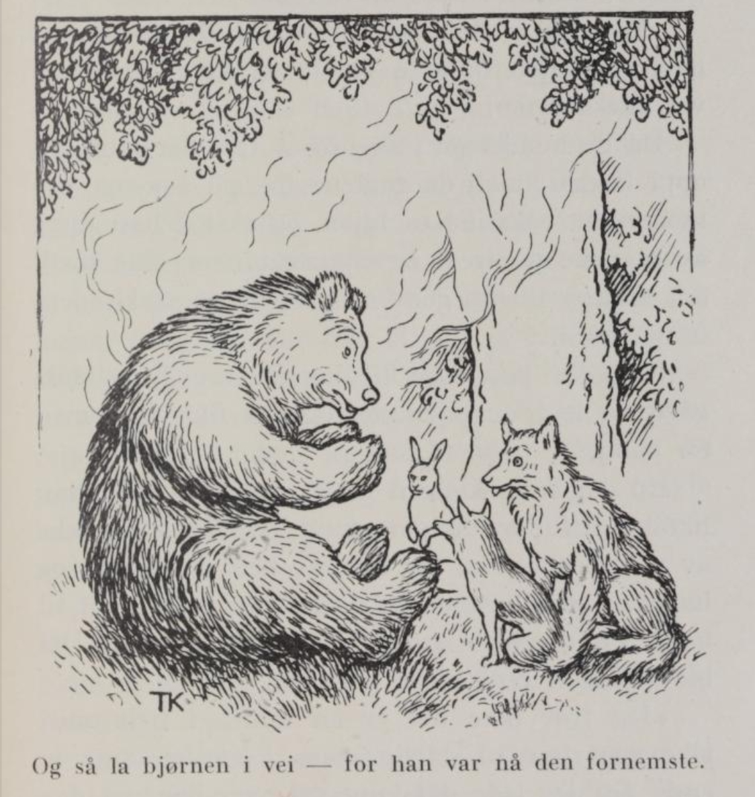
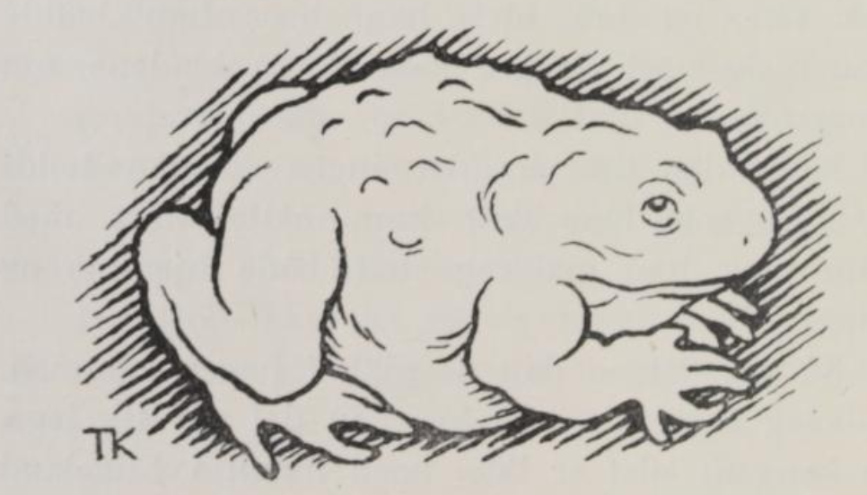

# Tro og Utro

Det var en gang to brødre, den ene hette Tro og den andre Utro. Tro var ærlig og god, men Utro var slem og full av løgn, så de aldri kunde lite på det han sa. Moren var enke og hadde ikke stort å leve av, og da sønnene var blitt voksne, måtte hun ha dem fra sig, så de selv kunde tjene sitt brød i verden. Hver av dem gav hun ei lita skreppe med mat, og så skulde de i veien.

Da de nå hadde gått til om kvelden, satte de sig på et vindfall i skogen og tok frem skreppene sine, for sultne var de efter å ha gått hele dagen, og så syntes de at nå skulde en matbete smake godt.

«Vil du som jeg, eter vi først av skreppa di, så lenge det er noe i den, så kan vi siden ta av mi,» sa Utro. Ja, det var Tro nøgd med, og så åt de; men alt det beste så Utro til å la putte i sig, og Tro fikk bare skorpene, og de brente lefsestykkene og fleskesvorene, han. Om morgenen åt de igjen av maten hans Tro, og om middagen også; men så var det ikke mer i skreppa hans.

Da de så hadde gått til ut på kvelden og skulde til å få sig mat igjen, vilde Tro ete av brorens skreppe; men Utro sa nei, og mente på at den maten var hans, og at han ikke hadde mer enn han godt trengte til sjøl.

«Ja, men du fikk jo ete av skreppa mi, så lenge det var noe i den,» sa Tro.

«Ja, når du er slik en tosk og lar andre ete op for dig, kan du ha det så godt,» mente Utro; «nå kan du sitte der og sikle nå,» sa han.

«Å ja, Utro heter du og utro er du, og det har du vært all din tid også,» sa Tro.

Da Utro hørte det, slo han sig sint, røk like på broren og stakk ut begge øinene på ham.

«Nå kan du se om folk er tro eller utro nå, din blindebukk,» sa han, og dermed strøk han fra ham.

Tro, stakkar, han gikk nå der og trevlet sig fram midt i tykke skogen; blind og alene var han, og ikke visste han hva han skulde ta sig til. Men så fikk han tak i et stort tykt lindetre, og så tenkte han at det fikk han klyve op i og sette sig der natten over, for villdyrene. «Når fuglene tar på å synge, så er det dag, og så får jeg vel friste å trevle mig videre fram,» tenkte han, og så kløv han op i linden.

Da han hadde sittet der en stund, hørte han det kom noen og tok til å koke og stelle nedunder treet, og straks efter kom det flere, og da de hilste på hverandre, hørte han det var bjørnen og gråbeinen, reven og haren, som kom og skulle holde jonsokleiek der. De gav seg til å ete og leve godt, og da de var ferdige med det, satte de sig til å snakke sammen.

Så sa reven: «Skal vi ikke fortelle en liten stubb hver, mens vi sitter her?»

Jo, det syntes de andre godt om, det kunde være morosamt, sa de, og så la bjørnen i vei - for han var nå den fornemste -: «Kongen av Engeland har så dårlige øine,» sa bamsen, «han kan næsten ikke se et kvart i været; men dersom han kom op i denne linden om morgenen, mens det var dugg på bladene, og han fikk av duggen og smurte på øinene sine, så fikk han synet sitt igjen, så godt som han noen tid har hatt det.»

«Ja,» sa gråbeinen, «kongen av Engeland har en døvstum datter også; men visste han det jeg vet, så fant han snart råd for henne. Ifjor da hun gikk til alters, så spyttet hun ut igjen brødet, og det kom ei stor padde og slukte; men når de bare grov under gulvet, så fant de padda, hun sitter bent under knefallet, og brødet sitter i halsen på henne ennu. Når de skar op padda og tok brødet og gav kongsdatteren, så blev hun som andre folk igjen både til å høre og tale.»

«Ja, ja,» sa reven, «når kongen av Engeland visste det jeg vet, så hadde han ikke vondt for vann i kongsgården sin; under den store steinen midt i gården hans er det klareste kildevann noen kan ønske sig, bare han visste å grave der.»

«Ja,» sa haren, «kongen av Engeland har den vakreste frukthagen i hele landet, men den bærer ikke så mye som en eplekart engang; for det ligger en svær gullkjede tre ganger rundt om hagen. Fikk han gravd op den, så blev det den gildeste hagen i hele hans rike.»

«Men nå er det langt på natta, og vi lar nok gå hjem igjen nå,» sa reven, og så gikk de sin vei allesammen.

Da de hadde gått, så sovnet Tro, der han satt oppi linden; men da fuglene tok på å synge om morgenen, våknet han igjen, og så tok han dugg av bladene på treet og smurte øinene sine med; da så han likeså godt som før Utro stakk dem ut på ham.

Så gikk han like til kongen av Engelands gård og bad om tjeneste, og det fikk han med en gang.

En dag kom kongen ut på gården, og da han hadde gått der ute en stund, vilde han drikke av vannposten sin, for det var hett om dagen og han var blitt tørst; men da de øste op vannet til ham, var det både grumset og seigt og stygt. Det blev kongen rent harm over.

«Jeg tror ikke det er en mann i hele mitt rike som har så dårlig vann i gården sin, og enda må jeg lede det lang vei over berg og daler!» sa kongen.

«Ja, men når du vilde la mig få folk til å bryte op den store steinen som ligger her midt på gården, skulde du nok få både mye og godt vann,» sa Tro.

Ja, det var kongen straks ferdig til, og aldri før hadde de fått op steinen og gravd en stund, så stod vannspruten bent i været, så klar og kvikk som den skulde komme av en tønnetut; og klarere vann fantes ikke i hele Engeland.

En tid efter var kongen nedpå gården igjen; så kom det en stor hauk flygende efter hønsene hans, og alle til å klappe i hendene og skrike: «Der flyger'n! Der flyger'n!» Kongen grep bøssa si og la til å sikte; men han kunde ikke se så langt. Så blev han rent ute av det. «Gud gi noen kunde si mig råd for øinene mine! Jeg mener snart jeg blir rent blind,» sa kongen. «Det skal nok jeg si dig,» sa Tro, og så fortalte han hvordan han hadde båret sig at; og kongen reiste da til linden, samme kvelden, det kan du nok vite, og bra blev han, bare han hadde smurt sig med duggen som lå på bladene om morgenen.

Siden den tid var det ingen kongen holdt så gjæv som han Tro; han måtte være med ham hvor han gikk og stod, både hjemme og borte.

Så var det en dag de gikk i hagen sammen. «Jeg skjønner ikke hvordan det går til, jeg,» sa kongen; «det er ikke noen mann i Engeland som koster så mye på hagen sin som jeg, og enda kan jeg ikke få et eneste tre til å bære så mye som en kart.»

«Ja, ja,» sa Tro, «får jeg bare det som ligger tre ganger rundt om hagen din, og folk til å grave det op, så skal nok hagen bære.»

Ja, det vilde kongen gjerne; Tro fikk folkene, og til å grave, og så fikk han tilsist op hele gullkjeden. Nå var Tro en grunnrik mann, mye, mye rikere enn kongen sjøl, men kongen var enda vel nøgd, for nå bar hagen, så grenene hang like ned på bakken, og så søte epler og pærer hadde aldri noen smakt.

En dag igjen gikk Tro og kongen og snakket sammen; så kom kongsdatteren gående forbi dem, og kongen blev rent sorgmodig, da han så henne.

«Er det ikke synd, at så vakker en kongsdatter som min, skal vante mål og mæle?» sa han til Tro.

«Ja, men det er råd for det,» sa Tro.

Da kongen fikk høre det, blev han så glad at han lovte ham kongsdatteren og halve riket, dersom han kunde få henne god igjen.

Tro fikk med sig et par mann bort til kirken og grov frem padda som satt under knefallet ved alteret, skar henne op og tok ut brødet og gav kongsdatteren det, så blev hun som andre folk igjen til å tale straks på timen.

Nå skulde da Tro ha kongsdatteren, og det blev laget til bryllup, for det skulde holdes så det både kunde høres og spørres over hele riket.

Mens de så holdt på å danse i bryllupet, kom det en fattiggutt og bad om en matbete, og han var så fillete og ynkelig å se på, at alle forkorset sig over ham; men Tro kjente ham igjen med en gang, og så at det var Utro, bror sin.

«Kjenner du igjen mig?» sa Tro.

«Å, hvor skulde jeg ha sett så stor en herre, jeg da?» sa Utro.

«Sett mig har du nok likevel,» sa Tro; «det var mig du stakk øinene ut på, et år idag siden. Utro heter du og utro er du, det sa jeg og det sier jeg ennu; men du er nå bror min likevel, og derfor skal du få litt mat, og så kan du gå til det lindetreet, der jeg satt ifjor. Får du så høre noe som kan gjore din lykke, så er det dig vel unt.»

Ja, det slapp han si Utro to ganger. «Har han Tro hatt slik nytte av å sitte i lindetreet, at han er blitt konge over halve Engeland siden ifjor, så —,» tenkte han; han la i veien og kom til linden, og den kløv han op i.

Han hadde ikke sittet der lenge, så kom alle dyrene og åt og drakk og holdt jonsokleik ned under treet igjen. Da de hadde ett fra sig, vilde reven at de skulde til å fortelle historier, og da kan det vel hende han Utro la til å lye, og det så ørene var ferdige til å dette av ham. Men bjørnen var sint han og brummet og sa: «Det har noen sladret om det vi fortalte ifjor, og og derfor vil vi nå tie med det vi vet.» Og så bad dyrene godnatt og gikk fra hverandre, og Utro var like klok.

Det var for det han hette Utro og var utro, det.
