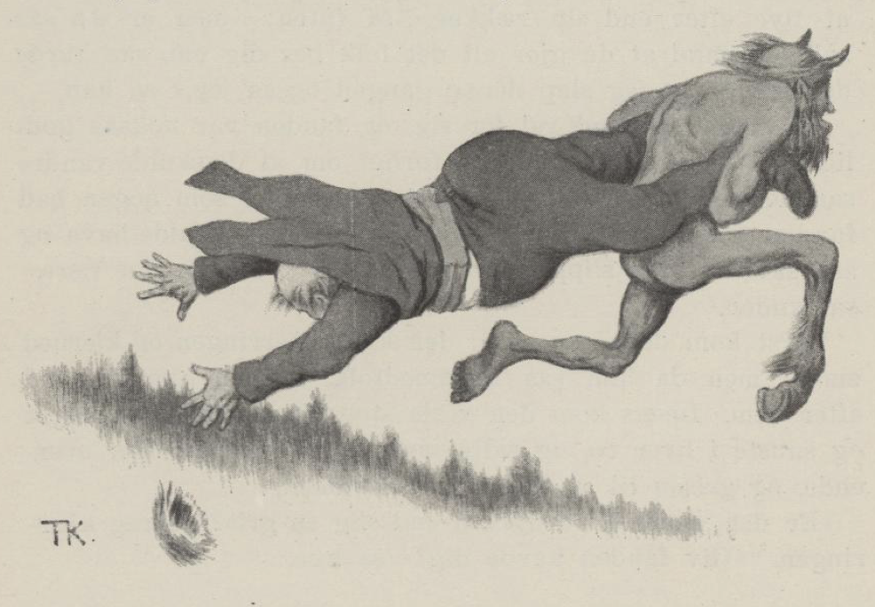

# Fanden og futen

Der var en gang en fut, slik en riktig flåer av det verste slaget. En dag kom fanden og ville hente ham. «Aldri hører jeg annet,» sa han, «enn at folk sier: 'Giv fanden hadde denne futen!' så nå får du følge med meg; og så slem er du og, så jeg ikke tror du kan bli slemmere og verre enn du er heller,» sa fanden.

«Ja, vil du løpe etter alt det folk snakker, så får du mer å fly etter enn du rekker,» sa futen; «men er du så snill en mann at du gjør alt det folk ber deg om, så turde det hende at jeg slipper denne gangen også jeg,» sa han.

Ja, futen snakket vel for seg, og fanden var nokså godlidende; så til sist ble de forlikt om at de skulle vandre sammen et stykke, og den første de møtte, som noen ba fanden ta, ham skulle det bli som fanden skulle ha, og så skulle futen slippe. «Men hjertelig måtte det være,» sa fanden.

Først kom de til en stue; der stod kjerringen og kjernet smør; men da hun så fremmedfolk, måtte hun titte ut etter dem. I mellomtiden kom den vesle stuegrisen hennes, som gikk og snuste i hver krok, og satte trynet opp i kjernen; den veltet, og grisen til å smatte på rømmen.

«Er der verre skadedyr til enn slik en gris?» skreik kjerringen. «Giv fanden hadde deg!» sa hun.

«Så ta grisen da!» sa futen.

«Tror du hun unner meg griseflekket?» sa fanden. «Hva skulle hun så ha til helgekost i vinter? Nei, det var ikke av hjertet!»

Så gikk de til de kom til en annen stue. Her hadde den vesle ungen gjort ugagn. «Rett nå er jeg lei deg,» sa kjerringen, «jeg vinner ikke annet enn å gå og tørke og stelle etter denne stygge ungen. Giv fanden hadde deg!» sa hun.

«Så ta ungen da!» sa futen.

«Å det er ikke av hjertet at moren banner barnet,» sa fanden.

Så gikk de et stykke til; der møtte de to bønder.

«Der ser du futen vår,» sa den ene.

«Giv fanden hadde ham lyslevende, den bondeflåeren!» sa den andre.

«Det var av hjertet det,» sa fanden; «kom så med meg!» sa han.

Da hjalp der hverken bønn eller påkallelse.

