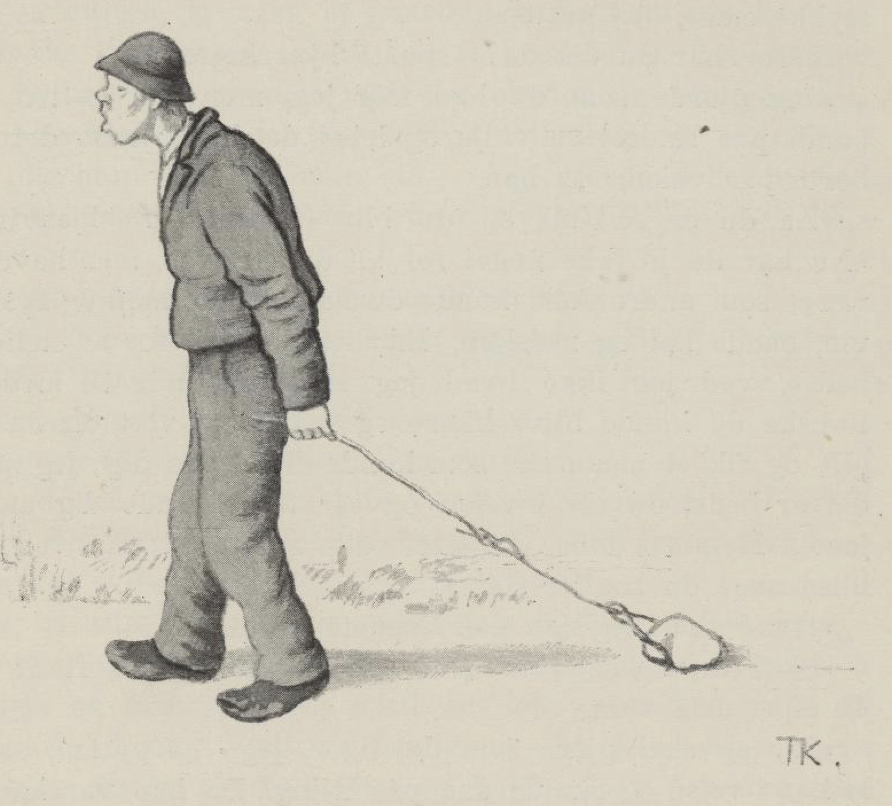

# Gale-Mattis

Der var en gang en kjærring, som hadde en søn som het Mattis. Men han var så tullet at han ikke hadde forstand på nogen ting; ikke tok han seg stort til heller, men det vesle han gjorde, blev altid bagvendt og aldri rigtigt; derfor kaldte de ham aldri andet en Gale-Mattis.

Dette syntes kjærringen var ilde, og endda værre syntes hun det var at sønnen gikk der og aldri tok seg andet til end drage seg ut med veggene.

Tett ved der de bodde, gikk en stor elv, og den var strid og slem å komme over. Så sa kjærringen en dag til gutten, at der ikke var vondt for tømmerskog der, den vokste mest innpå stueveggen; han fikk hugge, drive frem, og prøve å bygge bro over elven og ta told, så hadde han både noget å gjøre og noget til levemåde også.

Ja, det syntes Mattis også; for mor hans hadde sagt det; det hun bad ham om, det skulle han gjøre, det var visst, sa han, og det hun sa, det skulle være så og ikke anderledes. Han hugget tømmer og drev det frem og bygget bro. Det gikk ikke felende fort med arbeidet, men så hadde han da noget å ta seg til, mens det stod på.

Da broen var færdig, skulle gutten stå nede ved den og ta told av dem som ville fare over, og mor hans sa, han skulle ikke slippe over nogen, med mindre de betalte told; det fikk være det samme, om det ikke altid var penger; varer var også god betaling, sa hun.

Den første dagen kom der tre karer med hver sitt høilass og ville over broen.

«Nei,» sa gutten, «dere får ikke fare over, før jeg har fått told.»

«Vi har ikke noget å betale med,» sa de.

«Ja, så kommer dere ikke over; men det får være det samme, om det ikke er penger; varer er også god betaling,» sa gutten.

Så gav de ham hver en dott høi, så han hadde et lidet kjelkelass; så skulle de få lov å fare over broen.

Så kom der en skreppekræmmer, som hadde synåler og tråd og andet skreppegods, og ville over.

«Du får ikke fare over, før du har betalt told,» sa gutten.

«Jeg har ikke noget å betale med,» sa kræmmeren.

«Du har vel varer?» sa gutten.

Så tok kræmmeren frem et par synåler og gav ham; så fikk han fare over broen. Gutten stikk nålene inn i høiet, og så reiste han. Da han vel var kommet hjem, så sa han: «Nu har jeg fått told og noget til levemåde!»

«Hvad fikk du da?» sa kjærringen.

«Å, der kom farende tre karer med hver sitt høilass; de gav meg en høidott hver, så jeg fikk et lidet kjelkelass; og så fikk jeg et par synåler av en skreppekræmmer,» sa gutten.

«Hvor gjorde du av høiet?» sa kjærringen.

«Jeg tygget på det jeg; men det smakte bare græs, så kastet jeg det til elven,» sa gutten.

«Det skulle du bredt ut over låvegulvet,» sa kjærringen.

«Det skal jeg gjøre en anden gang det, mor,» sa gutten.

«Hvor gjorde du av synålene da?» sa kjærringen.

«Jeg stikk dem i høiet,» sa gutten.

«Å du er en tull!» sa kjærringen; «du skulle stukket dem ut og inn i luen din.»

«Ja, ti still, du mor, det skal jeg gjøre en anden gang,» sa gutten.

Neste dagen, da gutten var nede ved broen igjen, kom der en mann fra kvernen med en melkløv og ville over.

«Du kommer ikke over, før du betaler told,» sa gutten.

«Jeg har ikke skillinger å betale med,» sa mannen.

«Ja, så kommer du ikke over,» sa gutten; «men varer er god betaling,» sa han. Så fikk han et melpund, og så slapp han mannen over.

Det var ikke lenge før der kom farende en smed med en kløv smedarbeide og ville over. Men det var det samme.

«Du får ikke komme over, før du betaler told,» sa gutten. Men han hadde heller ikke penger å betale med, så gav han gutten en navar, og så slapp han over.

Da gutten kom hjem til mor sin, så var tolden det første hun spurte om. «Hvad fikk du til told idag?» sa hun.

«Å, der kom en mann fra kvernen med en melkløv, han gav meg et melpund, og så kom der en smed med en kløv smedarbeide, han gav meg en navar,» sa gutten.

«Hvad gjorde du av navaren da?» sa kjærringen.

«Jeg gjorde som du bad meg jeg, mor,» sa gutten; «jeg stikk den ut og inn i luen min.»

«Ja, men det er galt det,» sa kjærringen; «den skulle du ikke ha stukket ut og inn i luen din, men du skulle stukket den inn i trøieærmet ditt.»

«Ja ja, ti still, du mor, det skal jeg gjøre en anden gang,» sa gutten.

«Hvad gjorde du av melet da?» sa kjærringen.

«Å jeg gjorde som du bad meg jeg, mor,» sa gutten; «jeg bredde det ut over låvegulvet.»

«Jeg har aldri hørt så galt!» sa kjærringen; «du skulle gått hjem efter et spand og havt det i,» sa hun.

«Ja, ti still, du mor, det skal jeg gjøre en anden gang,» sa gutten.

Dagen efter var gutten ved broen igjen og skulle ta told. Så kom der én med en brennevinsklǿv og ville fare over.

«Du kommer ikke over, før du betaler told,» sa gutten.

«Jeg har ikke skillinger,» sa kløvkaren.

«Ja, så får du ikke komme over; men du har vel varer?» sa gutten. Ja, så fikk han en halv pot brennevin, og den slo han i trøieærmet sitt.

En stund efter kom der én med en gjetedrift og ville over broen.

«Du kommer ikke over, før du betaler told,» sa gutten.

Ja, han var ikke rigere han end de andre; han hadde ingen penger; men så gav han gutten en liden gjetebuk, og så kom han over med driften sin. Men gutten tok bukken og trådte ned i en ambar han hadde taget med. Da han kom hjem, spurte kjærringen igjen:

«Hvad fikk du idag?»

«Å der kom én med en brennevinsklǿv; ham fikk jeg en halv pot brennevin av,» sa gutten.

«Hvad gjorde du med det?» sa kjærringen.

«Å jeg gjorde som du bad meg jeg, mor,» sa gutten; «jeg slo det i trøieærmet mitt.»

«Ja, men det var galt det, søn min; du skulle ha gått hjem efter en flaske og slått det i,» sa hun.

«Ja, ti still, du mor, det skal jeg gjøre en anden gang det,» sa gutten. «Så kom der en mann med en drift gjeter, han gav meg en liden gjetebuk, og den trådte jeg ned i ambaren,» sa han.

«Det var galt, og galere enn galt det, søn min,» sa kjærringen; «du skulle ha bundet på den en vidje og leiet bukken hjem med,» sa mor hans.

«Ja, ti still, du mor, det skal jeg gjøre en anden gang,» sa gutten.

Neste dagen la han ned til broen igjen og skulle ta told. Så kom der en mann med en smørklǿv, og ville over broen. Men gutten sa, han fikk ikke komme over, før han betalte told.

«Jeg har ikke noget å betale med,» sa mannen.

«Ja, så får du ikke fare over,» sa gutten; «men har du varer, kan jeg ta dem for god betaling,» sa han.

Så gav mannen ham et smørstykke, da fikk han lov til å fare over broen og gutten strøg til vidjeskogen, vred en vidje, satte den på smørstykket, og drog det hjem efter veien; men hvor han gikk, blev der liggende noget igjen av smøret, og da han kom hjem, hadde han ikke mer igjen.

«Hvad fikk du idag?» sa mor hans.

«Der kom en mann med en smørklǿv, han gav meg et stykke smør,» sa gutten.

«Hvor har du det da?» spurte kjærringen.

«Jeg gjorde som du bad meg jeg, mor,» sa gutten, «jeg bandt på smøret en vidje og leiet det hjem; men det blev borte på veien,» sa han.

«Å du er en tull, og du blir en tull!» sa kjærringen. «Nu har du jo ikke noget for alt det strevet; men hadde du vært som andre folk, kunne du havt både mad og brennevin, både høi og redskap. Er du ikke god for å stelle deg bedre, ved jeg ikke hvad jeg skal ta meg til med deg. Kanskje du kunne bli likere og få noget vett, om du blev gift og fikk et menneske som kunne stelle på deg; jeg mener det er best du tar i veien og ser til å finne deg en bra jente. Men så må du bære deg snildt ad på veien, og hilse når du treffer folk.»

«Hvad skal jeg si da?» spurte gutten.

«Skal du spørre om det?» sa moren. «Guds fred! skal du si, må vide.»

«Ja, jeg skal gjøre som du sier, jeg,» sa gutten, og så la han i veien og skulle gå på friing. Da han var kommet et stykke på veien, møtte han en gråben med syv unger, og da han kom så langt frem at han var ved siden av den, stanset han og hilste: «Guds fred!» Da han hadde sagt det, gikk han hjem igjen. «Jeg sa som du bad meg jeg, mor,» sa gutten.

«Hvad sa du da?» spurte moren.

«Guds fred! sa jeg,» sa gutten.

«Hvem møtte du da?» spurte moren.

«Jeg møtte en skrubb med syv unger jeg,» sa gutten.

«Ja, du er lig deg selv du!» sa moren. «Hvorfor skulle du si Guds fred til skrubben? Du skulle ha klappet sammen hendene og sagt: «Husj! husj! di skrubbe!» skulle du sagt.»

«Ja, ti still, du mor, det skal jeg si en anden gang det,» sa gutten og strøg av gårde, og da han var kommet et stykke på veien, møtte han et brudefølge. Så stanset han, da han var kommet midt for bruden og brudgommen, slo hendene sammen og sa: «Husj! husj! di skrubbe!»

Så gikk han hjem til mor sin. «Jeg gjorde som du bad meg jeg, mor,» sa gutten; «men stryk fikk jeg for det,» sa han.

«Hvad gjorde du da?» spurte kjærringen.

«Jeg slo hendene sammen og sa: «Husj! husj! di skrubbe! jeg,» sa gutten.

«Hvem møtte du da?» sa kjærringen.

«Jeg møtte en brudeferd,» sa gutten.

«Å du er en tull; du blir lig deg!» sa moren. «Hvorfor skulle du si så til brudefærden? «Rid lystig, brud og brudgom!» skulle du sagt,» sa kjærringen.

«Ja, ti still, du mor, det skal jeg si en anden gang,» sa gutten og la i veien igjen. Så møtte han en bjørn, som red på en hest. Gutten bied til han kom ved siden av dem. «Rid lystig, brud og brudgom!» sa han, og så gikk han hjem igjen, og fortalte han hadde sagt det som mor hans bad ham.

«Hvad sa du da?» spurte mor hans.

«Rid lystig, brud og brudgom! sa jeg,» svarte gutten.

«Hvem møtte du da?» spurte mor hans.

«Jeg møtte en bjørn, som red på en hest,» sa gutten.

«Kors for en tull du er!» sa moren. «Til helvete med deg! skulle du sagt,» sa hun.

«Ja, ti still, du mor, det skal jeg gjøre en anden gang,» sa gutten.

Så la han avsted igjen og møtte et ligfølge; da han kom midt for liget, hilste han og sa: «Til helvete med deg!» Så la han hjem til mor sin, og fortalte han hadde sagt som hun bad ham.

«Hvad sa du da?» spurte kjærringen.

«Til helvete med deg! sa jeg,» svarte gutten.

«Hvem møtte du da?» spurte mor hans.

«Jeg møtte et ligfølge,» sa gutten; «men stryk fikk jeg,» sa han.

«Ja, det skulle du havd mer av,» sa kjærringen; «Gud være din arme sjel nådig! skulle du sagt,» sa hun.

«Ja, ti still, du mor, det skal jeg gjøre en anden gang det,» sa gutten, og så strøg han avsted igjen. Da han kom et stykke på veien, fikk han se et par stygge langfanter som flådde en bikkje. Da han kom frem til dem, så hilste han og sa: «Gud være din arme sjel nådig!» og da han hadde sagt det, gikk han hjem igjen og fortalte at han hadde sagt det mor hans bad ham; men stryk fikk han, så han nesten ikke orket å drage seg hjem.

«Hvad sa du da?» spurte kjærringen.

«Gud være din arme sjel nådig! sa jeg,» svarte gutten.

«Hvem møtte du?» spurte mor hans.

«Det var et par langfanter som flådde en bikkje,» sa gutten.

«Ja du blir lig deg du!» sa kjærringen. «Det er både synd og skam som du farer frem. En skulle aldri hørt slik styghet,» sa hun. «Men nu får du fare i veien en gang til og ikke bry deg om hvem du møter, for du får bort å gifte deg, og se om du kan få en som skjønner bedre på verdens løp og er klokere til å styre enn du. Men nu får du skikke deg som folk, og går det vel, får du ønske til lykke og skrie hurra,» sa hun.

Ja, gutten gjorde alt det som mor hans bad ham om. Han la i veien og fridde til en jente, og hun syntes at gutten kunne ikke være så lei endda, og så sa hun ja, hun ville ha ham.

Da gutten kom hjem, ville kjærringen vite hvad jenten hans het. Men det visste han ikke. Så blev kjærringen sint, og sa at han fikk gå i veien igjen; for nu ville hun vite hvad jenten hans het. Med det samme gutten skulle reise hjem igjen, sanset han så mye, at han spurte om hvad hun het. Jo, hun het «Sølvi», sa hun. Gutten sprang og mullet ved seg selv:

> «Sølvi, Sølvi,  
> tausa mi!  
> Sølvi, Sølvi,  
> tausa mi!»

Men ret som han rendte så fort, for at han skulle komme hjem før han hadde glemt det, stupte han over en tue, og så glemte han navnet igjen. Da han kom på benene, begynte han å lete rundt omkring tuen, men han fant ikke andet enn et grev. Det tok han, og til å grave og lete alt han orket. Som han stod der og grov, kom der en gammel mann.

«Hvad er det du graver efter?» sa mannen. «Har du mistet noget her?»

«Å ja, å ja, jeg har mistet navnet til tausa mi,» sa gutten; «men jeg kan ikke finne det igjen,» sa han.

«Jeg tror hun heter Sølvi,» sa mannen.

Da gutten hørte det, rendte han avsted med grevet i hånden og ropte:

> «Sølvi, Sølvi,  
> tausa mi!»

Men da han var kommet litt bort på jordet, kom han i hug at han hadde taget grevet med seg, og så kastet han det tilbage, lige i foten på mannen. Mannen til å skrige og bære seg, som der satt en kniv i ham, og så glemte gutten navnet og løp hjem det forteste han kunne, og da han kom hjem, var det første mor hans spurte: «Hvad heter jenten din?» Gutten var lige klok; han visste det ikke bedre nu enn den første gangen.

«Du er samme stortullen du,» sa kjærringen. «Du kommer nok ingen vei med dette heller du. Men nu får jeg selv reise i veien, og hente jenten din her hjem og få giftet deg. Imens får du bære vann på femte veggen[^1], og så får du ta noget av bust, og noget av bog[^2], og det grønneste i kålhagen får du ta, og koke alt, og når du har gjort det, får du fjære deg vel opp, så du er søt gut til jenten din kommer, og så kan du sette deg på stabben.»

Ja, det mente gutten han nok skulle gjøre; han bar vann og slo inn i stuen, så det hadde skikk; men han kunne ikke få det til å stå høiere enn på det fjerde bjelkelaget; når det kom høiere, rant det ut. Så måtte han holde opp med det. Men nu hadde de en hund som het Bust, og en katt som het Bog; dem tok han og puttet i soddgryden. Det grønneste han fant i kålhagen, var en grøn kjole, som kjærringen hadde eslet sønnekonen sin; den hakket han fin og hadde på soddet; men grisen, som het Alt, den kokte han for seg selv i bryggepanden. Da gutten vel hadde gjort fra seg det, fant han seg en krukke med sirup og en fjærdyne; først smurte han seg med sirupen, og siden sprettet han opp dynen og veltet seg i fjæren, og så satte han seg på stabben ute i kjøkkenet, til moren og jenten kom.

Det første kjærringen savnet, da hun kom til gårds, var hunden, for den pleiet altid møte henne på jordet. Det neste hun savnet, var katten, for den møtte henne altid i svalen, og når det var rigtig godt veir og solskin, så kom den ut på tråkken og møtte henne ved grinden. Den grønne kjolen hun hadde eslet sønnekonen sin, så hun heller ikke, og grisen, som gryntet og fulgte henne hvor hun gikk, den var ikke der, den heller. Så skulle hun til å spørre om det; men i det samme hun lettet på klinken, stod vannet ut igjennem døren som en foss, så de nær var blit borte i flommen, både kjærringen og jenten.

De måtte gå omkring til kjøkkendøren, og da de kom inn, satt denne skikkelsen oppfjæret der.

«Hvad er det du har gjort?» sa kjærringen.

«Jeg gjorde som du bad meg jeg, mor,» sa gutten; «jeg bar vann på femte veggen; men lige så fort som jeg bar inn, rant det ut, så jeg ikke fikk det høiere enn på den fjerde.»

«Ja men Bust og Bog da?» sa kjærringen, og ville slå det bort i noget andet, «hvor har du gjort av dem?» sa hun.

«Jeg gjorde som du bad meg jeg, mor,» sa gutten, «jeg tok og la dem i soddgryden. De både skreg og de låt, og de bet og de klorte, og han Bust var sterk og sparket imod, men han måtte til til sidst likevel, og Alt, han koker i bryggepanden i storhuset, for ham var der ikke rum til i soddgryden!» sa han.

«Men hvad har du gjort av den nye grønne kjolen jeg hadde eslet sønnekonen min?» sa kjærringen, og ville slå bort galskapen hans.

«Å jeg gjorde som du bad meg jeg, mor,» sa gutten. «Den hang i kålhagen, og den var det grønneste som var der, så tok jeg den og hakket den smått og hadde på soddgryden.»

Kjærringen bort i skorstenen, rev gryden av, slo ut alt sammen, og fikk på en ny en. Men da hun fikk se på gutten, blev hun rent skræmt.

«Hvordan er det du ser ut da?» sa hun.

«Jeg gjorde som du bad meg jeg, mor,» sa gutten; «først så smurte jeg meg med sirup og gjorde meg søt, og siden så sprettet jeg opp dynen og fjæret meg vel opp,» sa han.

Ja kjærringen slo det bort så godt hun kunne, fikk ribbet fjærene av gutten, vasket ham, og fikk klær på ham igjen.

Så skulle de ha bryllup; men først skulle Mattis gå til byen og selge en ko og kjøpe til bryllups for. Kjærringen sa ham hvorledes han skulle bære seg ad, og både det første og det siste var, at han endelig måtte se at få noget for kuen. Ja, gutten mente nok at han skulle få noget for den. Da han kom på torvet med kuen, og de spurte hvad han skulle ha for den, var der ikke andet svar å få av ham, enn at han skulle ha «noget» for den.

Så kom der en slakter, og han bad ham ta kuen og følge med hjem, så skulle han få «noget» for den. Ja, gutten tok med kuen, og da han kom frem, så spyttet slakteren i neven på gutten og sa: «Der har du noget for kuen din, men pass vel på det!»

Gutten gikk så varlig som han gikk på egg, og holdt neven igjen; men da han var kommet så langt som på bygdeveien nedenfor jordet, møtte han presten, som kom kjørende.

«Luk opp grinden for meg, min gut!» sa presten.

Gutten skyndte seg å lukke opp, men glemte det han hadde i hånden, og grep til med begge hender, så det blev siddende igjen på grinden. Da han kjente, at det var borte, blev han sint, og sa at «han far» hadde taget «noget» fra ham. Men da presten spurte om han ikke var rigtig, og sa at han ikke hadde taget noget fra ham, blev gutten så harm at han slo presten ihjel, og grov ham ned i en myr ved veien. Da han var kommet hjem, fortalte han moren det, og hun slaktet en gjetebuk og la ned der gutten hadde lagt presten, og presten grov hun ned et andet sted. Da hun hadde gjort det, hengte hun over en gryde med grynvelling, og da den var kokt, fikk hun Mattis til å sette seg i peisen og spikke stikker. Imens gikk hun opp på taket med gryden og heldte grynvellingen ned igjennem, så den flømmet over gutten.

Dagen efter kom lensmanden. Da han spurte, dulgte ikke Mattis for det at han hadde slått presten ihjel, og han sa han gjerne skulle vise lensmanden hvor han hadde lagt han far også. Lensmanden spurte hvilken dag det var.

«Det var den dagen da det regnet grynvelling over al verden,» sa gutten. Da han så kom dit med lensmanden, hvor han hadde gravet presten ned, trakk han frem gjetebukken og spurte: «Hadde presten jeres horn?» Men da øvrigheden hørte det, trodde den at gutten var rent fra vettet, og så slapp han.

Så skulle brylluppet stå, og kjærringen snakket både godt og vel for gutten, og sa at når de kom til bordet, måtte han bære seg vakkert ad; han måtte ikke se for mye på bruden, men kaste et øie på henne nu og da; erterne kunne han æde selv, men eggene måtte han skifte med henne, og benene skulle han ikke legge utmed seg på bordet, men han måtte legge dem vel sammen opp på tallerkenen.

Ja, Mattis skulle gjøre det, og gjøre det vel også; han gjorde alt det mor hans bad ham om, han, og ikke noget andet. Han strøg ut i sauehuset og stikk ut øinene på alle de sauer og gjeter der fantes, og tok dem med seg. Da de kom til bords, satte han seg med ryggen til jenten; men bedst han satt, kastet han et saueøie, så det klintet seg i ansiktet på henne; om en liden stund kastet han ett til, og slik holdt han på. Eggene åt gutten alle sammen, så jenten fikk ikke smake ett; men da erterne kom, skiftet han med henne. Da de så hadde spist en stund, la gutten føttene sine sammen, og opp på tallerkenen med dem.

Om kvelden da de skulle legge seg, var jenten kjei og lei, og hun syntes der ikke var nogen hjelp i å ha slik en tull til mann. Så sa hun at hun hadde glemt noget, hun ville gå ut litt. Men det måtte hun slett ikke få lov til; gutten ville følge med henne, for han var ræd for, at hun ikke skulle komme inn igjen.

«Nei, lig still du!» sa bruden; «her er et langt busterep; det skal jeg binde på meg, og så skal jeg la døren stå åpen. Synes du da at jeg blir for lenge, kan du bare trekke i repet, så drar du meg inn igjen.»

Ja, det var Mattis nøid med; men da jenten kom ut på tråkken, møtte hun en gjetebuk, løste av seg repet og bandt det på gjetebukken.

Da gutten syntes at hun blev lenge ute, begynte han å trekke i repet, og så drog han gjetebukken opp i sengen til seg. Da han hadde ligget en stund, ropte han:

«Mor, mor, bruden min har horn som en gjetebuk!»

«Ei, stygge gutten ligger og våser!» sa mor hans; «det er hårflettene hennes vesla, ved jeg.»

Ret som det var, skreg gutten igjen:

«Mor, mor, bruden min har ragg som en gjet!»

«Ei, du stygge gutten, ligger og galer!» sa kjærringen.

Men der var ingen ro å få, for ret som det var, skreg og gol gutten om at jenten hans var som en gjetebuk, både i ett og andet. Da det led på morgenen, sa kjærringen:

«Klyv opp du, søn min, og gjør på varmen!»

Gutten kløv opp på en hjell under taket og tendte ild i noget halm og flis og andet rask som lå der; men så blev der sådan røk at han ikke kunne holde ut inne; han måtte ut, og det var i det samme dagen sprakk. Kjærringen måtte også ta hyven fat, og da de kom ut, brente stuen, så luen stod høit opp igjennem taket.

«Til lykke, til lykke! Hurra!» skreg gutten. Det syntes han var bryllupsmoro.

[^1]: Vaske de fem nederste omhvarv, omfar, eller bjelkelag i stuen.

[^2]: «Bust og bog»: Flesk og fårekjøtt, fårebog, spekebog.
