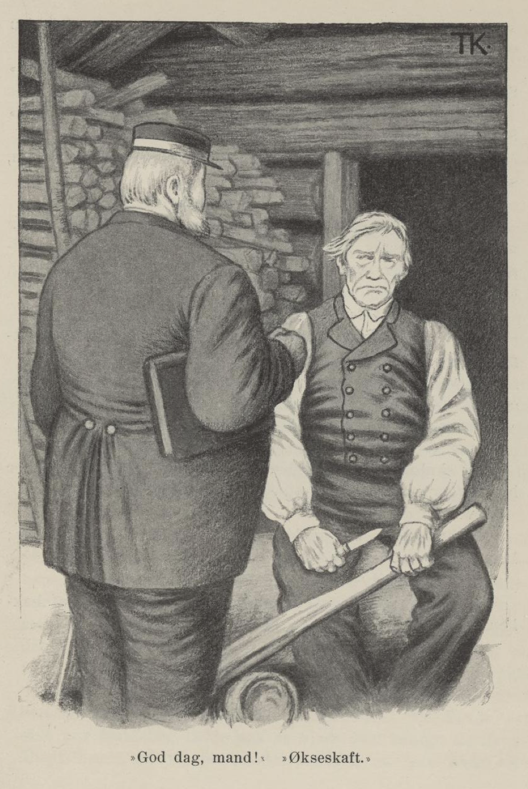

# «God dag, mann!» «Økseskaft!»

Der var en gang en færgemann, som var så tumhørt at han hverken kunne høre eller samle det nogen sa til ham. Han hadde en kjærring og to sønner og en datter, og de brydde seg ikke om mannen, men leved lystig og vel, så lenge der var noget å leve av, og siden tok de på borg hos gjestgiveren og holdt bedt lag og kastud hver dag.

Da ingen ville borge dem lenger, skulle lensmanden komme og pante for det de hadde borget og ødt bort; så reiste kjærringen og barna til skyldfolkene hennes og lot den tunghørte mann bli igjen alene og ta mot lensmanden og lensmandsdrengen.

Mannen gikk der og stullet og stelte, og undres på hvad lensmanden ville spørre efter, og hvad han skulle si når han kom.

«Jeg kan ta meg til å emne til noget,» sa han ved seg selv, «så spør han meg om det. Jeg får gi meg til å telje på et økseskaft. Så spør han meg hvad det skal bli; så siger jeg: «Økseskaft.» Så spør han meg hvor langt det skal være; så siger jeg: «Opp under denne kvisten.» Så spør han hvor færgen er henne; så siger jeg: «Jeg skulle tjærebre henne; nu ligger hun på stranden og er sprukket i begge ender.» Så spør han: «Hvor er den grå mærren din henne?» Så siger jeg: «Hun står på stalden føldiger.» Så spør han: «Hvor er fæet og sommerfjøset ditt henne?» Så siger jeg: «Det er ikke langt unda; når du kommer opp av bakken, så er du der straks.»»

Dette syntes han var godt og vel overlagt.

Da det led om en stund, kom lensmanden; han var sikker nok, men drengen hans hadde gått en anden vei om gjestgiveren, og der satt han nok og drakk endda. «God dag, mann!» sa han.

«Økseskaft,» sa færgemannen.

«Jasså,» sa lensmanden. «Hvor langt er det til gjestgiveren?» spurte han.

«Opp under denne kvisten,» sa mannen og pegte et stykke opp på økseskaft-emnet.

Lensmanden ristet på hodet og glantet stort på ham.

«Hvor er kjærringen din, mann?» sa han.

«Jeg skulle til å tjærebre henne,» sa færgemannen, «for hun ligger på stranden og er sprukket i begge ender.»

«Hvor er datter din?»

«Å hun står på stalden og er føldiger,» sa mannen; han syntes han svarte både godt og vel for seg.

«Å reis du til helvete, din tull du er!» sa lensmanden.

«Ja, det er ikke langt unda; når du kommer opp av bakken, så er du der straks,» sa mannen.

