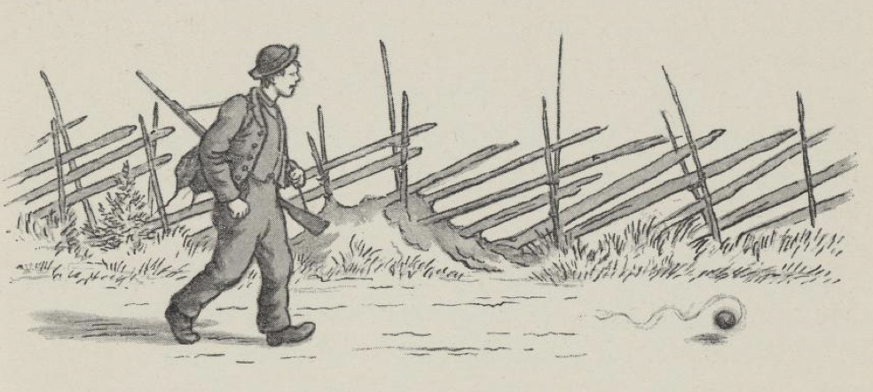
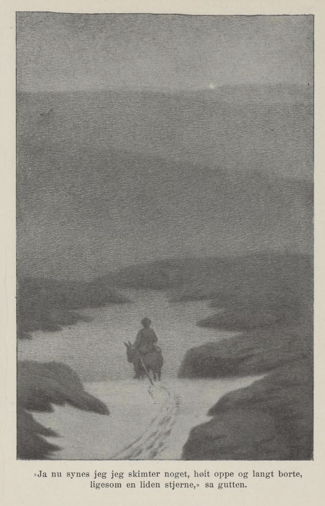
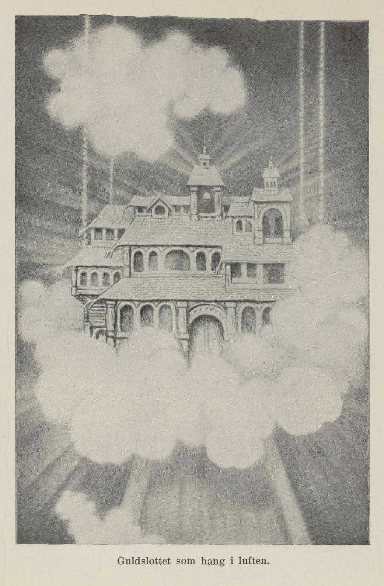
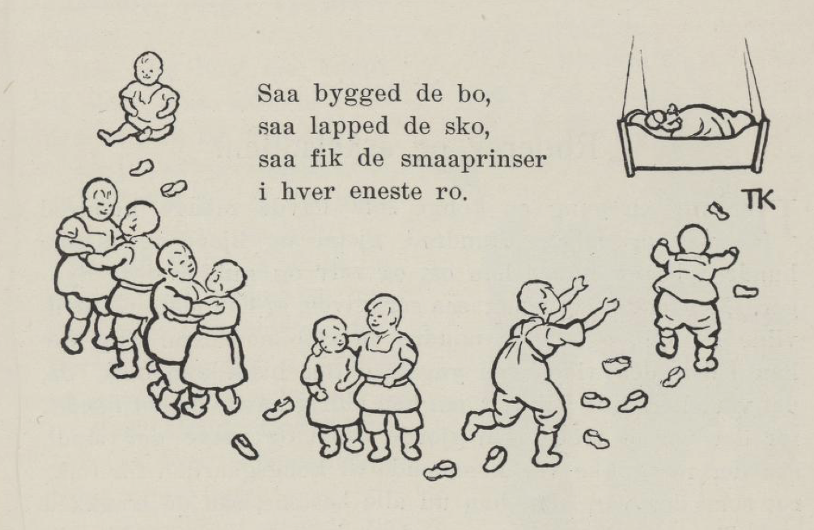

# Gullslottet som hang i lufta

Der var en gang en fattig mann som hadde tre sønner. Da han døde, skulle de to eldste ut i verda for å prøve sin lykke; men den yngste ville de ikke ha med, på noe sett eller vis. «Du da,» sa de, «du duer ikke til annet enn til å sitte og holde tyrilyset og grave i aska og blåse i glørne du!» «Ja ja, så får jeg vel gå alene med meg selv jeg,» sa askeladden, «så blir jeg ikke uforlik med følget mitt.»

De to drog av vei, og da de hadde reist i noen dager, kom de inn i en stor skog; der satte de seg til å hvile, og skulle få seg mat av nista de hadde med, for de var både trette og sultne. Som de satt der, kom det en gammel kjærring opp gjennom en tue og ba om litt mat; hun var så gammel og skrøpelig, at hun jevnet på munnen og hakket med hodet og måtte stave seg fram; hun hadde ikke hatt brødsmula i sin munn på hundre år, sa hun. Men gutterne lo bare og åt, og sa til hende, at når hun hadde livnært seg så lenge, så holdt hun nok ut resten, om hun ikke skulle ete opp matsmulene for dem; de hadde lite niste og ingenting å miste.

Da de hadde spist seg gode og mette og hvilt, satte de i vegen igjen, og langt om lenge kom de til kongsgården; der fikk de tjeneste begge to.

En stund etter at de var reist hjemmefra, sanket askeladden sammen de smulene som brødrene hans hadde vraka, og la dem i den vesle nisteskreppa si, og tok med den gamle børsa som det ikke var lås på, for han tenkte den kunne alltid være god å ha på vegen; så gikk han av sted. Da han hadde vandret noen dager, kom han også inn i den store skogen brødrene hans hadde gått igjennom, og da han ble trøtt og sulten, satte han seg under et tre og ville hvile seg og spise; men han hadde øynene med seg, og mens han tok opp nisteskreppa, fikk han se at det hang et skilderi på et tre, og på det var det malt en ung jomfru eller en prinsesse, som han syntes var så deilig at han ikke kunne vende øynene sine fra det. Han glemte både maten og skreppa og tok ned skilderiet og lå og glattet på det. Rett som det var, kom den gamle kjærringa opp gjennom tua, jevnet på munnen og hakket med hodet og stavet seg fram, og så ba hun om litt mat, for hun hadde ikke hatt brødsmula i sin munn på hundre år, sa hun.

«Det kan være på tide du får litt å leve av da, gamle mor,» sa gutten, og ga hende av brødsmulene han hadde. Kjærringa sa, det var ikke noen som hadde kalt hende mor på hundre år, og hun skulle nok gjøre ham et morsstykke igjen, sa hun. Hun ga ham et grått ullgarnsnøste, som han bare skulle trille foran seg, så kom han dit han selv ville; men skilderiet sa hun han ikke skulle røre; han kom bare i ulykke for det. Askeladden syntes at alt var godt og vel; men skilderiet ville han ikke være foruten; så tok han det under armen og trillet ullgarnsnøstet foran seg, og det varte ikke lenge før han kom til kongsgården, hvor brødrene hans tjente. Der ba han også om tjeneste. De svarte at de ikke hadde bruk for ham, for de hadde nylig fått to tjenestegutter; men da han ba så vakkert, skulle han til slutt få lov å være hos staldmesteren og bli opplært til å stelle hestene. Det ville askeladden gjerne; for hester likte han godt, og han var både flink og flittig, så han snart lærte å stulle og stelle dem, og det varte ikke lenge før alle i kongsgården holdt av ham; men hver stund han hadde til overs, var han oppe og så på skilderiet; for det hadde han hengt i en krok på staldtrevet.

Brødrene hans var late og dovne; derfor fikk de ofte vonde ord og hugg, og da de så det gikk askeladden bedre enn dem selv, ble de avindsyke på ham, og sa til staldmesteren at han var en avgudsdyrker; han ba til et bilde og ikke til vorherre. Selv om staldmesteren syntes vel om gutten, var det ikke lenge før han sa det til kongen. Men kongen bare hekset og bet etter ham; han var nå stur og sorgmodig støtt, for døtrene hans var røvd av et troll; men så lenge tutei de i øra på kongen, at han ville ha greie på hva det var gutten hadde for seg. Da han kom opp på staldtrevet og fikk se skilderiet, så var det den yngste datteren hans som var malt på det. Men da brødrene til askeladden hørte det, var de straks ferdige og sa til staldmesteren: «Dersom bror vår ville, har han sagt seg god for å skaffe kongen igjen datter hans.» En kan nok vite, det var ikke lenge før staldmesteren gikk til kongen med det, og da kongen hørte det, ropte han på askeladden og sa: «Brødrene dine sier at du kan skaffe min datter igjen, og nå skal du gjøre det.» Askeladden svarte, han hadde aldri visst det var kongens datter, før kongen sa det selv, og kunne han frelse hende og hente hende, så skulle han vist gjøre sitt beste; men to dager måtte han ha til å tenke seg om og ruste seg på. Det skulle han få.

Gutten tok fram det grå ullgarnsnøstet og kastet i vegen, og det trillet foran, og han gikk etter, til han kom til den gamle kjærringa som han hadde fått det av. Henne spurte han hva han skulle gjøre, og hun sa han skulle ta med den gamle børsa si, og tre hundre kasser med spiker og hesteskosøm, og tre hundre tønner bygg og tre hundre tønner gryn og tre hundre slaktede griser og tre hundre okseskrott, og trille nøstet i vegen, til han traff en korp og en trollunge, så kom han nok fram; for de to var av slekta hennes. Ja gutten gjorde som hun sa; han gikk innom i kongsgården og tok den gamle børsa si, og ba kongen om spiker, kjøtt og flesk, og hester og gutter og kjøredoning til å få det fram med. Kongen syntes det var mye for langt; men når han kunne skaffe datteren tilbake, skulle han få alt han ville kreve, om det så var halve riket, sa han.

Da gutten hadde rusta seg, trillet han nøstet i vegen igjen, og han hadde ikke gått mange dagene før han kom til et høyt berg; der satt det en korp oppe i en furu. Askeladden gikk til han kom tett innunder, og begynte å sikte og peike med børsa si. «Nei, skyt ikke, skyt ikke meg, så skal jeg hjelpe deg,» skreik korpen. «Jeg har aldri hørt noen har kytt av korpesteg,» sa gutten, «og siden du er så nødig om livet ditt, så kan jeg gjerne spare deg.» Så kastet han børsa, og korpen kom flyvende ned og sa: «Her oppe på dette fjellet går det en trollunge som har tullet seg bort, så han ikke kan komme ned igjen; jeg skal hjelpe deg opp, så kan du følge den hjem og få deg en lønn, som du vel kan behøve. Når du kommer dit, så byr trollet deg alt det gildeste han har, men det skal du ikke røre; du skal ikke ta noe annet enn det lille grå asenet som står bak stalldøra.»

Så tok korpen gutten på ryggen og fløy opp på berget med ham og sette ham av der. Da han kom et stykke inn over, hørte han trollungen kvink og bar seg ille, fordi den ikke kunne komme ned igjen; gutten snakket nok så vel med den; de ble venner og vel forlikte, og han tok seg på å hjelpe den ned, og så skulle han følge trollungen hjem i trollgården, for at han ikke skulle tulle seg bort på hjemvegen. Så gikk de til korpen, og han tok dem på ryggen begge to og bar dem like til bergtrollet.

Da trollet fikk se ungen si igjen, ble han så glad at han glemte seg selv og sa til gutten han kunne følge med inn og ta hva han ville ha, fordi han hadde frelst sønnen hans; han bød ham både gull og sølv og alt det som rar og dyrt var; men gutten sa han helst ville ha seg en hest. Ja, han skulle få hest, sa trollet, og så bar det til stalden med dem. Der var det fullt av de gildeste hester; de skinte både som sol og måne; men gutten syntes de alle sammen var for store til ham. Så gløttet han bak stalldøra, og da han fikk se det lille grå asenet som stod der, sa han: «Det vil jeg ha; det er min like; faller jeg av, så er jeg ikke lengre fra jorda enn som så.» Trollet ville nødig miste asenet, men siden han hadde sagt det, måtte han stå ved det. Så fikk gutten asenet med sadel og bidsel og alt det som til hørte, og så for han av sted.

De reiste gjennom skog og mark, over fjell og vide heier. Da de hadde reist lengre enn langt, spurte asenet gutten, om han så noe. «Nei, jeg ser ikke annet enn et høyt berg som det blåner i,» sa gutten. «Ja, det berget skal vi gjennom,» sa asenet. «Skal tro det?» sa gutten. Da de var ved berget, kom det farende mot dem en enhjørning, som om den ville ete dem levende. «Nå tror jeg mest jeg blir redd,» sa gutten. «Å inte,» sa asenet; «less av et par tjaug okseskrott og be den bore hull og bryte vei gjennom berget,» sa det. Gutten gjorde så. Da enhjørninga hadde fått metten sin, lova de den et par tjaug slaktede svin, om den ville gå foran og bore hull i berget, så de kom igjennom. Da den hørte det, bora den hull og brøt vei gjennom berget så fort at de hadde nok med å følge den, og da den var ferdig med det, kastet de av et par tjaug slaktede svin til den.

Da de var kommet vel fra dette, reiste de langt bort igjen gjennem landene, og så kom de gjennom skog og mark, over fjell og ville heier igjen. «Ser du noe nå?» spurte asenet. «Nå ser jeg ikke annet enn himmel og ville fjell,» sa gutten. Så reiste de langt, og lengre enn langt, og da de kom høyere opp, ble fjellet jevnere og flatere, så de kunne se videre om seg. «Ser du noe nå?» sa asenet. «Ja, jeg ser noe langt langt borte,» sa gutten; «det glitrer og skinner som en liten stjerne.» «Den er nok ikke så liten ennå,» sa asenet. Da de hadde reist langt, og lengre enn langt igjen, så spurte asenet: «Ser du noe nå?» «Ja, nå ser jeg noe langt borte; det skinner som en måne,» sa gutten. «Det er ingen måne,» sa asenet; «det er sølvslottet vi skal til,» sa det. «Når vi kommer dit, ligger det tre drager på vakt foran porten; de har ikke vært våkne på hundre år, så det er grodd mose på øynene på dem.» «Jeg mener mest jeg blir redd dem, jeg,» sa gutten. «Å inte,» sa asenet; «du får vekke den yngste og kaste i den et par tjaug okseskrott og slaktesvin, så snakker den nok til de andre to, så du kommer inn på slottet.»

De reiste langt, og lengre enn langt, før de kom fram til slottet; men da de kom dit, var det både stort og gildt, og alt det de så, var støpt av sølv, og utenfor porten lå dragene og stengte for den, så ingen kunne komme inn; men de hadde hatt det stille og rolig og ikke vært mye uroet på vakta si, for de var så moseløpne, at ikke noen kunne se hva de var gjort av, og bort med sidene på dem begynte det å gro småskog mellom mosetua.

Gutten vekket den minste av dem, og den tok til å gnide øynene sine og kare mosedottene av dem. Da draga fikk se at det var folk, kom den mot ham med gapet på vid vegg; men da stod gutten ferdig og kastet i den okseskrott og slengte i den slaktede svin, til den hadde fått metten og ble litt rimelig å snakke med. Gutten ba at den skulle vekke kammeratene sine og be dem flytte seg unna, så han kunne komme inn i slottet. Men det torde og ville den ikke, sa den i førstningen, for de hadde ikke vært våkne og ikke smakt mat på hundre år; den var redd de skulle fare i ørska og somle i seg både levende og dødt. Gutten mente, det ikke hadde noen nød, for de kunne legge igjen en hundre okseskrott og en hundre slaktesvin og reise unna et stykke, så kunne de vel få åd metten sin og samle seg, til de kom tilbake igjen. Ja, det ville draga også, og så gjorde de så; men før dragene ble riktig våkne og fikk mosen av øynene på seg, for de om og ørska og glefste både etter lik og ulik, og den yngste draga hadde nok med å hytte seg for dem, til de hadde fått veiret av kjøttet. Da sluge de ned hele okser og svineskrott, og åt til de var mette; siden ble de noksså spake og føyelige og slapp gutten mellom seg inn i slottet.

Der var det så gildt at han aldri hadde trodd det kunne være så gildt noen steds; men det var ødt for folk; for han gikk fra den ene stua til den andre og lukket på alle dørene, men han så ingen. Jo, til slutt så gløttet han inn gjennom døra til et kammer han ikke hadde sett før; der inne satt det en prinsesse og spant, og hun ble glad og sæl, da hun fikk se ham. «Nei, nei, tør det komme kristefolk hit?» ropte hun. «Men det er nok best at du går igjen, ellers kunne trollet drepe deg; for her bor et stort troll med tre hoder.» Gutten mente at han ikke flyttet seg, om trollet så hadde syv. Da prinsessa hørte det, ville hun at han skulle prøve om han kunne svinge det store rustne sverdet som hang bak døra; nei han kunne ikke svinge det, han kunne ikke løfte det engang. «Ja,» sa prinsessa, «når du ikke orker det, så får du ta deg en slurk av den flaska som henger ved siden, for det gjør trollet når han skal ut og bruke det.» Gutten tok seg et par slurker; så kunne han svinge sverdet, som om det var en bagstevløy.

Rett som det var, kom trollet susende. «Hv, her lukter så kristen mannlukt!» skreik det. «Det gjør så,» sa gutten; «men du har ikke bo å blåse i nesa for det; du skal ikke lenge ha vondt av den lukta,» sa han, og så hugd han alle hodene av det.

Prinsessa ble så glad som hun hadde fått noe godt. Men da det led om litt, ble hun tungsindig; for hun lengtet etter sin søster, som var røvd av et troll med seks hoder, og bodde på et slott av gull, tre hundre mil borten for verdens ende. Gutten mente, det ikke var verre det; han kunne hente både prinsessa og slottet, og så tok han sverdet og krukka, sette seg på asenet, og ba dragene følge med og frakte kjøttet og flesktet og spikerne han hadde.

Da de hadde vært på vegen en stund og reist langt langt bortover både land og strand, så sa asenet en dag: «Ser du noe?» «Jeg ser ikke annet enn land og vann og himmel og høye hamrer,» sa gutten. Så reiste de langt og lengre enn langt. «Ser du noe nå?» sa asenet. Ja, da han hadde sett seg vel for, så han noe langt langt borte; det skinte som en liten stjerne, sa gutten. «Det blir nok større,» sa asenet. Da de hadde reist et langt stykke igjen, spurte asenet: «Ser du noe nå?» «Nå ser jeg det skinner som en måne,» sa gutten. «Ja ja,» sa asenet. Da de hadde reist langt, og lengre enn langt, bortover land og strand, over haug og hei igjen, spurte asenet: «Ser du noe nå?» «Nå synes jeg det skinner mest som sola,» sa gutten. «Ja, det er gullslottet vi skal til,» sa asenet; men utenfor ligger en lindorm som stengar for vegen og holder vakt.» «Jeg mener jeg blir redd den,» sa gutten. «Å inte,» sa asenet; «vi får bryte over den kvistelag og legge mellom flø'er av hesteskosøm og tenne ild på, så blir vi vel kvitt den.»

Langt om lenge kom de bort imot der hvor slottet hang; men lindormen lå foran og stengte for vegen dit. Så ga gutten dragene et godt måltid med okse- og svineskrott, for at de skulle hjelpe ham, og de brøt over den en flø kvister og ved og en flø spiker og hesteskosøm, til de hadde brukt opp de tre hundre kassene som de hadde, and a det var gjort, sette de varme på og brente lindormen lys levende opp.

Da de vel var ferdige med den, fløy den ene draga under og løftet slottet opp, og de to andre for høyt til veirs og løftet ut lenkekrogene som de hang i, og så sette de det ned på marka. Da det var gjort, gikk gutten inn, og her var det ennå gildere enn i sølvslottet; men folk så han ikke, før han kom inn i det innerste værelset; der lå prinsessa på en gullseng. Hun sov så hardt som om hun skulle være død; men det var hun ikke, selv om han ikke var kar for å vekke hende; for hun var rød og hvit som melk og blod. Rett som gutten stod og så på hende, kom trollet farende. Da det sette det første hodet inn gjennom døra, skreik det: «Huf, her lukter så kristen mannlukt!» «Kanskje,» sa gutten; «men du har ikke bo å blåse så hardt i nesa for det; du skal ikke lenge ha vondt av det,» sa han; og så hugd han alle hodene av det, som om de satt på kålstilker. Så tok dragene gullslottet på ryggen og for hjem med det — de var ikke lenge om vegen, skal jeg tro — og sette det ved siden av sølvslottet, så det skinte både vidt og bredt.

Da prinsessa fra sølvslottet kom til vinduet om morgenen og fikk se det, ble hun så glad at hun sprang over i gullslottet straks på timen; men da hun fikk se søster si, som lå og sov som hun var død, sa hun til gutten at de ikke kunne få liv i hende før de fikk dødsens og livets vann, og det stod i to brønner på begge sider av et gullslott som hang i lufta ni hundre mil bortenfor verdens ende, og der bodde den tredje søstera. Ja, det var ikke annen råd, mente gutten, enn han fikk hente det også, og det var ikke lenge før han var på vegen.

Så reiste han langt, og lengre enn langt, gjennom mange riker, gjennom mark og skog, over fjell og fjære, over berg og båre. Til slutt kom han til verdens ende, og ennå reiste han både langt og lenge, over hei og haug og høye hamrer. «Ser du noe?» sa asenet en dag. «Jeg ser ikke noe annet enn himmel og jord,» sa gutten. «Ser du noe nå?» sa asenet, da det led om noen dager. «Ja, nå synes jeg jeg skimter noe høyt oppe og langt borte, likesom en liten stjerne,» sa gutten. «Det er nok ikke så lite ennå,» sa asenet. Da de hadde reist en stund igjen, spurte asenet: «Ser du noe nå?» «Ja, nå tykker jeg det skinner som en måne.» «Jasså,» sa asenet. Så reiste de noen dager til. «Ser du noe nå?» spurte asenet. «Ja, nå skinner det som sola,» svarte gutten. «Dit skal vi,» sa asenet; «det er gullslottet som henger i lufta. Der bor en prinsesse, som er røvd av et troll med ni hoder; men alle de ville dyr som i verda er, ligger på vakt og stengar for vegen dit,» sa asenet. «Huf, jeg mener mest jeg blir redd nå!» sa gutten. «Å inte,» sa asenet. Og så sa det, at det ikke hadde noen fare når han ikke ga seg til å stanse der, men reiste så snart han hadde fylt krukkene sine med vannet; for det var ikke framkommelig mer enn én time om dagen, og det var høgstdags; men var han ikke kar til å bli ferdig i den tida og komme unna, så rev de ham i tusen stykker. Ja det skulle han gjøre, sa gutten; han skulle nok ikke bie for lenge.

Klokka tolv kom de fram. Da lå alle de ville og vonde dyr som til var, som et gjerde foran porten og på to sider av vegen; men de sov som stokk og stein, og det var ikke ett av dem som led på labben engang. Gutten gikk mellom dem og aktet seg vel, så han hverken trådte på tærne eller rumpetippene av dem, og fylte krukkene sine med livets og dødens vann, og mens han gjorde det, så han på slottet, som var støpt av blanke gull. Det var det gildeste han hadde sett, og han mente det måtte være ennå gildere innvendig. «Pyt, jeg har tida for meg,» tenkte askeladden, «jeg kan alltid se meg om en halv times tid,» og så lukket han opp og gikk inn. Men der var det gildere enn gildt; han gikk fra den ene staselige stua i den andre; det var så det lavde av gull og perler og alt det dyreste som til var. Folk fantes det ikke. Men til slutt kom han inn i et kammer; der lå en prinsesse og sov på en gullseng igjen, som hun var død; men hun var så gild som den gildeste dronning, and rød og hvit som blod og snø, og så deilig at han aldri hadde sett noe som var så deilig, unntatt skilderiet hennes; for det var hun som var skildra der. Gutten glemte både vannet han skulle hente, og dyra og hele slottet, and så bare på prinsessa, og han syntes han aldri kunne bli mett av å se på hende; men hun sov som en død, og han var ikke god for å få hende våken.

Da det led mot kvelden, kom trollet susende, og ramlet og smeldte i porter og dører så det braget i hele slottet. «Huf, her lukter så kristen mannlukt!» sa det og stakk det første hodet inn av døra og snøftet. «Det tør nok hende,» sa gutten; «men du har ikke bo å blåse, så belgen revner, for det; du skal ikke lenge ha vondt av det,» sa han, og dermed så hugd han alle hodene av det. Men da han var ferdig med det, var han så trøtt at han ikke kunne holde øynene oppe. Så la han seg på senga ved siden av prinsessa, og hun sov både natta og dagen, som hun aldri skulle våkne; men ved midnattstid var hun våken et øyeblikk, og da sa hun til ham at han hadde frelst hende; men hun måtte være der i tre år til; kom hun ikke hjem til ham da, fikk han komme og hente hende.

Da klokka gikk til ett den andre dagen, våknet han først, og hørte at asenet begynte å skrike og late så ille, og så tenkte han, det var vel best at han ga seg på hjemvegen; men først klippet han et spuns ut av kjolen til prinsessa og tok med seg. Hvordan det var eller ikke, så hadde han druntet der så lenge at dyra begynte å våkne og ruske på seg, og da han var kommet opp på asenet, kringrendte de ham, så han syntes det begynte å se spøkelig ut. Men asenet sa, at han skulle skvette på dem noen dråper av dødens vann. Det gjorde han, and så styrtet de på flekka og rørte ikke et lem mer.

Mens de var på hjemvegen, sa asenet til gutten: «Når du nå kommer til ære og herlighet, skal du se du glemmer meg og det jeg har gjort for deg, så jeg kommer på knærne av sult.» Nei, det skulle aldri skje, mente gutten. Da han kom hjem til prinsessa med livsvannet, skvettet hun noen dråper på søster si, så hun våknet, og da ble det stor glede, og det stod herlig til med dem.

Så reiste de hjem til kongen, og han var også blid og glad, fordi han hadde fått dem igjen; men han gikk og stundet og stundet etter at det skulle være forbi med de tre åra, til den yngste datteren skulle komme. Gutten som hadde hentet dem, gjorde han til en mektig mann, så han ble den første i landet, nest kongen selv. Men det var mange som var avindsyke, fordi han var blitt slik en storkar, og så var det én — han het ennå ridder Rød — som de sa ville ha den eldste prinsessa; han fikk hende til å skvette på gutten litt av dødens vann, så han sovnet av.

Da de tre åra var omme, og det led et stykke udi det fjerde, kom det seilende et fremmed krigsskip, og på det var den tredje søstera, og hun hadde med seg et tre års gammelt barn. Hun sendte bud opp til kongsgården, og sa at hun ikke ville sette sin fot på land, før de sendte den som hadde vært på gullslottet og frelst hende. Så sendte de én av de høyeste der i kongsgården, og da han kom på skipet til prinsessa, strøk han hatten av og bukket og krummet seg.

«Kan det være din far, min sønn?» sa prinsessa til barnet, som lekte med et gulleple. «Nei, min far kryper ikke som en ostemakk,» sa gutungen. Så sendte de én til av samme slag, and det var ridder Rød. Men det gikk ikke bedre med ham enn med den første, og prinsessa sendte bud med ham, at sendte de ikke den rette, så skulle det gå dem ille. Da de hørte det, måtte de vekke gutten med livets vann, og så gikk han ned på skipet til prinsessa; men han bukket ikke for mye på seg, skal jeg tro; han bare nikket på hodet og tok fram spunset han hadde klippet ut av kjolen til prinsessa på gullslottet. «Det er far min,» ropte barnet og ga ham gulleplet det lekte med.

Så ble det stor glede og herlighet over hele riket, og den gamle kongen var den gladeste av dem alle, fordi han hadde fått kjæleungen si igjen. Da det kom for dagen, det som ridder Rød og den eldste prinsessa hadde gjort ved gutten, ville kongen at de skulle rulles i hver sin spikertønne; men askeladden og den yngste prinsessa ba for dem, og så slapp de. Da de skulle til å tuere bryllup i kongsgården, så var det en dag gutten stod og så ut igjennom vinduet, — det var på vårsida, da de skulle til å slippe ut hestene and kreatura, og den siste som kom ut av stalden, var asenet; men det var så utsveltet, at det kom på knærne ut gjennom stalldøra. Da ble han så ille ved, fordi han hadde glemt det, at han gikk ned og ikke visste hva godt han ville gjøre det; men asenet sa, det beste han kunne gjøre, var å hugge hodet av det. Det ville han nødig; men asenet ba så vakkert, at han måtte gjøre det til slutt, og i det samme hodet falt på tråkka, var det forbi med trollhamma som var kastet på det, and der stod den vakreste prins som noen ville se. Han fikk den andre prinsessa, og så turet de bryllup, så det hørtes og spurtes over syv kongeriker.

