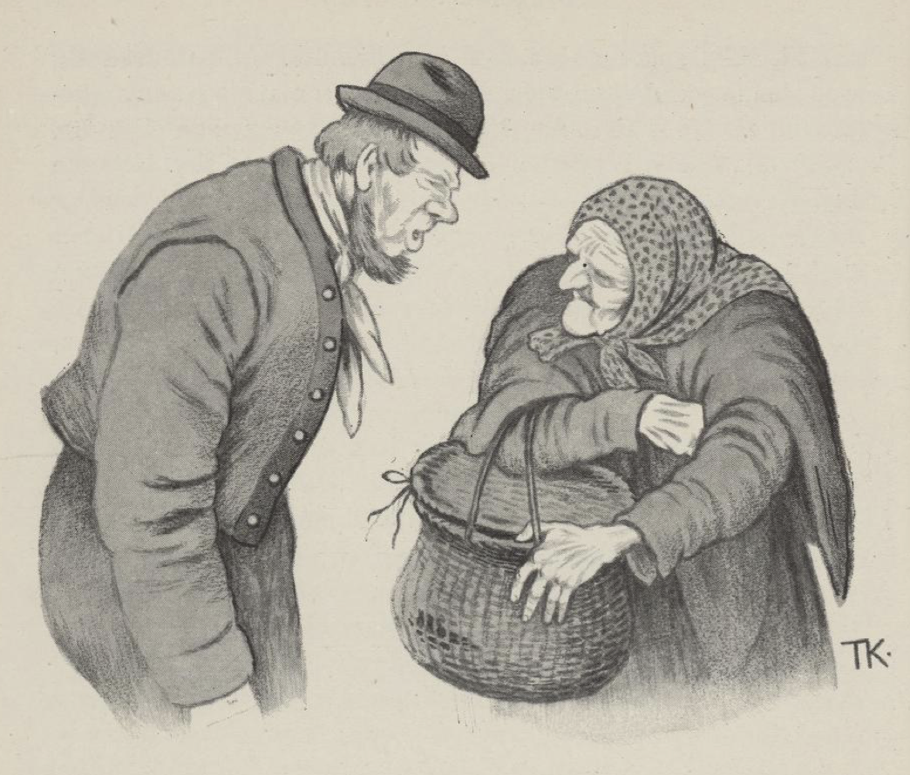
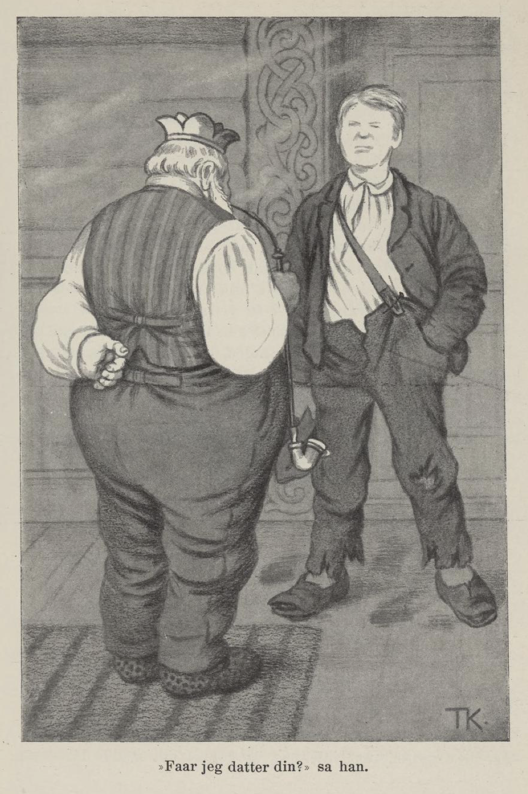
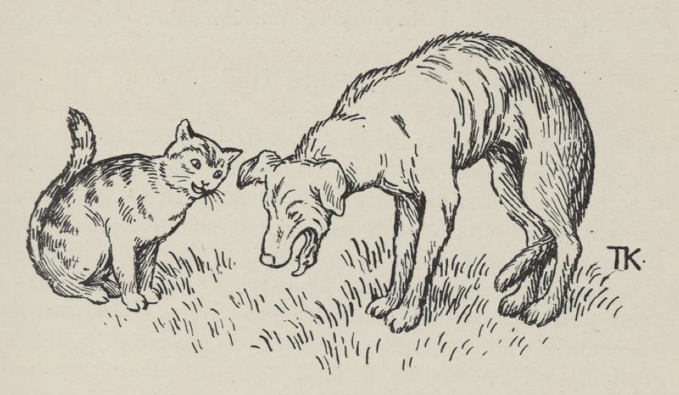

# Gutten som skulle tjene tre år uten lønn

Det var en gang en fattig husmann, som hadde en eneste sønn; men han var så lat og uskikkelig, denne sønnen, han ville hverken folke seg eller ta seg til noen verdens ting. Skal jeg ikke bli fødende på denne lange gutten, så må jeg ha ham så langt bort at ingen kjenner ham, tenkte faren ved seg selv; rømmer han da, så er det ikke så lett fanget å komme hjem igjen. Ja, mannen tok med seg sønnen sin og for både vidt og bredt og bød ham frem til tjenestegutt; men der var ikke noen som ville ha ham.

Langt om lenge kom de til en riking, som hadde det ord på seg, at han snudde skillingen syv ganger før han slapp den. Han skulle ta gutten til gårdsgut, og der skulle han tjene i tre år uten lønn; men når de tre årene var ute, skulle mannen gå til byen to morgener og kjøpe det første han møtte, som var å få, og den tredje morgenen skulle gutten gå til byen og kjøpe det første som han møtte: det skulle han få istedenfor lønn. Ja, gutten tjente årene ut, og han skikket seg bedre enn noen kunne tenkt. Han var ikke av de beste gårdsdengene, det er sikkert nok; men husbonden var ikke av det beste slaget, han heller, for han lot ham gå der hele tiden med de samme klærne han hadde da han kom, så til sist var de ikke annet enn bot på bot og lapp på lapp.

Da mannen skulle i veien og kjøpe, la han ut i otta lenge før dag. «Dyre varer må sees ved dagens lys: de farer ikke i byveien så tidlig,» sa han ved seg selv; «dyrt nok kan det bli likevel, for det er på von og våge hva jeg finner.»

Den første han møtte på bygata, var en gammel kjærring, og hun bar en kurv med et lokk over. «Goddag, gamle mor,» sa mannen. «Goddag igjen, far,» sa kjærringen. «Hva har du i kurven din?» sa mannen. «Skulle du visst det?» sa kjærringen. «Jeg skulle så,» sa mannen, «for jeg skulle kjøpe det første jeg møtte.» «Ja vil du vite det, så kjøp!» sa kjærringen. «Hva koster det da?» sa mannen. Ja, fire skilling måtte hun ha, sa hun. Det var ikke så urimelig pris enda, syntes mannen; han fikk nok bli ved det da, sa han og løftet på lokket; det var en hundehvalp som lå nedi kurven.

Da mannen kom hjem fra byreisen, stod gutten på trappa og undret seg på hva han skulle få til lønn for det første året. «Er du alt hjemme igjen, husbond?» sa gutten. Ja, han var da det. «Hva kjøpte du da?» sa han. «Det ble litt trist, det jeg kjøpte,» sa mannen; «jeg vet mest ikke om jeg skal vise det frem; men jeg kjøpte det første som var å få, og det var en hundehvalp,» sa han. «Det skal du riktig ha takk for,» sa gutten, «hunder har jeg alltid likt så vel,» sa han.

Den andre morgenen gikk det ikke bedre. Mannen var ute i otta igjen, og han var ikke inne på bygata før han møtte kjærringen med kurven. «Goddag, gamlemor,» sa mannen. «Goddag igjen, far,» sa kjærringen. «Hva har du i kurven i dag?» spurte mannen. «Skulle du visst det, så kjøp!» sa kjærringen. «Hva koster det da?» sa mannen. Ja, det var fire skilling det, hun hadde ikke mer enn én pris hun. Hun fikk ha det da, sa mannen; det var vel vent han fikk noe som var bedre kjøp på. Han løftet på lokket; så var det en kattunge den gangen.

Da han kom til gårds, stod gutten på trappa igjen og ventet og undret seg på hva han skulle få til lønn for det andre året. «Er du alt der, husbond?» sa gutten. Ja, han var da det. «Hva kjøpte du i dag da?» sa han. «Å, det ble verre og ikke bedre,» sa mannen; «men det var etter som vi var forlik om det; jeg kjøpte det første jeg møtte, og det var ikke annet enn denne kattungen,» sa han. «Du kunne aldri ha truffet det bedre,» sa gutten, «for katter har jeg alltid likt vel så godt som hunder,» sa han. «Det kom jeg ikke så ille fra enda; men det blir vel andre tider, når han skal i veien selv,» tenkte mannen.

Den tredje morgen la gutten av sted, og som han kom inn på bygata, møtte han den samme gamle kjærringen med kurven på armen. «Godmorgen, gamlemor,» sa gutten. «Godmorgen igjen, gutten min,» sa kjærringen. «Hva har du i kurven din?» sa gutten. «Skulle du visst det, så kjøp!» sa kjærringen. «Vil du selge da?» sa gutten. Ja, det ville hun, og fire skilling skulle det koste. Det var godt kjøp, mente gutten, og han måtte ha det, for han skulle kjøpe det første kjøpende han møtte. «Nå kan du ta hele stasen,» sa kjærringen, «både kurven og det som er i den; men se ikke på det før du kommer hjem, hører du det,» sa hun. Nei, han skulle ikke se på det, var det lik seg.

Men han gikk og undret seg og undret seg på hva der kunne være i kurven, og enten han ville eller ikke, så kunne han ikke berge seg for å løfte på lokket og glotte nedi. Med det samme smatt der ut igjennom gluggen en liten firfisle, og rente bort etter gata så fort at det hven etter den, — der var ikke noe annet i kurven. «Nei, bi litt og far ikke slik av sted, jeg har kjøpt deg jeg,» sa gutten. «Stikk meg i sporden, stikk meg i sporden!» ropte firfislen. Ja gutten var ikke sen til å renne etter og hugge tollkniven i sporden på den, just som den ville smette inn i et hull i muren, og med det samme ble den omskapt til en kar, så gild og så vakker som den gildeste prins, og prins var det og.

«Nå har du frelst meg,» sa han; «for den kjærringen som du og husbonden din har handlet med, det er en troldkjærring, og hun har skapt meg om til firfisle og søskenbarna mine til hund og katt,» sa han. Det var artig, syntes gutten. «Ja,» sa prinsen, «nå var hun på veien og ville kaste oss til fjords og drepe oss; men kom der noen og ville kjøpe, så måtte hun selge oss for fire skilling stykket; så var det laget, og så mye rådet far min også. Nå skal du være med hjem til ham og få lønn for det du har gjort,» sa prinsen. «Det kan bli vonlig langt det,» sa gutten. «Å, ikke så langt enda,» sa prinsen. «Der er det,» sa han og viste på et stort berg borte i vidden.

De la i veien det beste de vant; men det var vonlig lengre enn det så ut til; for de kom ikke frem før det led langt på natt. Prinsen tok til å banke på. «Hvem er det som banker på min dør og øder min nattero?» sa det inne i berget; han var så sterk i målet, at jorda skalv. «Å, lukk opp du, far, det er sønnen din som kommer hjem igjen,» sa prinsen.

Ja han lukket opp både fort og vel. «Jeg trodde mest du lå på havets bunn,» sa gamlingen; «men du er ikke alene,» sa han. «Det er denne karen som har frelst meg,» sa prinsen; «jeg har bedt ham med hit, så du kan gi ham lønn for det.» Det skulle der nok bli råd til, mente kallen. «Nå får I komme inn,» sa han; «I kan ha bo å hvile.»

Ja de gikk inn og satte seg, og kallen la på varmen et fang vedskier og et par store kubber, så det tok til å lue og lyse som av klar dag i hver krok, og hvor de så hen, var det gildere enn gildt. Slikt hadde gutten aldri sett før, og slik mat og drikke som gamlingen satte frem til dem, hadde han ikke smakt heller; og fat og brikker og støp og krus var av bare sølv og blanke gull alt sammen. De var ikke vonde å nøde, de karene; de spiste og de drakk og levde vel, og siden sov de til langt ut på den andre dagen.

Men gutten var ikke våken, før gamlingen kom med en morgenskjænk til ham i en gulltomling. Da han så hadde rasket på seg fillene sine og matstellet seg, tok gamlingen ham med og viste ham omkring, så han kunne ta ut det han ville ha til lønn, for det han hadde frelst sønn hans. Der var mye å se og mer å ta av, kan du tro.

«Hva vil du nå ha?» sa kongen. «Du kan få hva du vil; du ser der er nok å ta av,» sa han. Han fikk da tenke seg om litt og tale med prinsen først, sa gutten. Ja, det skulle han få.

«Nå har du vel sett mye gildt?» sa prinsen. «Det var lik til det,» sa gutten, «men si meg hva jeg skal ta av all denne herligheta du,» sa han; «far din sier jeg skal få lov å velge.» «Du skal ikke ta noe av alt det du har sett,» sa prinsen; «men han har en liten ring på fingeren sin, den skal du be om.»

Ja, han gjorde så, han bad om den lille ringen som satt på fingeren hans. «Det er det kjæreste jeg eier, det,» sa kongen, «men så er da sønnen min vel så kjær; du får ha den likevel. Vet du nå hva den dur til?» sa han. Nei det visste han ikke. «Når du har denne på fingeren, kan du få alt det du ønsker deg,» sa kongen.

Så takket gutten for seg, og kongen og prinsen bød ham lykke på reisen og bad ham passe vel på ringen.

Han var ikke kommet langt på veien, før han tenkte han fikk prøve hva ringen dugde til, og så ønsket han seg nye klær fullt opp; ikke før hadde han ønsket det, før de satt på ham. Og han var så gild og så blank som en nyslått toskilling. Så tenkte han: Det skulle være artig å spille far min et puss; han var nå ikke så grei han heller, den tid jeg var hjemme. Og så ønsket han at han skulle stå utenfor døra hos far sin så fillet som han var før, og med det samme så stod han der.

«Goddag, far, og takk for sist,» sa gutten. Men da faren fikk se han kom igjen enda mer fæl og fillet enn han reiste, satte han i å tute og bære seg ille: «Der er ikke råd med deg, når du ikke har tjent så mye som klær på kroppen, i all den tid du har vært borte,» sa han.

«Å, bær deg ikke så ille, du far,» sa gutten; «du skal ikke skue fanten på fillene. Nå skal du være talsmann og gå til kongens gård og fri til dattera hans for meg,» sa gutten.

«Å fy, å fy, det er jo til spott og spe!» sa far hans. Men gutten mente det var ramme alvor; han tok en bjørkekølle og jaget far sin helt inn i døra på kongsgården. Og der kom han inn stupende lige til kongen med grådende tårer.

«Nå, nå, hva er der på ferde med deg, mann min?» sa kongen; «har du lidt urett, så skal jeg se til å skaffe deg rett,» sa han. Nei, det hadde han ikke, sa mannen; men han hadde en sønn som han hadde stor sorg av; ikke kunne han få folk av ham, og nå kunne han ikke tro annet enn at han var gått fra det vesle vettet han hadde hatt og, sa han; «for nå fulgte han meg lige til dørs her i kongens gård med en stor bjørkekølle og truet meg til å begjære kongens datter til ham,» sa mannen. «Slå deg til tåls, du min mann,» sa kongen, «og be ham komme inn til meg, så får vi se hvorledes vi kan bli forlik,» sa han.

Gutten drev inn til kongen, så fillene flaknet om ham. «Får jeg datter din?» sa han. «Det var nå det vi skulle tales ved om,» sa kongen. «Kanskje du ikke kan være tjent med henne, og kanskje hun ikke kan være tjent med deg heller,» sa han. Det var von det, mente gutten.

Så var der nylig kommet et stort skip fra utlandet, og det kunne de se fra vinduet i kongsgården. «Det er det samme,» sa kongen; «er du god for å gjøre et skip på en time eller to, som er make til det som ligger der nede på fjorden og skaller så gildt, så skal du kanskje få henne,» sa han.

«Var det ikke verre?» sa gutten. Så gikk han ned til stranda og satte seg i en sandhaug, og da han hadde sittet der lenge nok, ønsket han at der skulle ligge et skip på fjorden fullt ferdig med master og seil og fulle greier, som var maken til det som lå der før. Rett som det var, så lå det der, og da kongen så der var to skip for ett, kom han ned på stranda og skulle ha greie på dette; da så han gutten stod ute i en båt med en kost, likesom han skulle koste etter flekkene og jevne skjolder; men da han fikk se at kongen var innpå stranda, kastet han kosten og skreg: «Nå er skipet ferdig, får jeg dattera din nå?» «Det var nå det,» sa kongen; «du får vel prøve et stykke til først. Kan du bygge et slott, make til slottet mitt, på en times tid eller to, så får vi se,» sa kongen.

«Ikke verre?» ropte gutten og strøk av sted. Da han hadde drevet omkring så lenge at det led mot slutten på tiden, så ønsket han der skulle stå et slott maken til det som stod der før. Det var ikke lenge før det stod der, skal jeg tro, og det var ikke lenge heller før kongen kom både med dronningen og prinsessen og skulle se seg om i det nye slottet. Gutten stod der med kosten og kostet igjen han. «Her er slottet fiks og ferdig; får jeg henne nå?» skreg gutten.

«Det var nå det — » sa kongen. «Du får komme inn, så vi kan tales ved om det,» sa han; for han skjønte at gutten kunne mer enn mat seg, og så gikk han og grundet på hvorledes han skulle bli av med ham. Ja kongen gikk da foran, og så dronningen, og så kom kongsdattera nærmest foran gutten. Best som han gikk, så ønsket gutten han skulle være den vakreste i hele verda, og med det samme var han det. Da kongsdattera fikk se hvor vakker han var blitt med ett, dyttet hun til dronningen, og hun til kongen igjen, og da de hadde glant seg mett, så kunne de grant skjønne at han var mer enn det var lik til, da han kom dit i fillepelsen sin. Så la de over at prinsessen skulle fare fint, til hun fikk greiet ut hvorledes det hadde seg med ham.

Ja, prinsessen gjorde seg nå så lekker og så blid som en smørjeske og tisket og smisket for gutten; hun kunne da ikke være ham foruten hverken dag eller natt. Da det led ut på den første kvelden da, så sa hun: «Siden vi skal ha hverandre, du og jeg, så har du vel ikke noe å dølge for meg, og du dølger vel ikke for meg hvorledes du har gjort alle disse gilde greiene heller.»

«Å ja,» sa gutten «det skal du nok få vite siden; la oss bli mann og kone, det gjelder ikke før,» sa han. Den andre kvelden lå ikke kongsdattera riktig vel. Hun kunne nok skjønne det, sa hun, at han ikke brydde seg stort om kjæresten sin, når han ikke ville si henne det hun bad om; og når han ikke ville føye henne i sånt et lite grand, så fikk det heller være med hele kjæresteskapet da.

Nå ble gutten rent ille ved, og for at det skulle bli vel igjen, så sa han henne alt sammen. Hun var ikke sen til å bære det frem til kongen og dronningen; så la de over hvordan hun skulle få ringen fra gutten, og siden mente de det skulle ikke være farlig å bli kvitt ham.

Om kvelden kom kongsdattera med dvaledråper, og sa hun ville skjenke kjæresten sin en elskedrikk, for hun syntes ikke han hold nok av henne, sa hun. Ja, han tenkte ikke på noe galt han, og så drakk han ut drikken, og med det samme sov han så hardt at de gjerne kunne ha revet ned huset over hodet på ham. Så tok prinsessen ringen av fingeren hans, satte den på sin, og ønsket at gutten skulle ligge på dyngen ute på gata så fillet og fantefæl som han var da han kom dit, og i hans sted ville hun ha den vakreste prins i verda. Det var så med det samme det. Da det led, våknet gutten ute på dyngen; først trodde han bare det var en drøm; men da han kjente at ringen var borte, skjønte han hvorledes det var gått til, og da ble han så rent forturt, at han satte i vei og ville springe lukt på sjøen og drukne seg.

Med det samme møtte han katten som husbonden hans hadde kjøpt til ham. «Hvor skal du hen?» sa katten. «På sjøen og drukne meg,» sa gutten.

«Vær ikke det,» sa katten. «Du skal nok få ringen igjen,» sa hun.

«Ja skal jeg det, så — — » sa gutten.

Katten tok i veien. Rett som det var, så møtte hun en rotte. «Nå tar jeg deg,» sa katten.

«Å, vær ikke det,» sa rotta, «så skal du nok få ringen igjen.»

«Ja skal jeg det, så — — » sa katten.

Da de hadde kvart seg på kongsgården, løp rotta omkring og noset og lurte der prinsessen og prinsen lå; til sist så fant hun et lite hull, som hun smatt inn igjennom. Så hørte hun de snakket enda, og hun kunne skjønne at prinsen hadde ringen på fingeren sin, for prinsessen sa: «Du passer vel ringen, venn min,» sa hun. «Pøh! — der kommer vel ingen her inn igjennom murer og vegger etter den ringen!» sa prinsen; «men tror du ikke den er sikker på fingeren, så kan jeg ta den i munnen,» sa han.

Om en stund vendte han seg på ryggen og skulle til å sove; med det samme ville ringen fare i halsen på ham, og så hostet han, så den spratt ut og trilte bortetter gulvet. Vips — tok rotta og smatt ut med den til katten, som satt og lurte ved rottehullet.

Men i mellomtiden hadde kongen fått tak i gutten og satt ham inn i et stort tårn og dømt ham til å avlives, fordi han hadde drevet spott og spe med ham og hans datter, sa han, og der skulle han sitte til den dagen han skulle rettes.

Mens katten holdt på å krype omkring og skulle prøve å luske seg inn i tårnet til gutten med ringen, kom der en ørn og slo klørne i den, og reiste ut over sjøen med den; rett som det var, kom der en falk og kastet seg på ørna, så den slapp katten på sjøen; men da katten kjente det våte, ble den så redd at den slapp ringen og svømte til lands. Den hadde ikke ristet vannet av seg og pyntet seg, før den møtte hunden, som husbonden hadde kjøpt til gutten.

«Nei hvordan skal det bære i vei nå da?» sa katten og gråt og ille lot; «nå er ringen borte, og gutten vil de ta livet av,» sa hun.

«Jeg vet ikke jeg,» sa hunden; «men det vet jeg, at det river og sliter i innmaten på meg, så det kunne ikke være verre, om den skulle vrenge seg,» sa den.

«Du skal se du har forått deg på spist mat,» sa katten.

«Jeg eter aldri mer enn jeg orker,» sa hunden, «og nå har jeg ikke ett annet enn en død fisk, som lå udi fjæra og flød,» sa den.

«Kanskje fisken hadde svelget ringen,» sa katten, «og nå holder du vel på å sette til, du også, fordi du ikke kan døye gull,» sa hun.

«Kan hende det,» sa hunden; «så var det like så godt å ta livet først som sist; kanskje gutten kunne komme fra det da,» sa den.

«Å, vær ikke det,» sa rotta — hun var også med — ; «der skal ikke stort åp til, før jeg kommer inn, og er ringen der så sant, skal jeg nok snuse den opp,» sa hun. Ja rotta smatt inn i hunden, og det var ikke lenge før hun kom ut igjen med ringen. Så la katten av sted til tårnet og krafset seg oppover, til fant et hull som hun kunne få labben inn igjennom, og gav så gutten ringen igjen.

Han hadde ikke fått den på fingeren, før han ønsket at tårnet skulle revne, og med det samme stod han midt i døra og skjelte kongen og dronningen og kongsdattera ut for noe skarvepakk. Kongen var ikke sen til å rope sammen krigsmakten sin, og sa til dem at de skulle kringsette tårnet og ta gutten, det kvittet enten de fikk ham død eller levende. Men gutten ønsket bare at hele soldatmakten skulle sitte til opp under armene i den store bløtmyra inne i fjellet, så hadde de kav nok med å komme opp igjen, de som ikke ble der. Da han så var ferdig med krigsmakten, tok han fatt på kongen, dronningen og kongsdattera igjen; han ønsket at de måtte bli sittende alle sine levedager i tårnet, der de hadde satt ham.

Så tok han landet og riket etter kongen. Hunden ble til prins og katten til prinsesse igjen, henne tok han og giftet seg med, og så drakk de bryllup og turt både vel og lenge.

