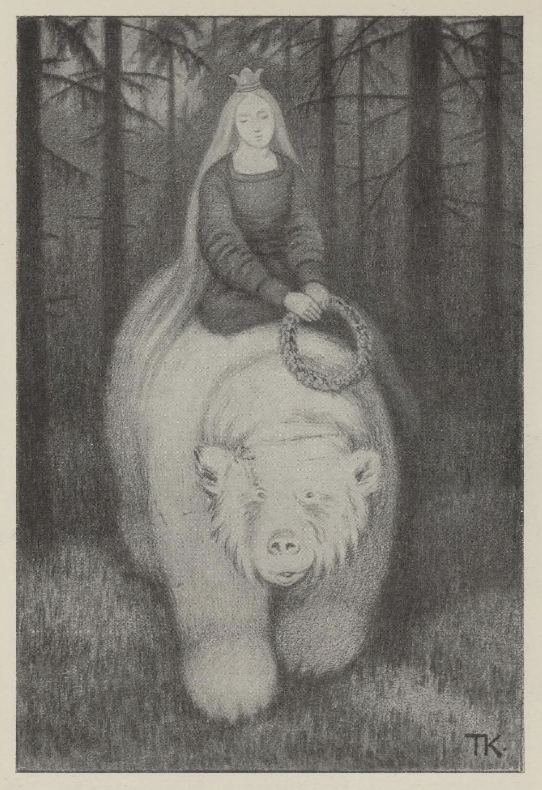
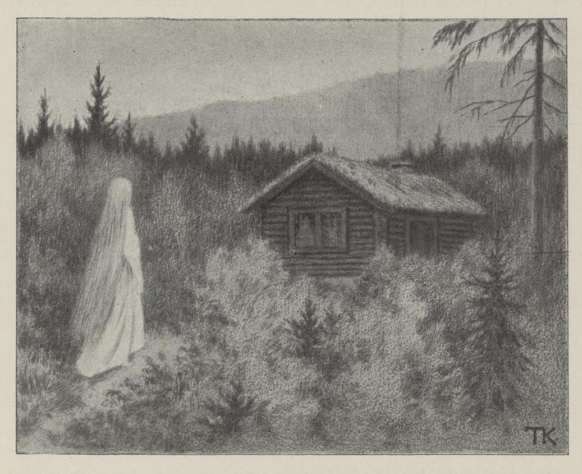
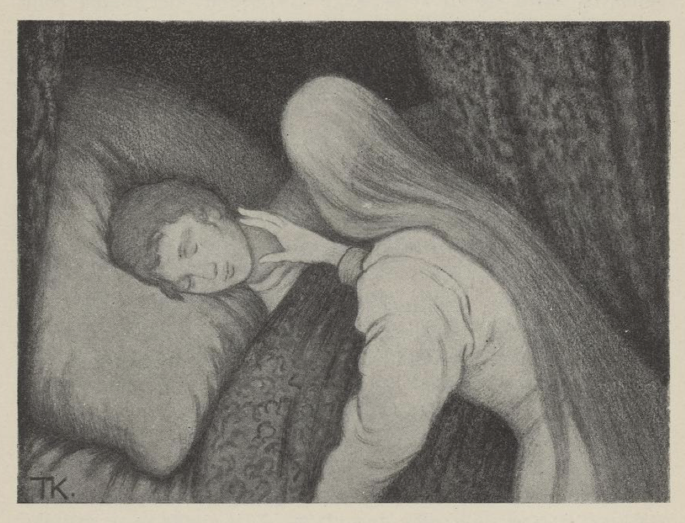
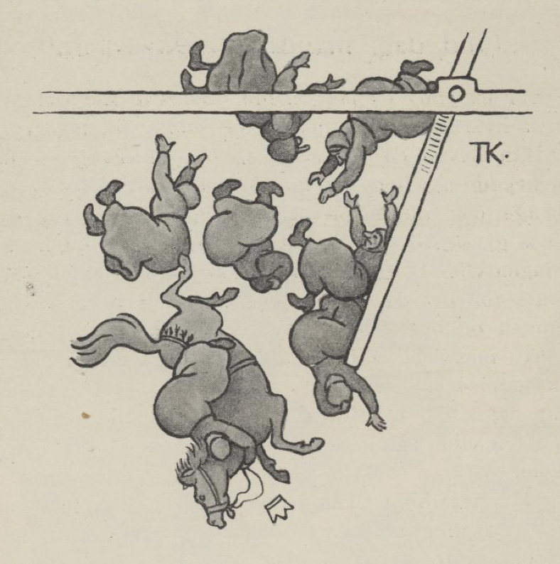

# Hvitebjørn kong Valemon

Gå var der en gang, som vel kunne være, en konge. Han hadde to døtre som var stygge og slemme, men den tredje var så ven og blid som klare dagen, og kongen og alle var glad i henne. Hun drømte en gang om en guldkrans, som var så deilig, at hun aldri kunne leve om hun ikke fikk den. Men da hun ikke kunne få den, blev hun sturen og kunne ikke tale for sorg, og da kongen fikk vite at det var kransen hun sørget for, så sendte han ut en som var klippet ut på lag som den kongsdatteren hadde drømt om, og skikket bud til guldsmedene i alle land, om de kunne skaffe mage til den. De arbeidet både dag og natt; men nogle av kransene slengte hun, og andre ville hun ikke så mye som se på.

En gang som hun var i skogen, fikk hun se en hvitbjørn, som hadde den kransen hun hadde drømt om, mellem labbene og lekte med. Så ville hun kjøpe den.

Nei, den var ikke til fals for penger, men bare når han fikk henne selv. Ja, det var aldri vært å leve uten den, sa hun; det var det samme hvor hun kom og hvem hun fikk, når hun bare måtte ha kransen, og så blev de forligt om at han skulle hente henne om tre dager, og det var torsdagen.

Da hun kom hjem med kransen, blev alle glade, fordi hun var glad igjen, og kongen mente, det kunne sagtens ikke være så farlig å stagge en hvitbjørn. Den tredje dagen måtte hele krigsmagen ut rundt slottet, til å ta mot ham. Men da hvitbjørnen kom, var der ingen som kunne stå seg mot ham, for ham bet der ingenting på; han slo dem ned på ymse sider, så de lå i haugevis. Dette syntes kongen gikk rent på skade; så sendte han ut den eldste datteren, og henne tok hvitbjørnen på ryggen og for avsted med.

Da de hadde reist langt og lenger enn langt, så spurte hvitbjørnen:

«Har du sittet mygere, har du sett klarere?» sa han.

«Ja, på min mors fang satt jeg mygere, i min fars gård så jeg klarere,» sa hun.

«Ja, så er du ikke den rette,» sa hvitbjørnen, og jaget henne hjem igjen.

Neste torsdagen kom han igjen, og da gikk det lige ens. Krigsmagen var ute og skulle ta imot hvitbjørnen; men der bet hverken jern eller stål på ham, og så slo ham dem ned som græs, så kongen måtte bede ham å holde opp, og så sendte han ut den nesteldste datteren, og henne tok hvitbjørnen på ryggen og for avsted med. Da de hadde reist langt og lenger enn langt, spurte hvitbjørnen:

«Har du sett klarere, har du sittet mygere?» sa han.

«Ja,» sa hun, «i min fars gård så jeg klarere, på min mors fang satt jeg mygere.»

«Ja, så er du ikke den rette,» sa hvitbjørnen, og jaget henne hjem igjen.

Den tredje torsdagen kom han igjen. Da sloss han endda hårdere enn de forrige gangene; så syntes kongen han ikke kunne la ham slå ned hele krigsmagen, og så gav han ham den tredje datteren i Guds navn. Så tok han henne på ryggen og reiste avsted langt og lenger enn langt, og da de var kommet bort i skogen, så spurte han henne som han hadde spurt de andre, om hun hadde sittet mygere og sett klarere.

«Nei aldri!» sa hun.

«Ja, du er den rette,» sa han.

Så kom de til et slott som var så gildt, at det slottet hennes far hadde, var som den usleste husmannsplass i ligning med det. Der skulle hun være og leve godt, og hun skulle ikke ha andet å gjøre enn passe at varmen aldri gikk ut. Bjørnen var borte om dagen, men om natten var han hos henne, og da var han et menneske. Det gikk alt både godt og vel i tre år. Men hvert år fikk hun et barn, og det tok han og for bort med, straks det var kommet til verden.

Så blev hun mer og mer sturen, og bad hun kunne få lov å komme hjem og se til foreldrene sine. Ja, der var ikke noget i veien for det; men først måtte hun love ham, at hun nok skulle lyde på hvad faren sa, men ikke på hvad moren ville hun skulle gjøre. Så kom hun hjem, og da de var alene med henne, og hun hadde fortalt hvordan hun hadde det, ville moren gi henne lys med, for at hun kunne få se hvordan han var. Men faren sa: «Nei, det skulle hun ikke gjøre; det er til skade, og ikke til gagn.»

Men hvorledes det var eller ikke, så fikk hun lysestubben med seg, da hun reiste. Det første hun gjorde, da han var sovnet, det var at hun tendte den og lyste på ham; han var så deilig, at hun syntes hun aldri kunne se nok på ham; men som hun lyste, så dryppet der en hed talgdråpe på pannen hans, og så våknet han.

«Hvad er det du har gjort?» sa han. «Nu har du gjort oss ulykkelige begge to; der var ikke mer enn en måned igjen, hadde du bare holdt ut den, så hadde jeg vært frelst; for det er en troldkjærring som har forgjort meg, så jeg er hvitbjørn om dagen. Men nu er det forbi med oss, nu må jeg fare dit og ta henne.»

Hun grått og bar seg ille; men han måtte reise, og han skulle reise. Så spurte hun om hun ikke kunne få være med. Der var ingen råd til det, sa han; men da han for avsted i bjørnehammen, tok hun tag i ragget likevel, kastet seg opp på ryggen av ham og holdt seg vel fast. Så gikk det avsted over ur og berg, gjennem holt og runner[^1], til klerne blev revet av henne, og hun var så dødelig træt at hun slapp taget og ikke visste mer av seg.

Da hun våknet, var hun i en stor skog, og så la hun avsted igjen; men hun visste ikke hvor det bar hen. Langt om lenge kom hun til en hytte; der var det to kvindfolk, en gammel kone og en vakker liden jentunge. Kongsdatteren spurte, om de hadde sett noget til Hvitebjørn kong Valemon.

«Ja, han for her idag tidlig; men han for så fort at du visst aldri tar ham igjen,» sa de.

Jentungen for om og klippet og lekte seg med en guldsaks, som var slik at silke- og fløielsremserne fløi om hender bare hun klippet i luften. Der den var, trøt det aldri klær.

«Men denne konen som skal fare så vidt og så vonde veier, hun må slide hardt,» sa jentungen; «hun kunne trenge mer til denne saksen, hun enn jeg, til å klippe klær til seg,» sa hun, og så bad hun om hun ikke fikk lov til å gi henne saksen. Jo, det skulle hun ha lov til.

Så reiste kongsdatteren avsted igjennem skogen, som der aldri ville bli nogen ende på, både dagen og natten, og neste morgen kom hun til en hytte igjen. Der var det også to kvindfolk, en gammel kone og en jentunge.

«God dag,» sa kongsdatteren. «Har dere sett noget til Hvitebjørn kong Valemon?» spurte hun dem.

«Var det du som skulle havd ham kanskje?» sa kjærringen. Det var da det. «Jo, han for her forbi igår; men han for så fort at du nok aldri tar ham igjen.»

Jentungen gikk på gulvet og lekte seg med en flaske, som var slik, at den skjenket alt hvad de ville ha, og der den var, trøt det aldri drikke.

«Men denne stakkars kjærringen som skal fare så vidt og så vonde veier, tenker jeg kan tørste og lide mye andet vondt,» sa jentungen; «hun kan trenge mer til denne flasken, hun enn jeg,» sa hun, og så spurte hun om hun ikke fikk lov til å gi henne flasken. Ja, det skulle hun få.

Så fikk kongsdatteren flasken, takket for seg og reiste avsted igjen bort igjennem den samme skogen, både den dagen og natten med. Den tredje morgenen kom hun til en hytte, hvor der også var en gammel kone og en jentunge.

«God dag,» sa kongsdatteren.

«God dag igjen,» sa kjærringen.

«Har dere sett noget til Hvitebjørn kong Valemon?» sa hun.

«Kanskje det var du som skulle havd ham?» sa kjærringen. Ja, det var da det. «Jo, han for forbi her igårkveld; men han for så fort at du aldri tar ham igjen,» sa hun.

Jentungen gikk på gulvet og lekte seg med en duk, som var slik, at når de sa til den: «Duk, bred deg og red deg med alle gode retter!» så gjorde den det, og der den var, trøt det aldri godmad.

«Men denne stakkars kjærringen som skal fare så vidt og så vonde veier,» sa jentungen, «hun kan både sulte og lide mye andet vondt, så hun kan trenge mer til denne duken, hun enn jeg,» sa hun, og så spurte hun om hun ikke fikk lov til å gi henne duken. Det skulle hun ha lov til.

Så tok kongsdatteren duken og takket for seg, og reiste avsted langt og lenger enn langt, bort igjennem den samme mørkeskogen, hele den dagen og natten, og om morgenen kom hun til et tverberg, som var så bratt som en vegg, og så høit og så bredt at hun ingen ende kunne se. Det var en hytte der også, og da hun kom inn, var det første hun sa:

«God dag, har dere sett om Hvitebjørn kong Valemon har faret denne veien?»

«God dag igjen,» sa kjærringen; «det var kanskje du som skulle havd ham?» sa hun. Det var da det. «Ja, han for forbi oppefter berget for tre dager siden; men der kan ikke noget uflyvende slippe opp,» sa hun.

I denne hytten var der så fullt av småbarn, og alle sammen hang de i stakken på mor sin og skreg på mad. Kjærringen satte på varmen en gryde full med runde småsten. Kongsdatteren spurte hvad det skulle bety. De var så fattige, sa kjærringen, at de hverken hadde til mad eller klær, og det var så vondt å høre barna skrike efter madbeten; men når hun satte gryden på varmen og sa: «Nu er eplerne[^2] snart kokt,» så var det som det døivet sulten, og de gav tål en stund,» sa hun.

Det varte ikke lenge før kongsdatteren fikk frem duken og flasken, det kan en nok vite, og da barna var mette og glade, klippet hun klærne til dem med guldsaksen.

«Ja,» sa kjærringen i hytten, «siden du har vært så hjertelig snil mot meg og barna mine, så var det skam, om ikke jeg gjorde hvad vi kan, for å prøve å hjelpe deg oppover berget. Mannen min er en av de bedste smeder. Nu får du slå deg til ro, til han kommer hjem, så skal jeg ha ham til å smide klør til deg til hender og føtter; så får du prøve å krabbe deg opp.»

Da smeden kom, tok han på med klørne straks, og den andre morgenen var de færdige. Hun hadde ikke tid til å bie, men takket for seg, hugget seg fast og krøp og krabbet med stålklørne hele dagen og natten, og da hun var så træt, så træt, at hun syntes hun ikke kunne løfte en hånd mer, men ville si ned igjen, da var hun oppe.

Der var en slette, med åkrer og enger så store og vide, at hun aldri hadde tenkt seg så vidt og så jevnt, og straks ved var der et slott fullt av arbeidsfolk av alle slag, som strevet som maur i en tue.

«Hvad er her på færde?» spurte kongsdatteren.

Jo, her bodde hun, den troldkjærringen som hadde forgjort Hvitebjørn kong Valemon, og om tre dager skulle hun ha bryllup med ham. Hun spurte, om hun ikke kunne få talt med henne. Nei, var det likt seg, det var da rent umulig.

Så satte hun seg utenfor vinduet, og til å klippe med guldsaksen, så fløiels- og silke-klerne føg som i en snekave. Da troldkjærringen fikk se det, ville hun kjøpe saksen; «for alt det skredderne strever, så moner det ikke,» sa hun; «der er for mange som skal klædes opp.»

For penger var den ikke til salgs, sa kongsdatteren; men hun skulle få den, om hun fikk lov å sove med kjæresten hennes i natt. Ja, det kunne hun godt få, sa troldkjærringen; men hun ville selv svæve[^3] ham og selv vekke ham. Da han hadde lagt seg, gav hun ham en sovedrikk, så han ikke var i stand til å våkne, alt det kongsdatteren ropte og grått.

Den neste dagen gikk kongsdatteren utenfor vinduene igjen, og satte seg til å skjenke av flasken; det fosset som en bekk både med øl og med vin, og den blev aldri tom. Da troldkjærringen fikk se det, ville hun kjøpe den; for «alt det de strever med å brygge og brenne, så moner det ikke; der er for mange som skal ha drikke,» sa hun. For penger var den ikke til fals, sa kongsdatteren; men fikk hun lov å sove med kjæresten hennes i natt, skulle hun få den. Ja, det kunne hun godt få, sa troldkjærringen; men hun ville selv svæve ham og selv vekke ham. Da han hadde lagt seg, gav hun ham en sovedrikk igjen, så det blev ikke likere den natten enn den forrige; han var ikke god for å våkne, alt det kongsdatteren ropte og grått.

Men den natten var der en av håndverkerne som arbeidet i rammet ved siden. Han hørte gråden der inne, og skjønte hvorledes det hang sammen, og neste dagen sa han til prinsen at hun måtte være kommet, kongsdatteren som skulle frelst ham.

Den dagen gikk det lige ens med duken, som med saksen og flasken; da det var ved middagstid, gikk kongsdatteren utenfor slottet, tok frem duken og sa: «Duk, bred deg og red deg med alle gode retter,» så var der mad, så det var nok til hundre mann; men kongsdatteren satte seg til bords alene. Da troldkjærringen fikk se duken, så ville hun kjøpe den; «for alt det de koker og steker, så moner det ikke; der er for mange munner som mad skal ha,» sa hun. For penger var den ikke til fals, sa kongsdatteren; men fikk hun lov å sove med kjæresten hennes i natt, skulle hun få den. Det kunne hun godt få, sa troldkjærringen; men selv ville hun svæve ham, og selv ville hun vekke ham og.

Da han hadde lagt seg, kom hun med sovedrikken; men den gangen passet han seg og lurte henne. Troldkjærringen trodde ham ikke mer enn som så, hun heller; for hun tok en stoppenål og stikk tvers igjennem armen på ham og ville prøve om han sov tungt nok; men endda så vondt det gjorde, rørte han seg ikke, og så fikk kongsdatteren lov å komme inn til ham.

Da var alting godt og vel, og når de bare blev kvitt troldkjærringen, så var han frelst. Så fikk han tømmermennene til å gjøre en svivelem i den broen brudefærden skulle fare over; for de hadde den skikken der, at bruden red fremst i færden. Da hun kom utpå, svev lemmen rundt med bruden og alle de troldkjærrringer som var brudekonene hennes. Men kong Valemon og kongsdatteren og alle bryllupsfolkene for tilbage til slottet og tok med av guldet og pengene til troldkjærringen alt det de kunne føre, og for så avsted til hans land, og skulle holde det rette brylluppet. Men på veien var kong Valemon indom og tok med de tre småjentene, og nu fikk hun se, hvorfor det var han hadde taget fra henne barna og satt dem bort; det var for at de skulle hjelpe henne frem til ham. Så drakk de bryllup både stivt og sterkt.

[^1]: Det som «renner opp»; tett småskog av rot- og stubbeskudd.

[^2]: Potetene

[^3]: Få ham til å sove.

