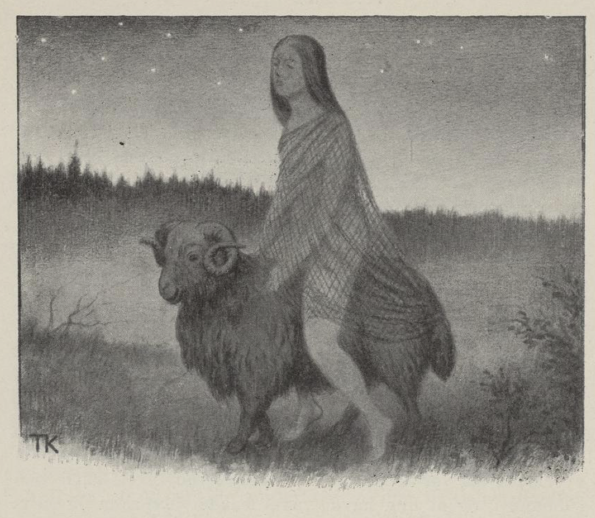

# Ikke kjørende og ikke ridende

Det var en gang en kongssønn som hadde fridd til en jente. Men da de var blitt gode venner og vel forlik, syntes han det kunne være det samme; da ville han ikke ha henne, fordi hun var ikke fin nok til ham. Men så tenkte han, han skulle prøve å bli kvitt henne, og så sa han, han skulle ta henne likevel, om hun kunne komme til ham

> ikke kjørende  
> og ikke ridende,  
> ikke gående  
> og ikke akende,  
> ikke sulten  
> og ikke mett,  
> ikke naken  
> og ikke kledd,  
> ikke dag  
> og ikke natt.

For det trodde han hun ikke kunne greie.

Hun tok tre bygkorn og bet over, så var hun ikke mett, men hun var ikke fastende heller; og så kastet hun et ullnett over seg, så var hun

> ikke naken  
> og ikke kledd.

Tok så en saubukk og satte seg på, så at bena slepte på jorda; så subbet hun frem, og så var hun

> ikke kjørende  
> og ikke ridende,  
> ikke gående  
> og ikke akende.

Og det var i skjellet mellom natt og dag.

Da hun kom frem til vaktene, ba hun at hun måtte få snakke med prinsen; de ville ikke lukke henne inn, fordi hun så ut som et spektakel. Men av denne styren våknet prinsen og kom til vinduet. Så subbet hun dit bort, og vred det ene hornet av bukken. Det tok hun, stod opp på ryggen av den og banket på vinduet med. Så måtte de lukke opp og gjøre henne til prinsesse.
