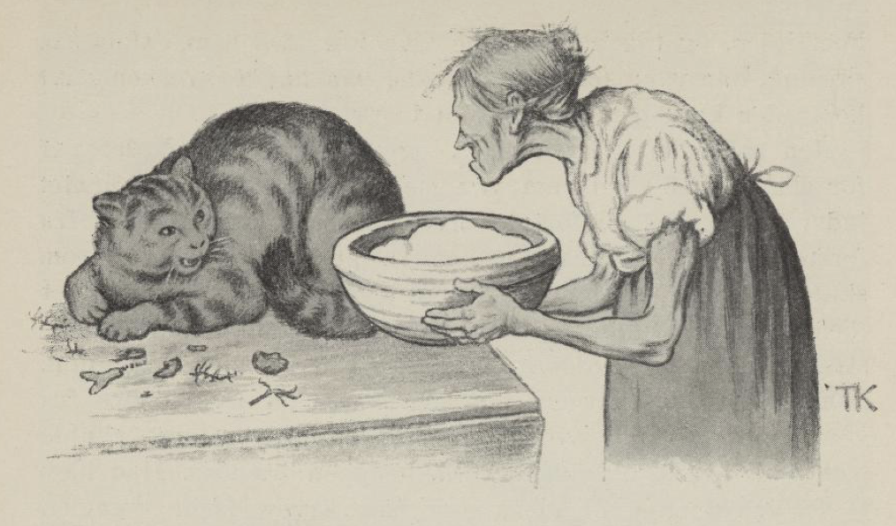
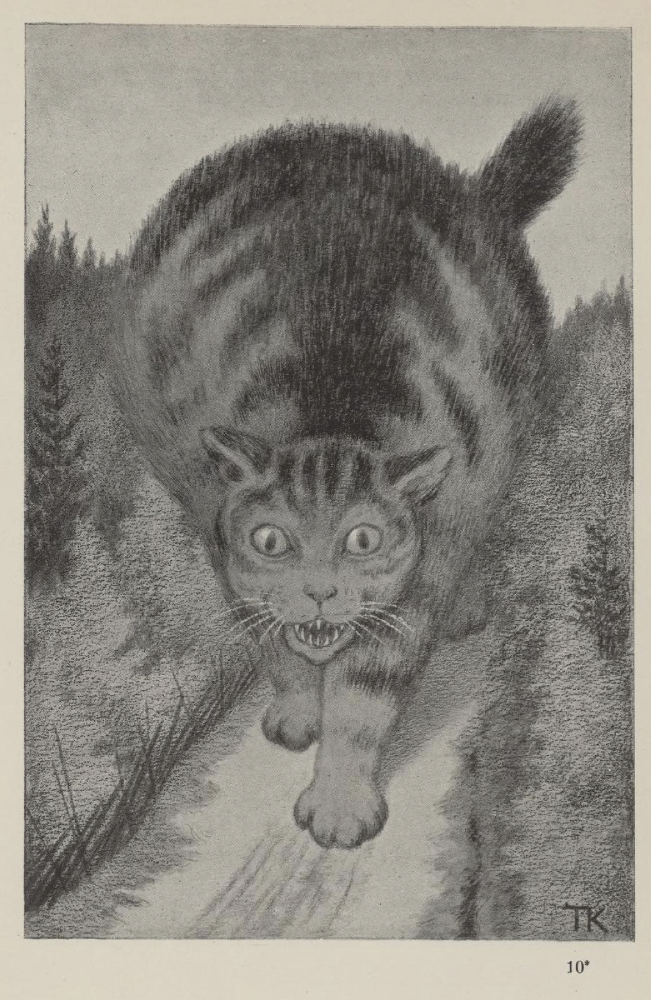
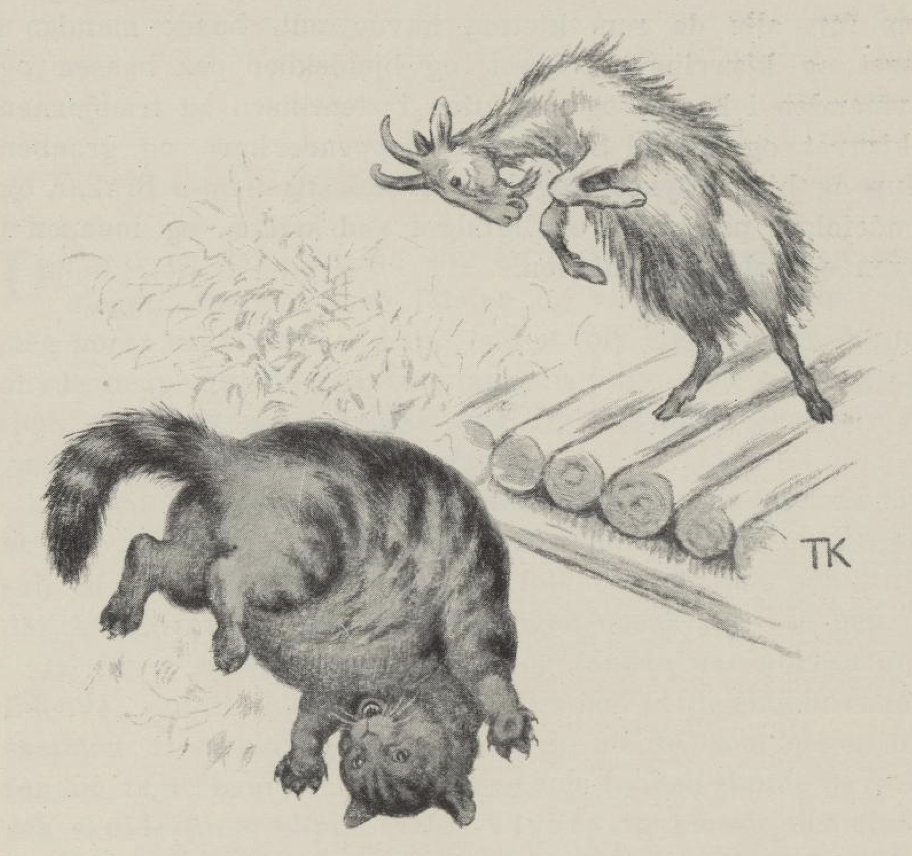

# Kjetten som var så fæl til å ete

Der var en gang en mann som hadde en kjette, og den var så fælt stor og slem til å ete, at han ikke kunne ha henne lenger. Så skulle hun til elvs med en stein om halsen; men før hun skulle avsted, fikk hun et måltid mad. Kjerringen satte til henne et grøtfad og et lite trug med matfett. Det rev hun i seg, og satte avsted ut gjennom vinduet. Der stod mannen på låven og tresket.

«God dag, du mann i huset,» sa kjetten.

«God dag, du kjette,» sa mannen; «har du fått deg noe mat i dag?» sa han.

«Å, jeg har fått et lite grand; men jeg er mest fastende,» sa kjetten; «det var bare et grøtfad og et fetttrug; og husk om meg, tar jeg ikke deg og,» sa hun, og så tok hun og åt opp mannen.

Da hun hadde gjort det, gikk hun i fjøset; der satt kjerringen og melket. «God dag, du kjerring i fjøset,» sa kjetten.

«God dag, er du der, du kjette?» sa kjerringen; «har du ett opp maten din?» sa hun.

«Å jeg har ett litt i dag, men jeg er mest fastende,» sa kjetten; «det var bare et grøtfad og et fetttrug og mannen i huset, og husk om meg, tar jeg ikke deg og,» sa hun, og så tok hun og åt opp kjerringen.

«God dag, du ku på båsen,» sa kjetten til bjellekua.

«God dag, du kjette,» sa bjellekua; «har du fått deg noe mat i dag?» sa hun.

«Å jeg har fått litt, men jeg er mest fastende,» sa kjetten; «det var bare et grøtfad og et fetttrug og mannen i huset og kjerringen i fjøset, og husk om meg, tar jeg ikke deg og,» sa kjetten, og så tok hun og åt opp bjellekua og.

Så satte hun opp i hjemmehagen; der stod en mann og løvet.

«God dag, du løvmann i hagen,» sa kjetten.

«God dag, du kjette; har du fått deg noe mat i dag?» sa løvmannen.

«Å jeg har fått litt, men jeg er mest fastende,» sa kjetten; «det var bare et grøtfad og et fetttrug og mannen i huset og kjerringen i fjøset og bjellekua på båsen, og husk om meg, tar jeg ikke deg og,» sa hun, og så tok hun og åt løvmannen også.

Så kom hun til en steinrøys; der stod røskatten og tittet ut.

«God dag, du røskat i steinrøysen,» sa kjetten.

«God dag, du kjette; har du fått deg noe mat i dag?» sa røskatten.

«Å jeg har fått litt, men jeg er mest fastende,» sa kjetten; «det var bare et grøtfad og et fetttrug og mannen i huset og kjerringen i fjøset og bjellekua på båsen og løvmannen i hagen, og husk om meg, tar jeg ikke deg og,» sa kjetten, og så tok hun og åt opp røskatten også.

Da hun hadde gått litt til, kom hun til et haslekjær; der satt trebjørnen[^1] og sanket nøtter.

«God dag, du trebjørn i busken,» sa kjetten.

«God dag, du kjette; har du fått deg noe mat i dag?» sa trebjørnen.

«Å jeg har fått litt, men jeg er mest fastende i dag,» sa kjetten; «det var bare et grøtfad og et fetttrug og mannen i huset og kjerringen i fjøset og bjellekua på båsen og løvmannen i hagen og røskatten i steinrøysen, og husk om meg, tar jeg ikke deg og,» sa kjetten, og så tok hun og åt opp ekornet også.

Da hun hadde gått et stykke til, møtte hun Mikkel rev, som gikk og lusket borte i skogkanten.

«God dag, du Mikkel Snittom,» sa kjetten.

«God dag, du kjette; har du fått deg noe mat i dag?» sa reven.

«Å jeg har fått litt, men jeg er mest fastende,» sa kjetten; «det var bare et grøtfad og et fetttrug og mannen i huset og kjerringen i fjøset og bjellekua på båsen og løvmannen i hagen og røskatten i steinrøysen og trebjørnen i kjæret, og husk om meg, tar jeg ikke deg og,» sa kjetten, og så tok hun og åt opp reven også.

Da hun hadde gått litt til, møtte hun en hare.

«God dag, du hoppende hare,» sa kjetten.

«God dag, du kjette; har du fått deg noe mat i dag?» sa haren.

«Å jeg har fått litt, men jeg er mest fastende,» sa kjetten; «det var bare et grøtfad og et fetttrug og mannen i huset og kjerringen i fjøset og bjellekua på båsen og løvmannen i hagen og røskatten i steinrøysen og trebjørnen i kjæret og Mikkel Snittom, og husk om meg, tar jeg ikke deg og,» sa kjetten, og så tok hun og åt opp haren også.

Da hun hadde gått et stykke til, møtte hun en gråbein.

«God dag, du gråbein Glup,» sa kjetten.

«God dag, du kjette; har du fått deg noe mat i dag?» sa gråbeinen.

«Å jeg har fått litt, men jeg er nesten fastende,» sa kjetten; «det var bare et grøtfad og et fetttrug og mannen i huset og kjerringen i fjøset og bjellekua på båsen og løvmannen i hagen og røskatten i steinrøysen og trebjørnen i kjæret og Mikkel Snittom og hoppende hare, og husk om meg, tar jeg ikke deg og,» sa kjetten, og så tok hun og åt opp gråbeinen også.

Så gikk hun til skogs, og da hun hadde gått langt og lenger enn langt, over berg og dype daler, så møtte hun en bjørnunge.

«God dag, du bjørn Byks opp,» sa kjetten.

«God dag, du kjette; har du fått deg noe mat i dag?» sa bjørnungen.

«Å jeg har fått litt, men jeg er nesten fastende,» sa kjetten; «det var bare et grøtfad og et fetttrug og mannen i huset og kjerringen i fjøset og bjellekua på båsen og løvmannen i hagen og røskatten i steinrøysen og trebjørnen i kjæret og Mikkel Snittom og hoppende hare og gråbein Glup, og husk om meg, tar jeg ikke deg og,» sa kjetten, og så tok hun og åt opp bjørnungen med.

Da kjetten hadde gått et stykke til, så møtte hun bjørninnen, som rev i stubbene, så fønken fløy, så arg var den, fordi den hadde mistet ungen sin.

«God dag, du bjørninn Bidsk,» sa kjetten.

«God dag, du kjette; har du fått deg noe mat i dag?» sa bjørninnen.

«Å jeg har fått litt, men jeg er mest fastende,» sa kjetten; «det var bare et grøtfad og et fetttrug og mannen i huset og kjerringen i fjøset og bjellekua på båsen og løvmannen i hagen og røskatten i steinrøysen og trebjørnen i kjæret og Mikkel Snittom og hoppende hare og gråbein Glup og bjørn Byks opp, og husk om meg, tar jeg ikke deg og,» sa kjetten, og så tok hun og åt opp bjørninnen også.

Da kjetten kom litt lenger fram, så møtte hun selve bamsen.

«God dag, du bamse Brakar,» sa kjetten.

«God dag, du kjette; har du fått noe mat i dag?» sa bamsen.

«Å jeg har fått litt, men jeg er mest fastende,» sa kjetten; «det var bare et grøtfad og et fetttrug og mannen i huset og kjerringen i fjøset og bjellekua på båsen og løvmannen i hagen og røskatten i steinrøysen og trebjørnen i kjæret og Mikkel Snittom og hoppende hare og gråbein Glup og bjørn Byks opp og bjørninn Bidsk, og husk om meg, tar jeg ikke deg og,» sa kjetten, og så tok hun og åt opp bamsen også.

Så gikk kjetten langt og lenger enn langt, til hun kom til bygds igjen; der møtte hun et brudefølge på veien.

«God dag, du brudefølge på veien,» sa kjetten.

«God dag, du kjette; har du fått deg noe mat i dag?» sa brudefølget.

«Å jeg har fått litt, men jeg er mest fastende,» sa kjetten; «det var bare et grøtfad og et fetttrug og mannen i huset og kjerringen i fjøset og bjellekua på båsen og løvmannen i hagen og røskatten i steinrøysen og trebjørnen i kjæret og Mikkel Snittom og hoppende hare og gråbein Glup og bjørn Byks opp og bjørninn Bidsk og bamse Brakar, og husk om meg, så tar jeg deg også,» sa kjetten, og så for hun på dem og åt både brud og brudgom og hele følget, med kokemester og spillemann og hester og alt.

Da hun hadde gått et stykke til, kom hun til kirken; der møtte hun et likfølge.

«God dag, du likfølge ved kirken,» sa kjetten.

«God dag, du kjette; har du fått deg noe mat i dag?» sa likfølget.

«Å jeg har fått litt, men jeg er mest fastende,» sa kjetten; «det var bare et grøtfad og et fetttrug og mannen i huset og kjerringen i fjøset og bjellekua på båsen og løvmannen i hagen og røskatten i steinrøysen og trebjørnen i kjæret og Mikkel Snittom og hoppende hare og gråbein Glup og bjørn Byks opp og bjørninn Bidsk og bamse Brakar og brudefølget på veien, og husk om meg, så tar jeg deg og,» sa kjetten, og så satte hun på likfølget og åt både liket og følget.

Da kjetten hadde fått til livs dette, så bar det til himmels med henne, og da hun hadde gått langt og lenger enn langt, så møtte hun månen i skyen.

«God dag, du måne i skyen,» sa kjetten.

«God dag, du kjette; har du fått deg noe mat i dag?» sa månen.

«Å jeg har fått litt, men jeg er mest fastende,» sa kjetten; «det var bare et grøtfad og et fetttrug og mannen i huset og kjerringen i fjøset og bjellekua på båsen og løvmannen i hagen og røskatten i steinrøysen og trebjørnen i kjæret og Mikkel Snittom og hoppende hare og gråbein Glup og bjørn Byks opp og bjørninn Bidsk og bamse Brakar og brudefølget i veien og likfølget ved kirken, og husk om meg, eter jeg ikke deg og,» sa kjetten, og så satte hun på månen og åt den opp, både med ny og med ne.

Så gikk kjetten langt og lenger enn langt, så møtte hun solen.

«God dag, du sol på himmelen,» sa kjetten.

«God dag, du kjette; har du fått deg noe mat i dag?» sa solen.

«Å jeg har fått litt,» sa kjetten; «det var bare et grøtfad og et fetttrug og mannen i huset og kjerringen i fjøset og bjellekua på båsen og løvmannen i hagen og røskatten i steinrøysen og trebjørnen i kjæret og Mikkel Snittom og hoppende hare og gråbein Glup og bjørn Byks opp og bjørninn Bidsk og bamse Brakar og brudefølget i veien og likfølget ved kirken og månen i skyen, og husk om meg, tar jeg ikke deg og,» sa kjetten, og så satte hun på den og åt opp solen på himmelen.

Så gikk kjetten langt og lenger enn langt, til hun kom til en bro; der møtte hun en diger gjetebukk.

«God dag, du bukk på brua den breie,» sa kjetten.

«God dag, du kjette; har du fått deg noe mat i dag?» sa bukken.

«Å jeg har fått litt, men jeg er mest fastende,» sa kjetten; «det var bare et grøtfad og et fetttrug og mannen i huset og kjerringen i fjøset og bjellekua på båsen og løvmannen i hagen og røskatten i steinrøysen og trebjørnen i kjæret og Mikkel Snittom og hoppende hare og gråbein Glup og bjørn Byks opp og bjørninn Bidsk og bamse Brakar og brudefølget i veien og likfølget ved kirken og månen i skyen og solen på himmelen, og husk om meg, nå tar jeg deg og,» sa kjetten.

«Det skal vi nappes om,» sa bukken, og stanget til kjetten, så hun røyk utover broa og for til elvs, og der sprakk hun.

Så krøp de fram og for hver til seg, og var like gode som før, alle de som kjetten hadde ett, både mannen i huset og kjerringen i fjøset, og bjellekua på båsen og løvmannen i hagen, og røskatten i steinrøysen og trebjørnen i kjæret, og Mikkel Snittom og hoppende hare, og gråbein Glup og bjørn Byks opp, og bjørninn Bidsk og bamse Brakar, og brudefølget på veien og likfølget ved kirken, og månen i skyen og solen på himmelen.

[^1]: Ekorn
