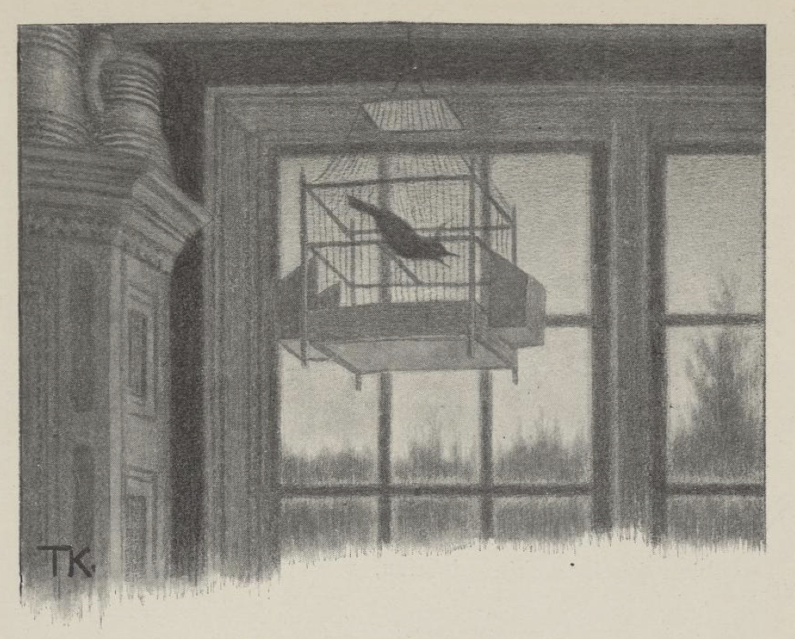
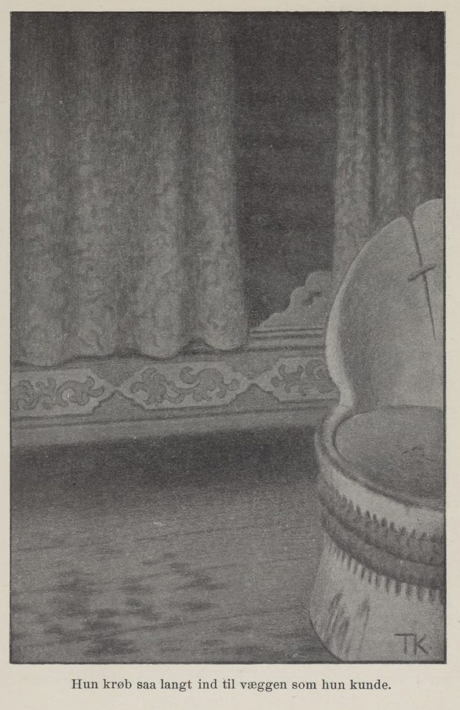

# Kjæresten i skogen

Det var en gang en mann som hadde en datter. Hun var så vakker at hun var navnspurt over mange kongeriker, og friere kom det til henne så mange som blekker i løvfall. En av dem gjorde seg til av det at han var rikere enn alle andre; vakker og gild var han og; så skulle han få henne. Og siden kom han tit og ofte på besøk.

Da det led om litt, så ville han at hun skulle komme til ham og se hvorledes han hadde det; han kunne ikke hente henne og følge henne, men den dagen hun skulle komme, skulle han strø erter etter veien lige hjem i husdøren til seg. Men hvorledes det var eller ikke var, så strødde han ertene en dag for tidlig.

Hun gikk både langt og lenge gjennom skog og mark, og til sist kom hun til et stort gildt hus, som lå på en grønn voll midt i skogen; men han var ikke hjemme, og ikke fant hun folk i huset heller. Først kom hun inn i kjøkkenet; der var ingen annen enn en underlig fugl, som hang i et bur under taket. Så gikk hun inn i stuen, og der var det så staselig at det var rent utrolig. Etter som hun gikk, så ropte fuglen til henne:

«Skjønn jomfru, vær dristig, men vær ikke altfor dristig!»

Da hun kom inn i kammeret, ropte den det samme igjen. Der stod det en hel hop med dragkister; hun drog skuffene ut, og de var fulle av gull- og sølvstas og alt det som gildt var. Da hun gikk inn i neste kammer, ropte fuglen igjen:

«Skjønn jomfru, vær dristig, men vær ikke altfor dristig!»

Der hang det fullt av gilde kvinnefolkklær rundt alle veggene. Da hun gikk inn i det neste kammeret, satte fuglen i å skrike:

«Skjønn jomfru, skjønn jomfru, vær dristig, men vær ikke altfor dristig!»

Her stod det mange sår fulle med blod.

Men da hun gikk inn i det neste kammer, illskreg fuglen:

«Skjønn jomfru, skjønn jomfru, vær dristig, men vær ikke altfor dristig!»

Der lå det fullt med døde kropper og benrangler av drepte kvinnefolk. Hun ble så fælen at hun ville springe ut igjen; men hun kom ikke lenger enn i nærmeste kammeret, hvor alt blodet stod. Da ropte fuglen til henne:

«Skjønn jomfru, skjønn jomfru, spring under sengen, under sengen; nå kommer han!»

Hun var ikke sen til å lyde fuglen og gjemme seg under sengen; hun krøp så langt inn til veggen som hun kunne, ja hun var så redd, at hun gjerne hadde krøpet inn i veggen, om det hadde vært råd.

Så kom kjæresten hennes med en annen jomfru. Hun bad så smått og så vent at han skulle spare livet, så skulle hun aldri åpenbare ham for noen; men der hjalp ingen bønn. Han rev av henne alt, både klærne og gulltet, så nær som en ring hun hadde på fingeren. Den sled han i, men kunne ikke få den av, og så hugget han av fingeren, så den spratt under sengen, og jomfruen som lå der, tok den til seg og gjemte den. Kjæresten sa til en liten gutt som var med ham, at han skulle krype under sengen og ta frem fingeren; ja, han la seg ned og tok innunder, og kjente henne som lå der; men hun klemte ham hardt i hånden, og så skjønte han meningen. «Den ligger så langt innunder at jeg ikke kan rekke den,» sa han; «det får være til det blir dag, så skal jeg ta den.»

Tidlig om morgenen for røveren ut igjen, og gutten skulle være hjemme og passe huset, og ta imot den jomfruen han ventet; men han skulle ikke slippe henne inn i de to rommene han visste.

Da han vel var kommet til skogs, gikk gutten inn og sa at nå kunne hun komme frem.

«Du var heldig du, som kom så tidlig, ellers hadde han drept deg, som alle de andre,» sa han.

Hun stanset ikke lenge, kan du tro, men skyndte seg hjem det forteste hun kunne, og da faren spurte hvorfor hun kom så snart, så fortalte hun hva kjæresten var for en, og det hun hadde hørt og sett.

Da det led om noen tid, kom frieren reisende igjen, og var så gild at det lavde av ham, og spurte hvorfor hun ikke kom og besøkte ham, som hun hadde lovet.

«Der var kommet en mann med en kjælke i veien for det,» sa faren; «men nå fikk han ta til takke med det huset de kunne skaffe ham»; og så bad han ham bli der, «for han hadde bedt til gjestebud; det skulle være likesom festerøl.»

Da de hadde spist og sat ved bordet enda, sa datteren i huset at hun hadde hatt slik en underlig drøm for et par netter siden; hadde de lyst til å høre, skulle hun fortelle den; men alle måtte love at de skulle bli sittende i ro, til hun var ferdig.

Ja de ville gjerne høre, og de skulle bli sittende, det lovet de alle; kjæresten også.

«Jeg drømte at jeg gikk på en bred vei, og der hvor jeg gikk frem, var der strødd erter.»

«Ja det er likesom når du går til meg det, venn min,» sa kjæresten.

«Så ble veien smalere og smalere, og det bar langt bort igjennom skog og ødemark.»

«Det er likesom veien til meg det, venn min,» sa han.

«Så kom jeg til en grønn voll og til et stort gildt hus.»

«Det er likesom hos meg det,» sa han.

«Så kom jeg inn i kjøkkenet. Jeg så ikke noe menneske der; men under taket hang der en underlig fugl i et bur, og da jeg gikk inn i stuen, ropte den etter meg: «Skjønn jomfru, vær dristig, men vær ikke altfor dristig!»

«Det var likesom hos meg det, venn min,» sa kjæresten.

«Så gikk jeg inn i kammeret; fuglen ropte det samme som den sa før. Derinne var det så mange dragkister, og da jeg drog skuffene ut og så ned i dem, var de fulle av sølvtøy og gullstas og alt det som gildt var.»

«Ja det var hos meg det, min venn,» sa han «Jeg har også mange skuffer fulle med gull og sølv og kostbare ting.»

«Så gikk jeg inn i et annet kammer; fuglen ropte til meg igjen og sa det samme som han hadde sagt, og der hang det fullt av gilde kvinnefolkklær rundt alle veggene.»

«Ja det var også hos meg, min venn,» sa han; «der er klær og stas både av silke og fløyel.»

«Da jeg gikk inn i det neste kammer, satte fuglen i å illskrike: «Skjønn jomfru, skjønn jomfru, vær dristig, men vær ikke altfor dristig!» Og i det kammeret stod der tønner og sår rundt alle veggene, og de var fulle av blod.»

«Fy, det er fælt, det er slett ikke som hos meg, venn min,» sa kjæresten; nå fikk han vondt og ville ut.

«Det er jo bare en drøm jeg forteller,» sa datteren i huset; «bli du sittende, du kan alltid tåle å høre på det.»

«Da jeg gikk inn i neste kammeret, tok fuglen på å illskrike det samme som den sa før: «Skjønn jomfru, skjønn jomfru, vær dristig, men vær ikke altfor dristig!» Der lå det mange døde kropper og benrangler av drepte mennesker.»

«Nei, det var slett ikke hos meg,» sa kjæresten, og ville ut.

«Sitt du,» sa hun; «det er jo ikke annet enn en drøm, og den tåler du nok å høre. Jeg syntes også det var fælt, og sprang ut igjen; men jeg kom ikke lenger enn ut i det andre kammeret, hvor alle blodtønnene stod; da skreg fuglen at jeg skulle springe under sengen og gjemme meg, for nå kom han. Og så kom han, og han hadde med seg en jomfru, som var så deilig at jeg syntes jeg ikke hadde sett make til henne. Hun bad så vakkert for seg, at han skulle spare livet; men han brydde seg ikke et grand om det. Hun gråt og bad; han rev av henne klærne og tok alt hun hadde, og sparte hverken livet eller noen ting. Men på den venstre hånden hadde hun en fingerring som han ikke kunne få revet av; så hugget han fingeren av henne, og den spratt under sengen til meg.»

«Fy, det er slett ikke som hos meg, min venn,» sa kjæresten.

«Jo, hos deg var det! Der er fingeren, og der er ringen, og der er mannen som hugget den av,» sa hun.

Så tok de ham og slo ham ihjel og brente både ham og huset i skogen.
