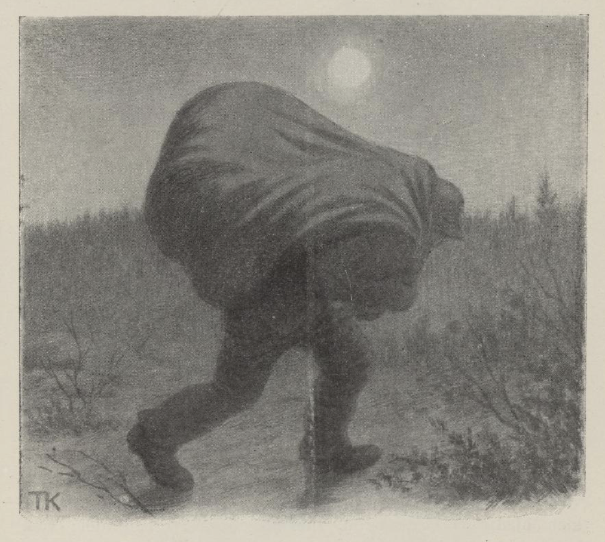

# Klokkeren i bygden vår

Der var en gang en klokker i bygden vår; han var kjær efter alt det som var vakkert og godt. Bygdefolket sa han hadde det meste vettet i vommen; for endda han likte vakre jenter og kjærringer både godt og vel, så likte han vel så godt god mad og godt drikke. «Ja en lever ikke lenge av elsk og søndenvind,» sa klokkeren; det var ordtaket hans. Derfor holdt han seg også helst til velstandskjærringerne, til dem som nylig var gift, eller til vakre jenter som skulle gifte seg til rigdom og gode gårdmenn; der var det best både for vakkert og lækkert, mente klokkeren. Det var ikke alle som syntes det var gjævt å ha en slik madfrier; men det var de som tykte det var nok så gjævt; for en klokker skulle da likesom være litt mer enn en bonde.

Så var der en ung rik jente som blev gift med grannemannen til klokkeren. Der smisket han seg inn, gjorde seg godvenner med mannen, og endda bedre venner blev han med kjærringen. Når mannen var hjemme, så låt han vel med ham; men når han var ved kvernen eller i skogen, på fløting og til tings, så sendte kjærringen bud på klokkeren, og så holdt de gjestebud og bedt lag, de to. Der var ingen som skjønte dette, før tjenestegutten fikk veiret av det. Han syntes han skulle snakke til husbonden om det også; men det ville aldri høve rigtigt, før en gang de var sammen i utengen efter løvkjærv. Der pratet de både likt og ulikt om jenter og kjærringer. Mannen han syntes han hadde vel veidet, da han fikk den rike vakre kjærringen, og det sa han:

«Gud ske lov og takk, fordi hun var både bra og snil.»

«Å ja, ja, hver mann er hjulpet med sin tro,» sa gutten; «men kjente dere henne vel, så talte dere ikke slik bort i veiret. Vene kvindfolk er som vind i varmt sommerveir,» sa gutten, «og elsk er ingen vilje, den faller snart på en klokker og snart på en lilje,» sa han.

«Hvad er det du sier?» sa mannen.

«Jeg har lenge tenkt jeg skulle tale om, at der går en svart okse klov om klov og horn om horn med den lyslette kvigen i hagen jeres, jeg, husbond,» sa gutten.

«En kan si mye på en sommerlang dag,» sa mannen; «men ikke ved jeg, hvor dette bærer hen,» sa han.

«Ja, det var da det,» sa gutten, «jeg hadde tenkt å tale om, at klokkeren er støtt og stendig hjemme hos mor, og de lever som der var bryllup hver dag, og vi, vi får ikke gumlingerne av godmaden engang,» sa han.

«Den som vil smake på alt, han får både surt og salt,» sa mannen. «Jeg tror ikke ordet av det du mener,» sa han.

«Det er et underlig øre som ikke vil høre,» sa gutten; «men det som en selv får sjå, det slipper en å tvile på, og vil du lyde meg, så skal jeg gjerne våge ti daler på, at du skal få troen i hendene.»

Det ville han, ti daler ville han våge, og om det så var hest og gård og hundred daler til.

Ja, det stykket skulle stå; «men gammel rev er vond å veide,» sa gutten; derfor skulle husbonden gjøre og si som tjenestegutten ville. Når de kom hjem, skulle han si de skulle reise til elven og lense tømmer, og hun skulle lage til niste til dem i røde rappet; det var best å passe på mens der var godt veir; det kunne snart slå opp med et uveir. Ja, mannen sa så, og nisten var færdig på timen. Gutten spente hesten for tømmerdraget og reiste avsted, men ikke lenger enn en halv fjerdings vei; der la de seg inn på en gård og satte hestene efter seg; utpå kvelden gikk de tilbage igjen. Da de kom hjem, var døren stengt.

«Nu har vi ham; det er vondt å vende fra åkeren, som til er vant,» sa gutten.

Så gikk de kjelderveien fra haven opp gjennem lemmen i kjøkkenet, tendte lys og gikk inn og lyste på ham. Jo, klokkeren hadde ædt så vel, at han lå med nesen i veiret og snorket, og kjærringen var ikke våken, hun heller.

«Ser dere nu, der går syn for sagn, husbond?» sa gutten.

«Gud trøste meg så sant; ikke hadde jeg trodd det, om ti hadde sagt det,» sa mannen.

«Tsju, ti still!» sa gutten, og tok ham med ut.

«Mandslov er ikke landslov; men med tukt kan en temme selve bjørnen. Har dere noget bly, husbond?» sa gutten.

Ja, han hadde visst over sytti blykuler i skatollet sitt. «Det var vel det.» De tok en glopande, braasmeltet blyet og rendte det i gapet på klokkeren.

«Hver liker sitt, derfor blir al mad ædt,» sa gutten, da det freste i halsen på klokkeren av den gloende blytappen.

Så gikk de ut samme veien som de var kommet inn, og gav seg til å banke og dundre på husdøren. Konen våknet, og spurte hvem det var.

«Det er meg; luk opp, siger jeg!» sa mannen.

Hun nugget på klokkeren. «Det er far, det er han far!» sa hun. Nei, han vørte det ikke, og rørte ikke på seg heller; så satte hun knerne i siden på ham, spente ham ut på gulvet, hoppet så over, tok klokkeren i aommelsbøterne[^1] og trakk ham opp i vedroen bag ovnen; der gjemte hun ham. Før fikk hun ikke tid til å lukke opp for mannen heller.

«Skulle du efter døpevann først?» sa mannen.

«Å, jeg ørsket i søvnen, og ikke tenkte jeg det var du heller,» sa kjærringen.

«Nu får du sette frem noget mad til meg og gutten,» sa mannen; «sultne er vi,» sa han.

«Jeg har ikke færdig noget mad,» sa kjærringen, «kan du tenke slikt; jeg ventet deg hverken i dag eller i morgen. Du skulle jo til elven og lense tømmer,» sa hun.

«En kan ikke henge kjeften på veggen; men selvhjulpen er velhjulpen; skal jeg ta inn nisten, husbond?» sa gutten.

Ja, han fikk det. Så satte de seg til å spise av nistetinen, og la et par vedskier i ovnen; der lå klokkeren i ovnsroen.

«Hvad er dette for en?» sa mannen.

«Å å, det var en fattigmann som kom her sent på kvelden og bad om hus; han var lige nøid, når han bare kunne få ligge i vedroen,» sa kjærringen.

«Det var en rar fattigmann det, han har sølvspente sko og sølvspender ved knerne,» sa mannen.

«Det er ikke alle fanter som har fillete klær,» sa gutten.

«Men det er jo klokkeren i bygden vår,» sa han.

«Hvad ville han her nu da, mor?» sa mannen, og rugget på ham og sparket til ham. Klokkeren hverken rørte seg eller reiste seg. Kjærringen stod og fomlet og stammet, og visste ikke hvad hun skulle si; hun bet seg bare i tommelfingeren hun.

«Jeg ser det på ansiktet ditt, hvad du har gjort, mor,» sa mannen; «men livet er sårt å miste, og han var da klokkeren i bygden vår. Gjorde jeg det som rett var, skulle jeg sende bud efter lensmanden.»

«Gud velsigne deg, skaff bare klokkeren avsted,» sa kjærringen.

«Det er din sag og ikke min det,» sa mannen; «jeg har hverken bedt ham eller budsendt ham,» sa han; «men kan du få nogen til å hjelpe deg av med ham, skal det ikke være meg imod.»

Så tok hun gutten til side og sa: «Jeg har laget til vad mel til mann min; det skal du få til klær, om du kan få gravet ned klokkeren, så det hverken blir hørt eller spurt,» sa hun.

«Ingenting dur ufristet; den som er ute i hålkeføre, han får la det skure og kjøre,» sa gutten. «Har dere liner og taug, husbond, så skal jeg prøve, om der er nogen botevon,» sa han.

Ja, han vipper klokkeren inn i rendesnarer, kaster ham på ryggen, napper hatten hans med, og stryker avsted. Han hadde ikke gått langt utenfor ledet i engen, før han traf nogle hester. Så tok han en av disse, snaret og bandt klokkeren vel fast, satte hatten på ham og hånden ned på låret, så han satt og husket og red, som en rytter skal.

«I utid skal trold drepes,» sa gutten, da han kom hjem; «der ved ingen hvor den feige flakker; men han kommer ikke igjen, som i jorden er gravet,» sa han; «og den fuglen som er fallt, han synger ikke mer.»

Hvorledes det nu var eller ikke var, så gikk der en vei fra engen bortefter til et utlåde, og der hadde de kjørt høi og spilt høi også. Efter den veien gikk hesten og pillet opp høispildet. Men i utlådet lå der to som skulle passe høiet for tyver; det var knapt forår det året.

«Der kommer tyven,» sa de, da de hørte hesten kom; «nu skal vi knipe ham.»

«Hvem der?» skreg de, så det ljomed i åsen. Nei, der var ingen som svarte. Hesten agtet ikke på det, og klokkeren endda mindre.

«Svarer du ikke, så skyr der jeg en kule i fleisen på deg, din hestetyv,» skreg de, og med det samme smalt det. Hesten til sprangs, så brått at klokkeren gjorde et kast og dumpet i marken.

«Jeg mener du skjøt ham kvik ihjel,» sa den ene, og sprang bort og skulle se om han kjente ham. «Å, jeie meg, det er klokkeren i bygden vår! Du skulle holdt på låret og ikke drebt ham.»

«Gjort gjerning står ikke til å endre,» sa den andre. «Den første skaden er best å bøte, — vi får holde ørene stive og grave ham ned i høigulvet så lenge.»

Ja, de gjorde så, og da de hadde gjort det, la de seg til å hvile. Om en stund kommer der én pesende og stampende, så det sang i marken. De nugget på hverandre, de to som lå i høiet, de mente det var tyver igjen. Tett ved ladeveggen var der en saltsten; der satte han seg med børen sin og snakket med seg selv. Han hadde slaktet svin i en gård for nogle dage siden, men tykte han hadde fått for lidet for det, for kleint traktement, og for lidet slaktemad; så hadde han vært avsted nu og stjålet den største grisen. «Den som skal bytte med bjørnen, får ikke lige lodder; derfor er det best å hjelpe seg til retten selv,» sa han; «bedre er en liden lod enn en lang trette. Men bitter død, glemte jeg ikke igjen votterne mine! Finner de dem, så ved de hvem det er som har arvet grisen,» sa han, og la avsted efter votterne.

De to som var i høilådet, lå og lytte på dette.

«Den som gildrer for andre, kommer i gildre selv,» sa den ene.

«Det er ikke greit å stjele fra en tyv; men der blir ikke andre hengt enn de som ikke stjeler rett,» sa den andre; «det skulle være artig å bli kvitt klokkeren på en lettfengt måde og få til gaven dess en gjødgris; jeg mener vi bytter jeg, gut,» sa han. Den andre storlo. Så vrengte de sekken av grisen, satte klokkeren med hatten hodestups nedi, og knytet mulebaandet vel til.

Ret som det var, kom tyven flyende med votterne, nappet sekken og strøg hjem. Der kaster han den inn på gulvet til kjærringen.

«Her har jeg en kult, mor!» skreg han.

«Det var gildt,» sa kjærringen. «Ingenting er godt i øine, men ikke i munnen; maden kan ingen savne, for den er mannens magt. Gud ske lov vi får mad i huset,» sa hun; «nu skal vi leve vel en stund.»

«Jeg tok den største jeg,» sa mannen, satte seg opp i høisetet og pustet og tørket svetten av skolten; «han hadde både bukser og bleier,» sa han; han mente, at grisen var vel gjødd og fleskelagt. «Har du noget mad, kjærring?» sa han.

«Nei, jeg har ingen mad,» sa hun; «hvor skulle jeg fått den fra?»

«Så gjør på varmen, skjær flesk, salt, og steg en fleskepande.»

Hun gjorde som han sa, rev opp mulebaandet og skulle til å skjære flesk.

«Hvordan har dette seg da? han har jo kloverne på,» sa hun, da hun fikk se skoene. «Svart er han også.»

«Ved du ikke det, i mørket er alle katter grå og alle griser svarte,» sa mannen.

«Joho, men hvitt i svart er altid bjart, og der er skil på skodde og myrbær,» sa kjærringen. «Men denne grisen har bukser,» sa hun.

«Ja, pine jord, har han fleskebukser på låret, det har jeg fått kjenne; jeg har båret på ham, så jeg er både hed og svett,» sa mannen.

«Nei, nei,» sa kjærringen; «han har sølvspente sko og sølvspender ved knerne; det er jo klokkeren i bygden vår!» skreg hun.

«Det var gjødgrisen jeg tok,» sa mannen. Så kom han bort og skulle se. Jo, der var syn for sagen; det var klokkeren det, både med sko og med spender. Men det var det største svinet han hadde puttet i sekken, det blev han ved. Det var gjort som gjort var. «Sjøl er beste drengen, men hjelp er også god, så nær som i grødfatet; væk hende Mari, kjærring,» sa mannen.

Ja da, de hadde en datter som var både flink og håndfast; hun hadde kars krefter og visste råd for al uråd. Hun skulle ta og grave ned klokkeren i en afdal, så det aldri kom for dagens lys, og for det skulle hun få en ny verkensklædning, som mor selv skulle havt. Jenten tok klokkeren om livet, slengte ham på nakken og strøg av gårde, og hatten tok hun med.

Men da hun kom et stykke på veien, hørte hun felen låt; der var dansebal på en gård; der lurte hun seg inn og satte klokkeren oppe i den andre trappen. Han satt med hatten mellem hendene, som om han skulle bede om noget for selebøts skyld, og støttet seg til staven og opp til veggen. Så kom der en jente vimsende.

«Jeg undres på hvad dette er for en,» sa hun; «bonden er grå som en gås, men denne-her er svart som en ravn. Hør du, hvorfor har du satt deg der? En kan mest ikke komme frem for deg.»

Klokkeren sa ikke et ord.

«Er du fattig? Ber du om en skilling for selebøts skyld? Å stakkars deg, der har du to skilling,» sa hun, og la dem i hatten. Klokkeren sa ingen ting. Hun ventet litt, for hun tenkte han skulle takke; men klokkeren var ikke den at han nikket på hodet engang.

«Nei, jeg har aldri sett maken til fattigmann som han som sitter i trappen her ute,» sa jenten, da hun kom inn; «han sitter ikke som en skjære på en skigar han,» sa hun; «for han svarer ikke og takker ikke og løer ikke så mye som en finger engang, endda jeg gav ham to skilling.»

«Det må det minste være, at tiggeren takker,» sa en futedreng, som var med i laget; «det skulle vel være snodig kar, om jeg ikke skulle få ham til å svare; jeg har fått mulebaandet opp både på tyver og tverbleier før jeg,» sa han; la ut på trappen og skreg inn i øret på klokkeren, for han trodde han var tunghørt: «Hvorfor sitter du der du?» Nei da. «Er du fattig, ber du?»

Nei, klokkeren sa ingenting. Så tager han opp en halv daler og kaster i hatten: «Der har du den!» Klokkeren tiet og rørte ikke på seg. Da han ikke fikk nogen takk, slo futedrengen til ham under øret, slikt som han orket, så klokkeren for kant om kant ned over trappen. Da var jenten ikke sen til å komme frem:

«Er dere svimert, eller er dere død, far?» skreg hun, og til å skråle og bære seg ille. «Fattigmanns fred finnes ikke noget sted,» sa hun; «men jeg har hverken hørt eller spurt, at de har lagt seg efter å slå ihjel fattigfolk.»

«Tsju, gjør ingen styr,» sa futedrengen; «der har du ti daler, hold så kjeften på deg, og få ham væk; jeg kom bare til å gi ham et svimeslag.»

Ja, hun var glad til: «Penger drar penger,» tenkte hun; «for gode ord og penger får en alt hvad en trenger, og der er ingen nød om niste, når en har penger i kiste.» Så tok hun klokkeren på nakken og strøg til nærmeste nabogården; der la hun ham tvers over brøndkanten. Da jenten kom hjem, sa hun, hun hadde båret ham til skogs og gravet ham vel ned langt borte i en afdal.

«Gud ske lov vi vel blev kvitt ham, du skal få det jeg har lovet, og mer til; det er sikkert det,» sa kjærringen.

Der lå klokkeren som han skottet ned i brønnen, til i grålysingen, da tjenestegutten kom kjørende.

«Hvad ligger du der og koper efter? Unda med deg; jeg skal ha vann!» sa gutten.

Nei, han rørte seg ikke. Gutten kjørte til, så det sa plump — og der lå klokkeren i brønnen. Så måtte han ha hjelp; han hadde ikke nogen råd, før husmannen kom med en bådshake og drog ham opp.

«Det er klokkeren i bygden vår!» ropte de, og mente at han hadde levet så vel i gjestebudsgården, at han hadde sovnet av på brøndkanten. Men da mannen på gården kom og fikk se klokkeren, og hørte hvorledes det var gått til, så sa han:

«Skaden våger mens mannen sover; men mandskaden er meste skaden. Når den ene krukken støter til den andre, så brotner begge. Ta sadlen og legg på blakken og reis efter lensmanden, gut,» sa han, «så vi ikke legger oss borti ulykken for klokkeren skyld; en ulykke kommer sjelden alene; men leit er det å drukne på tørre landet,» sa han.

Ja, gutten for avsted til lensmanden, og da tiden kom, kom lensmanden også. Men for mye hast er heller til last, og brågjort verk vil ikke vare. Det tok tid, før de fikk doktor og synsmenn til. Vi er alle vorherre en død skyldige; men da blev det greiet opp, at klokkeren var drebt tre ganger, før han falt i brønnen. Først hadde blytappen taget pusten fra ham, så hadde han fått en kule for pannen, og til syvende og sidst var nakkebenet knekket. Han var ikke ufeig, der han for. Det er ikke godt å vite hvorledes det er spurt og kommet ut; men en er ofte på orde, der en ikke er på borde, og ordet står oppe, når mannen ligger i mulden.

[^1]: Haserne

