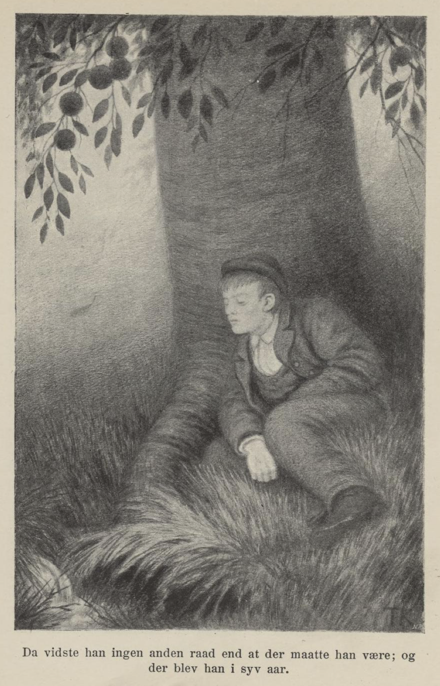
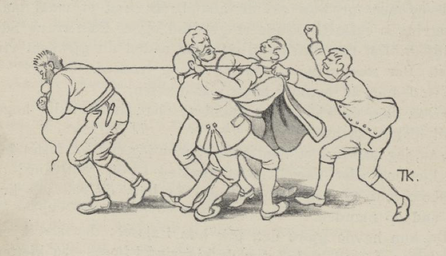

# Krambodgutten med gammelostlasten

Der var en gang en krambodgut; han var så godt likt av alle der han var, at de syntes han var for god til å stå bag disken med alen og bismer. De ville hjelpe ham til en ladning til å fare utenlands med, og så lot de ham velge selv hvad han ville reise med. Han valgte gammelost, og for til Tyrkiet med den. Der solgte han den godt; men da han skulle på hjemveien, traf han to som hadde drebt en mann, og det var ikke nok at de hadde drebt ham i levende live, men de for ille med liket, efter at han var død. Han kunne ikke tåle å se på at de bar seg så stygt; så kjøpte han liket av dem og jord til for pengene sine, og begrov det.

Langt om lenge kom han lykkelig hjem, og det var både vel og ille; nogle av dem som hadde hjulpet til og rustet ham ut, syntes han hadde gjort en god gjerning, men andre var misfornøiet over at han skulle kaste bort pengene sine således. Men så ville de prøve om han ikke kunne gjøre det bedre en anden gang, og lot ham så velge en last til. Han tok samme lasten og reiste samme veien, og fikk den endda bedre betalt. Men da han kom på hjemveien, traf han to som hadde røvet en kongsdatter. De hadde satt sele på henne og holdt på å kjøre med henne; de hadde klædt henne av til beltestedet, og gikk en på hver side og pisket på. Gutten ynkedes over dette, for det var en deilig jomfru. Så spurte han om de ville selge henne. Ja, ville han veie henne opp med sølvpenger, skulle han få henne, og der blev ikke lang pruting; han betalte det de forlangte.

Langt om lenge kom han lykkelig hjem igjen. Men de som hadde rustet ham ut, blev så ute av seg over handelen hans, at de landlyste ham. Så måtte han reise over til England. Der holdt han seg i fire år med kjæresten sin. De leved av det at hun var sådan mester til å slå kniplinger, som han solgte for to mark om dagen.

En dag traf han to som var uvenner, og den ene ville piske den andre opp, fordi han var skyldig ham halvanden mark. Dette syntes gutten var ulikt, og betalte for ham.

En anden dag traf han to reisende, som gav seg i tale med ham og spurte om han hadde noget å selge. Han hadde ikke andet enn kniplinger, sa han. Ja, de ville kjøpe for tre mark, og spurte hvor han bodde, og satte en dag de skulle komme; på den dagen kom de også. Da de kom, var den ene bror til kongsdatteren, og den andre en som hun var trolovet med, en keisersøn. De fikk kniplingerne som de hadde tinget på, og så ville de ha henne med seg hjem. Men hun ville ikke være med, med mindre de ville ta ham med og forsørge ham; for han som hadde frelst henne, ville hun ikke forlate, så lenge hun hadde liv. De måtte gå inn på dette, ville de ha henne med.

Da de skulle ombord, gikk broren og søsteren først i båden; men da keisersønnen skulle udi, skjøv han fra land og slengte seg oppi, så gutten blev stående igjen. Skibet lå seilfærdig, og seilte så snart de kom ombord. Men så kom han som han hadde betalt halvanden mark for, med båd, og reiste ombord med ham. Da blev kongsdatteren så glad at hun tok en guldring av fingeren sin og gav ham, og så skulle han ned i værelset der hun lå.

De seilte i mange dager; så kom de til en vild ø. Der ville de opp og se efter vildt, og så stelte de det slik, at broren og den norske som hadde frelst kongsdatteren liv, de skulle gå på hver sin lei av øen, og keisersønnen i midten; og da gutten var ringet, så de ikke så ham og han ikke dem, reiste de ombord, og så blev han gående igjen alene. Da visste han ingen anden råd, enn at der måtte han være; og der blev han i syv år. Sin føde fikk han av et fruktbart tre som han fant, og da de syv år var omme, kom der en gammel mann og sa til ham, at «idag skal din kjæreste stå brud,» sa han; «de har ikke fått et ord av henne på de syv årene, siden hun skiltes fra deg; men endda vil keisersønnen gifte seg med henne, fordi han skjønner hun er vettig, og fordi hun er så rik.» Og så spør mannen om han ikke hadde lyst å komme til bryllups. Det var vel noget en kunne vite, mente gutten; men han fikk vel lykke til helst å være der han var kommet. Men om en liden stund stod han i gården der brylluppet var. Nu ville han vite, hvad slags mann det var som hadde ført ham dit. «Han var ikke noget menneske,» sa han, «men en ånd; det var ham som han hadde kjøpt og begravet i Tyrkiet.»

Så foræret han ham et glass og en flaske med drikkevarer på, og sa det at han skulle sende en inn med bud til kjøgemesteren, at han skulle komme ut til ham. «Først skal du slå i et glass og drikke selv,» sa han; «så skal du slå i et og skjenke kjøgemesteren, og så skal du slå i det tredje og sende inn til bruden; men først skal du ta ringen av fingeren din og legge i det glasset du sender henne.»

Da kjøgemesteren kom inn med skjenken, sa alle hun måtte ikke drikke. Men kjøgemesteren sa: «Først drakk han, og så drakk jeg, så må vel hun trygt kunne drikke.» Da hun hadde drukket ut, kjente hun ringen som lå på bunnen av glasset, og ville ut, og da hun kom ut, kjente hun ham igjen, og tok ham om halsen og kysset ham, endda så skjegget han var; for du kan vite, han hadde hverken havt kost eller kniv på skjegget sitt i syv år.

Men så kom kongen efter, og ville vite hvad det var for slags kjærlighet som var mellem dem. De blev hentet inn i et værelse, og fortalte hvorledes det var gått til fra først til sidst. Så befalte kongen å hente barberer, som skulle skrabe børstene av ham og fli ham, og skredder med ny stasklædning, og så reiste kongen inn i bryllupsstuen og spurte brudgommen, denne keisersønnen, hvad dom han ville felle over én som hadde stjålet liv og ære fra et menneske. Han svarte, at slik en skarv først skulle henges i galgen, og siden skulle kroppen brennes. Han blev taget på samme måden, som han hadde felt dommen over seg selv, og krambodgutten blev gift med kongsdatteren og leved både lenge og lykkelig.

Så var jeg ikke lenger med, og jeg ved ikke hvorledes det gikk; men det ved jeg, at den som sidst fortalte dette eventyret, lever den dag idag, og det var Ole Olsen Hilli i Røldal.

