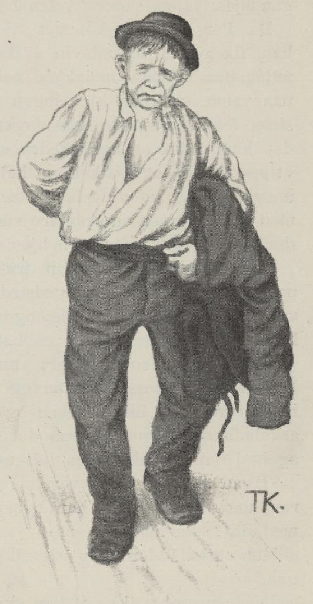
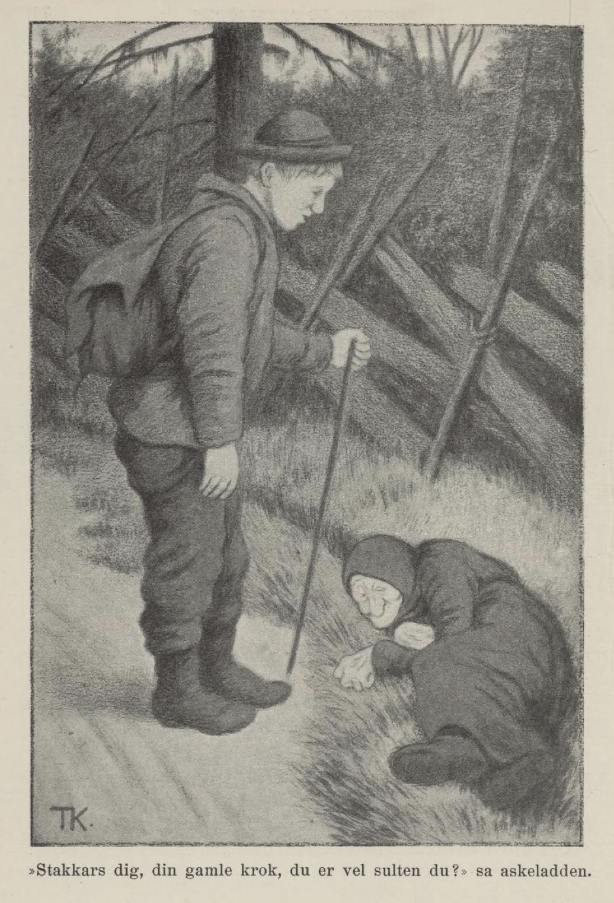
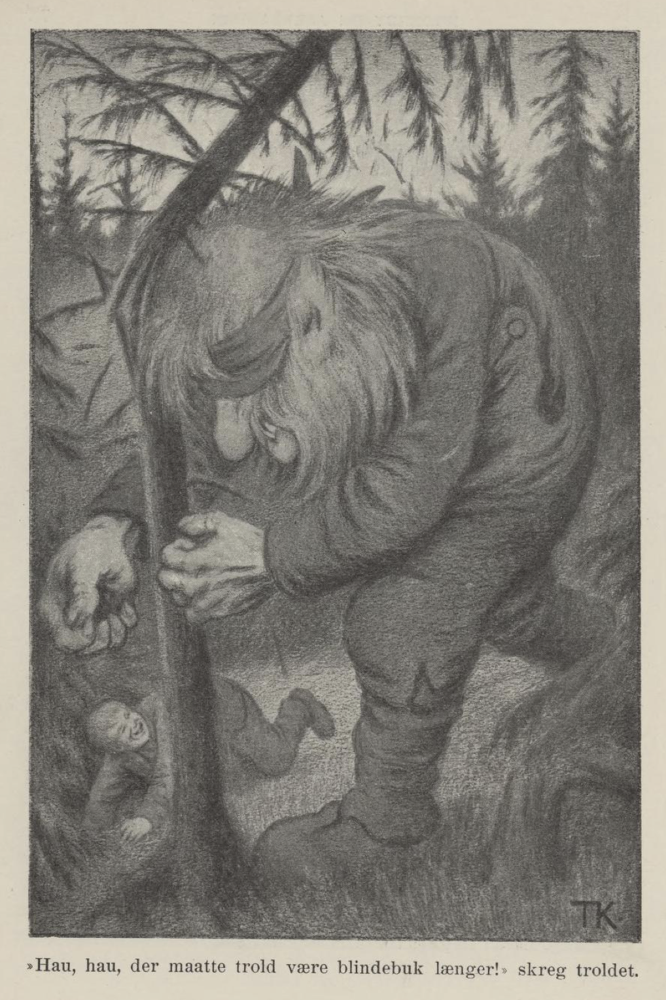

# Røderev og Askeladden

Der var en gang en konge som hadde mange hundre sauer og mange hundre gjeter og kjør; og mange hundre hester hadde han og, og sølv og gull i store dynger. Men ennå var han så sorgfylt, at han nesten aldri ville se folk, og ennå mindre snakke med dem. Slik var han siden den tida den yngste datteren hans kom bort. Ja, det var ellers ille nok der, om han aldri hadde mistet hende; for det var et troll, som gjorde ustell og ustyr der støtt, så det mest ikke var tilgjengelig til kongsgården for folk; rett som det var, slapp han ut alle hestene, så de tråkket ned alle åkrer og enger og åt opp kornet; rett som det var, rev han hodet av kongens ender og gjess; noen ganger drepte han kjørne på båsen, så drev han sauer og gjeter over åsen, og hver gang de skulle ta fisk i dammen, var den jaget på land alt sammen.

Men så var det et par gamle folk, som hadde tre sønner; den ene het Per, den andre het Pål, og den tredje kalte de Espen askeladd, for han lå alltid og karet i aska. Det var gjæve gutter; men Per som eldst var, skulle være den gjæveste, og så ba han far sin, om han fikk lov til å reise ut i verda og friste lykka.

«Ja, det skal du få; sent er bedre enn aldri, glunten min,» sa kallen. Så fikk han brennevin i flaska og niste i taska, og så tok han foten på nakken og lakket ned av bakken. Da han hadde gått en stund, kom han inn på en gammel kjærring, som lå ved vegen. «Å, kjære glunten min, gi meg en liten matsmule idag,» sa kjærringa.

Men Per han så knapt til siden, han slengte bare på nakken og gikk sin vei. «Ja ja,» sa kjærringa, «gå du, du skal få se det går som det går,» sa hun.

Per gikk langt og lenge, og lengre enn langt, til han kom fram til kongsgården. Der stod kongen i svalen og ga hønsene mat. «God kveld, Gud signe jer,» sa Per. «Tippe tippe tippe, tuppe tuppe!» sa kongen og strødde og strødde både øst og vest, og brydde seg ikke om Per. «Ja, stå der du og strø korn og kall hønemål, til det blir en bjørn av deg,» sa Per ved seg selv; «du skal nok være fri for at jeg skal tale til deg,» mente han, og så gikk han inn i kjøkkenet og sette seg bort på benken som en annen storkar.

«Hva er du for en ildgut?» sa kokka, for Per hadde ikke fått skjegg ennå. Det syntes han var spott og spe, og så tok han på å denge kokketøsa; men rett som det var, kom kongen og lot dem skjære tre røde remmer av ryggen på ham; så strødde de salt i såret og lot ham gå hjem igjen, samme vegen han var kommet.

Da Per vel var kommet til hus, ville Pål ut. Å ja, han fikk også brennevin i flaska og niste i taska, tok foten på nakken og lakket ned etter bakken. Da han kom på vegen, traff han kjærringa som ba om mat; men han strøk forbi og svarte ikke engang, og på kongsgården gikk det ham ikke et hår bedre enn det gikk Per. Kongen sa «tippe tuppe», og kokketøsa kalte ham en uskikkelig barnsunge, og da han ville banke hende opp for det, kom kongen med slaktekniva og skar tre røde remmer av ham og strødde ildmørje i, og sendte ham hjem igjen med sår rygg.

Så krøp askeladden opp fra grua og tok til å ruske på seg; den første dagen ristet han aska av seg, den andre vasket og kjemte han seg, og den tredje kledde han seg i kirkepynt.

«Nei, se på den!» sa Per; «nå skinner det en ny sol her. Du vil vel til kongsgården og vinne kongsdatteren og det halve riket? Å bli i aska og ligg i aska du,» sa han. Men askeladden hørte ikke på det øret, han gikk inn til far sin og ba om lov til å gå litt ut i verda.

«Hva skal du ute i verda?» sa gamlingen; «det gikk ikke rart med han Per og han Pål, hvordan skal det så gå med deg?» sa han.

Men askeladden ga seg ikke før han fikk lov til å gå.

Brødrene ville ikke at han skulle få matsmula med seg, men mora ga ham en osteskorpe og et kjøttben, og dermed labbet han av gårde. Det hastet ikke med ham; «du kommer alltid tidsnok,» tenkte han; «nå har du dagen for deg, og siden tør det hende måna kommer opp, om lykka er god.» Så sette han den ene foten framfor den andre og pustet i bakkene og så seg vel om på vegen.

Langt om lenge kom han fram til den gamle kjærringa som lå utved veivegen. «Stakkars deg, din gamle krok, du er vel sulten du?» sa askeladden.

Hun var det, sa kjærringa.

«Ja, så får jeg dele med deg,» sa askeladden og ga hende osteskorpa.

«Fryser du også?» sa han, han så hun hakket tenner. «Du får ta gamletrøya mi; det er ikke stort til ermer og lite til rygg, men det var et godt plagg da den var ny.»

«Bi nå,» sa kjærringa, hun raket nede i storlomma si; «her har du en gammel nøkkel,» sa hun. «Jeg har hverken bedre eller verre å gi deg; men når du kikker gjennom nøkkelringa, så kan du se alt du vil.»

Da han kom fram til kongsgården, holdt kokka på å bære vann, og det hadde hun stort strev med. «Det er for tungt for deg det,» sa askeladden, «det kan være så passe til meg å gjøre det,» sa han.

Den som ble glad, det var kokketøsa, og siden lot hun ladden alltid få skrape gryta; men det var ikke lenge, så fikk han mange uvener for det, og de løy på ham for kongen, og sa, han hadde sagt seg god for både det ene og det andre.

En dag kom kongen ut og spurte askeladden, om det var sant at han var god for å holde fiskene i dammen, så ikke trollet kunne skade dem; «de sier du har sagt deg god for det,» sa han.

«Ikke har jeg sagt det,» sa askeladden; «men hadde jeg sagt det, så var jeg også god for det.»

Ja, hvordan det var, så fikk han nok prøve det, om han ville frelse rygskinnet sitt, sa kongen.

Ja, han fikk prøve da, sa askeladden; for han hadde ikke hug til å gå med røde render under trøya, sa han.

Om aftenen kikket askeladden gjennom nøkkelringa si, og da så han det at trollet var redd for timian. Han tok til å ruske opp all den timian han kunne komme over; noe strødde han i vannet og noe på landet, og resten strødde han om bredden på dammen.

Så måtte trollet la fiska være i fred; men nå fikk sauene undgjelde for det; trollet jaget dem over alle hauger og hamrer hele den natta.

Så var det noen av de andre tjenerne som hadde vært ute igjen, og sagt at askeladden visste råd for kreatura også han, om han bare ville; han hadde sagt seg god for det, det var sikkert.

Ja, kongen gikk ut til ham og sa til ham likesom forrige gangen, og truet med at han skulle skjære tre brede røde remmer av ryggen på ham, om han ikke gjorde det.

Det var ikke annen råd da; askeladden syntes nok det kunne være gildt å gå med kongens mundering og rød kjole, men han fikk heller være den foruten, når han selv skulle late rygskinnet til å gjøre den av, sa han.

Og så tok han til med timian igjen; men det ble det mest ingen ende på; for etter som han bant timian på sauene, så åt de av hverandre igjen, og det varte og det rakk, for sauene åt fortere enn han bant på. Men til slutt gjorde han smurning av timian og tjære og smurte dem inn med, og så lot de være å ete den. Kjørne og hestene fikk også timianssmurning; så fikk de fred for trollet.

Men en dag som kongen var ute på jakt, kom han på villgress i skogen; han red omkring i mange dager og hadde hverken mat eller drikke, og klærne for så ille i transkogen, at til slutt hadde han nesten ikke fillen på kroppen. Så kom trollet og sa, at fikk han det første kongen møtte, når han kom i jordet sitt, så skulle han slippe hjem til kongsgården igjen. Ja, det skulle trollet få; kongen tenkte, det var vel den vesle hunden hans som alltid kjaket og kjastet i møte med ham. Men da han kom så nær kongsgården at de kunne se ham, gikk den eldste kongsdatteren med alle folka etter seg i møte med kongen og tok imot ham både godt og vel.

Da han fikk se det at hun var den første, ble han så ille ved at han falt i marka med det samme, og siden den tid var han mest som en halvtulling.

Om kvelden skulle trollet komme og hente kongsdatteren, og hun var pyntet og satt på en eng ute ved tjernet og gråt og bar seg ille. Det var en som het Røderev, som skulle følge hende, men han var så redd at han kløv opp i en tømmergran, og der ble han sittende. Rett som det var, kom askeladden og sette seg ned på marka ved siden av kongsdatteren. Og hun ble glad, det kan en nok vite, da hun fikk se det var kristefolk som torde være hos hende ennå.

«Legg hodet ditt i fanget mitt du, så skal jeg lyske deg,» sa hun. Espen askeladd gjorde som hun sa, og mens hun gjorde det, sovnet han, og så tok hun en gullring av fingeren sin og knytet fast i håret på ham.

Rett som det var, kom trollet pustende; han var så tung på foten at det knakket og braget i skogen en hel fjerding foran ham. Da han fikk se Røderev, som satt i grantoppen som en liten orre, spyttet han etter ham: «Tvi,» sa han, så både Røderev og tømmergranen fløy i marka, og der lå han og sprellet som en fisk på tørre landet.

«Hv hu!» sa trollet; «sitter du her og lysker kristefolk, så eter jeg deg,» sa han.

«Tvi!» sa askeladden med det samme han våknet, og tok til å kikke på trollet gjennom nøkkelringa.

«Hv hu! Hva glaner du på meg etter?» sa trollet til askeladden, «hv hu!» Så kastet det jernstanga etter ham, så den stod femten alen inn i berget; men askeladden var så snapp og snar på foten, at han kom seg forbi stanga, med det samme trollet kastet.

«Tvi for kjærringstykker!» sa askeladden. «Hit med tandstikka di, skal du få se kast!» Ja trollet nappet opp stanga i ett ryk; den var så stor som tre grindstaurer. Imellomtida stirret askeladden under himmelen både i syd og i nord. «Hv hu! hva glaner du etter igjen?» sa trollet. «Jeg ser etter, hva for en stjerne jeg skal kaste til,» sa askeladden; «ser du den ørlille vesle bent i nord, den tar jeg,» sa han. «Nei, la den sitte som den sitter,» sa trollet; «du får ikke slenge bort jernstanga mi.» «Ja ja, så får du vel ha den igjen da,» sa askeladden; «men kanskje du hadde bedre hug til at jeg skulle slenge deg opp til måna en vending?» sa han. Nei, det ville ikke trollet heller.

«Ja, men blindebukk! har du ikke hug til å leke blindebukk?» sa askeladden. Jo, det kunne være snodigt nok, mente trollet; «men du skal gå først,» sa han til askeladden. «Å ja, gjerne det,» sa gutten; «men det greieste er at vi teller, så slipper vi å ha noe å grele om.» Ja ja, de fikk da det. Og så kan en vite at askeladden lagde det slik, at trollet fikk bundet om øynene og kom til å gjøre den første reisa.

Men der skulle du sett blindebukk; hei! de for omkring i skogkanten; trollet røyk og rendte mot stubbene, så føska fløy og det knakket etter.

«Hau, hau, der måtte troll være blindebukk lengre!» skreik trollet, så illsint var det. «Bi litt,» sa askeladden, «så skal jeg stå stille og rope, til du tar meg.» Imellomtida tok han en hampehekle og sprang om på den andre sida av tjernet, som det ikke var bunn i. «Kom nå, her står jeg!» skreik askeladden. — «Det er vel læger og skog?» — «Du kan vel høre her ingen skog er,» sa askeladden, og svor på, det hverken var stubber eller skog. «Kom nå!» Så bar det i vegen igjen. Plump! sa det; der lå trollet i tjernet, og askeladden hugd han i øynene med hekla, hver gang han fikk hodet over vannet.

Nå ba trollet så tynt for livet sitt, at gutten syntes det var synd på han; men først måtte han si fra seg prinsessa og skaffe fram den andre som han hadde taget før, og love at folk og fe skulle ha fred; så slapp trollet og krabbei hjem til berget sitt. Da var Rødereven kar igjen, kom ned av granen, tok prinsessa opp til slottet, og truet hende til å si at det var han som hadde frelst hende. Og så lusket han ned og tok imot den andre også, da askeladden hadde sluppet hende inn i hagen. Nå ble det slik glede i kongsgården, at det hørtes og spurtes over land og rike, og Røderev skulle ha bryllup med den yngste prinsessa.

Ja, det var godt og vel; men det var ikke så vel ennå — for rett som det var, så hadde trollet gått ned i jorda og stoppet igjen alle vannårene; «kan jeg ikke gjøre annet ugagn, tenkte han, så skal de ikke få vann å koke bryllupsgrøten i.» Det var ikke annen råd enn å sende bud etter askeladden igjen. Han fikk seg en jernstang, som skulle være femten alen lang, og seks smeder, som skulle gjøre den gnistrende rød. Så kikket han gjennom nøkkelringa; da så han trollet likeså godt under jorda som over jorda, og kjørte så stanga ned igjennom marka og ned etter ryggen på trollet, så det luktet brent horn femten fjerdinger. «Hau, hau!» skreik trollet; «slipp meg opp!» Rett som det var, kom han settende opp gjennom hullet og var opbrent like til nakken. Men askeladden var ikke sen, han tok trollet og la det på en stang som var flettet med timian, og der måtte det ligge og si ham hvor det hadde fått øyne fra, siden han hakket dem ut med hampehekla. «Jeg stjal meg en rånype,» sa trollet; «den smurte jeg vel inn med smurning; siden skar jeg den til som jeg ville, og sette den inn med pumpespiker, og bedre øyne vil jeg ikke ønske noen kristemannn.»

Så kom kongen og begge prinsessene og ville se trollet, and Røderev gikk så krepp, at rumpen stod høyere enn nakken. Men så fikk kongen se at det var noe som blinket i håret på askeladden. «Hva har du der?» sa han. «Å, det er den ringa som datter di ga meg, da jeg frelste hende fra trollet,» sa askeladden. Og nå kom det for dagen, hvordan alt var gått til. — Røderev gråt og ba for seg; men alt han latet og alt han gråt, så hjalp det ikke, han måtte i ormegården, og der språk han med det samme.

Så tynte de trollet, og så tok de til å dundre og drikke og danse i brylluppet til askeladden; for nå var han basen. Han fikk den yngste prinsessa og halve kongeriket.

> Så legger jeg mitt eventyr på en slede,  
> og kjører det til deg, som bedre kan kvede;  
> men kan du ikke kvede bedre enn jeg,  
> så skam få deg, for du laster meg.

