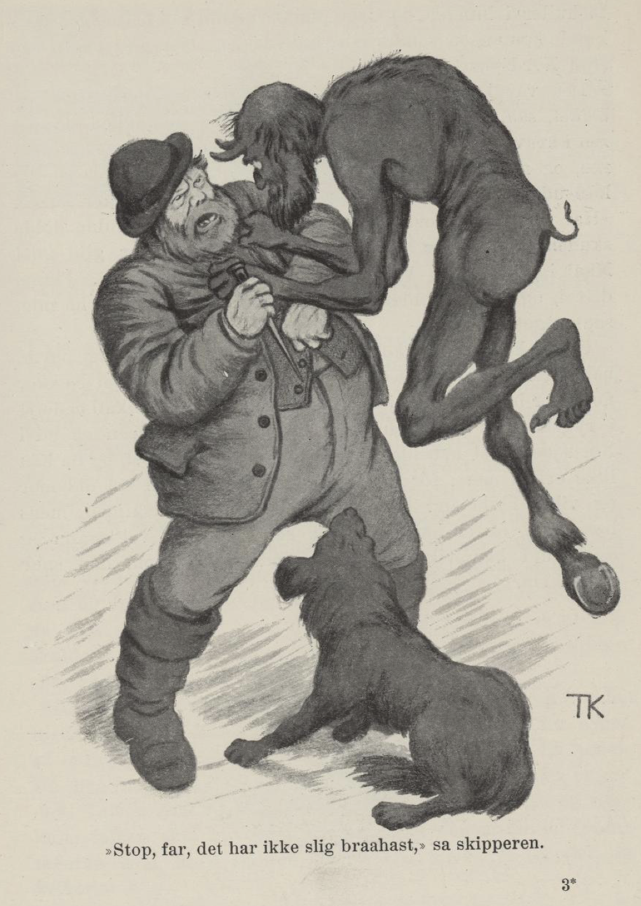
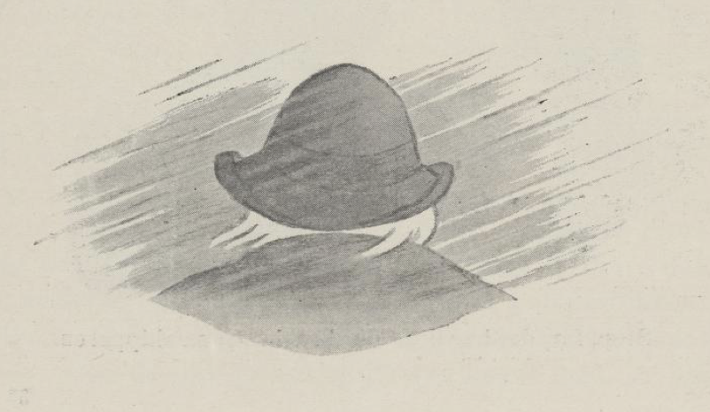

# Skipperen og Gamle-Erik

Det var en gang en skipper som var så ubegripelig heldig med alt det han tok seg til. Der var ingen som fikk slike frakter, og ingen som tjente slike penger, for de veltet likesom inn på ham; og slett ikke var der noen som var god for å gjøre slike reiser som han; for hvor han for hen, var vinden med ham, ja de sa, at bare han snudde hatten sin, så vendte han vinden dit han ville ha den også.

Således for han i mange år både i trelastfart og på Kina-reiser, og penger hadde han tjent sammen som gress. Men så var det en gang igjen han for avsted hjem over Nordsjøen for fulle seil, som han skulle ha stjålet både last og skute. Men den som ville ha tak i ham, han for endda fortere. Det var Gamle-Erik det; for ham hadde han gjort kontrakt med, som en kan vite, og den dagen var tiden ute; han kunne vente hvert øyeblikk at han kom og ville hente ham.

Ja, skipperen kom opp på dekket fra kahytta og så til veirs; så praia han på tømmermannen, og et par av folka til, og sa de skulle straks gå ned i rommet og hugge to hull i bunnen på skuta, og når de hadde gjort det, skulle de løfte opp pumpene av pumpesudet og drive dem tett inn i hulla, så sjøen stod langt opp i pumpestokken. Folka undret seg på dette og syntes det var et snodigt arbeide; men de gjorde som skipperen hadde sagt; de hugget to hull i bunnen, og drev pumpene inn så tett at der ikke kunne komme en vanndråpe inn i lasta; men opp i pumpene stod Nordsjøen syv fot høyt.

Det var knapt de hadde fått flisa over bord etter arbeidet, så kom Gamle-Erik i et vindkast og fakket skipperen i krava. «Stopp, far, det har ikke slik brå hast,» sa skipperen, og med det samme gav han seg til å verge for seg og løse ut klørne som han hadde slått i ham, med en merlspiker. «Har du ikke gjort kontrakt om at du alltid skulle holde skuta tørr og tett?» sa skipperen. «Jo, du er gild gut! Mål i pumpene! Vannet står syv fot opp i røret. Pump, djevel, og pump skuta lens, så kan du ta meg og ha meg, så mye du vil!»

Gamle-Erik var ikke klokere, enn at han lot seg narre, han strevde og svettet, og svetten den fosset som bekker ned over ham, så de gjerne kunne drevet en kvernkall nederst i ryggskarren; men han pumpa opp av Nordsjøen og ut i Nordsjøen. Det arbeidet ble han trøtt av til sist, og da han ikke orket mer, for han hjem i fullt sinne til sin oldemor og ville hvile seg. Skipperen lot han være skipper, mens han ville, og er han ikke død, så farer han vel ennu og seiler dit han vil, og dreier vinden etter som han snur hatten sin.

