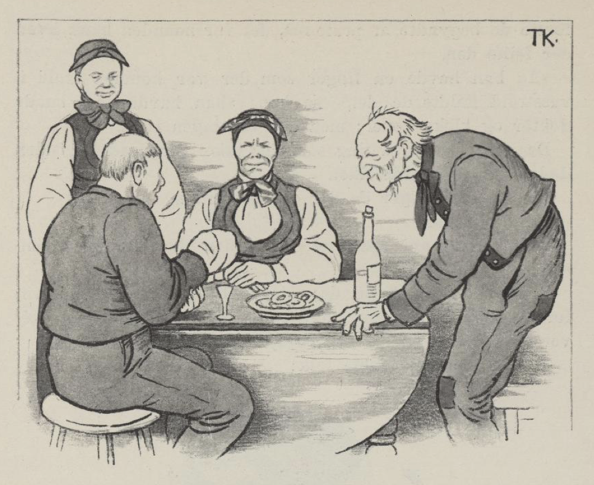

# Syv års gammel grøt

Der var også en gutt en gang som skulle ut å fri. Mor hans ville alltid ha det så rent, at «det skulle være som om det var blåst,» sa hun.

Det ville gutten også, og derfor ville han ha en kjerring som var like så renfærdig som mor hans. Men hvorledes han skulle komme etter om de var renfærdige eller slortvelte, det gikk han lenge og grundet på. Jo, til sist fant han på det. Han baldet den ene hånden sin inn i doker og plagg, som om han hadde en stor verk i den, og så drog han i veien. Der han kom, tok de imot ham som det er skikk å ta imot en frier til gårds, både med øl og med drikk, både med mat og med prat, og noe av det første de begynte å prate om, det var hånden hans, hva der feilte den.

«Å han hadde en finger som det var kommet troll i, vasstroll kalte de det,» sa han; «han hadde søkt både doktor og kloke koner; men der var ingen råd.»

Der var da ingen ting som det ikke var råd for, uten døden, mente gårdsfolket.

«Ja, én råd sier de der er,» sa gutten.

Hva det var?

Det var syv års gammel grøt; men den var vel ingensteds å få, sa han.

«Pøh, ikke annet?» sa de; «det skal der vist bli råd til; for i grytene våre og i de gamle grøttrugene er der skorver som vist er både syv og fjorten år gamle,» sa de.

Jo, det var renfærdige folk!

