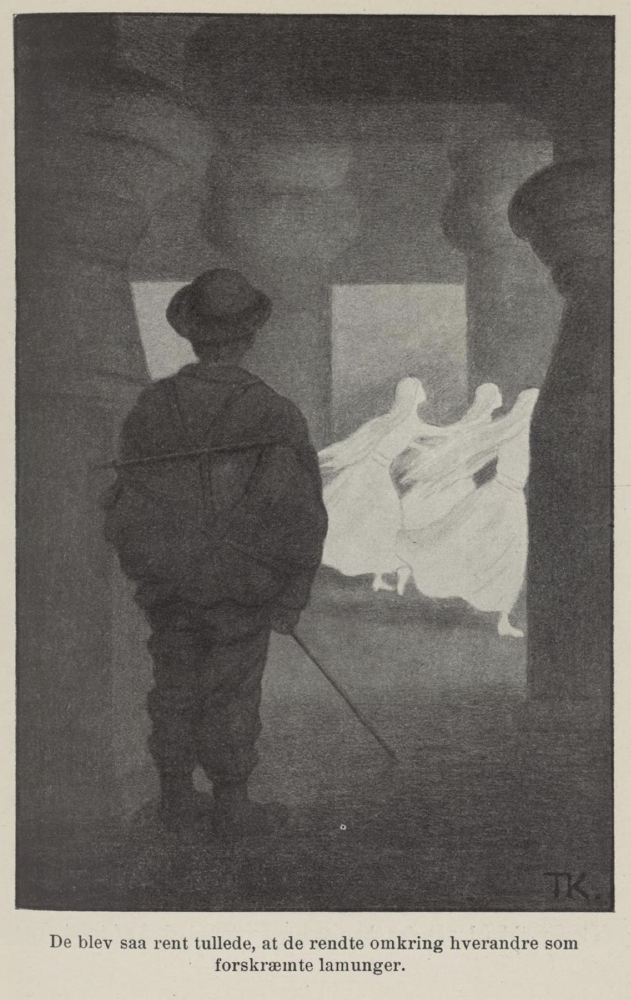
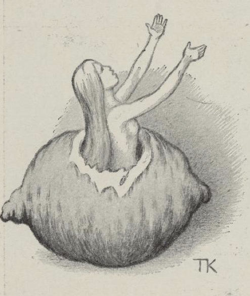
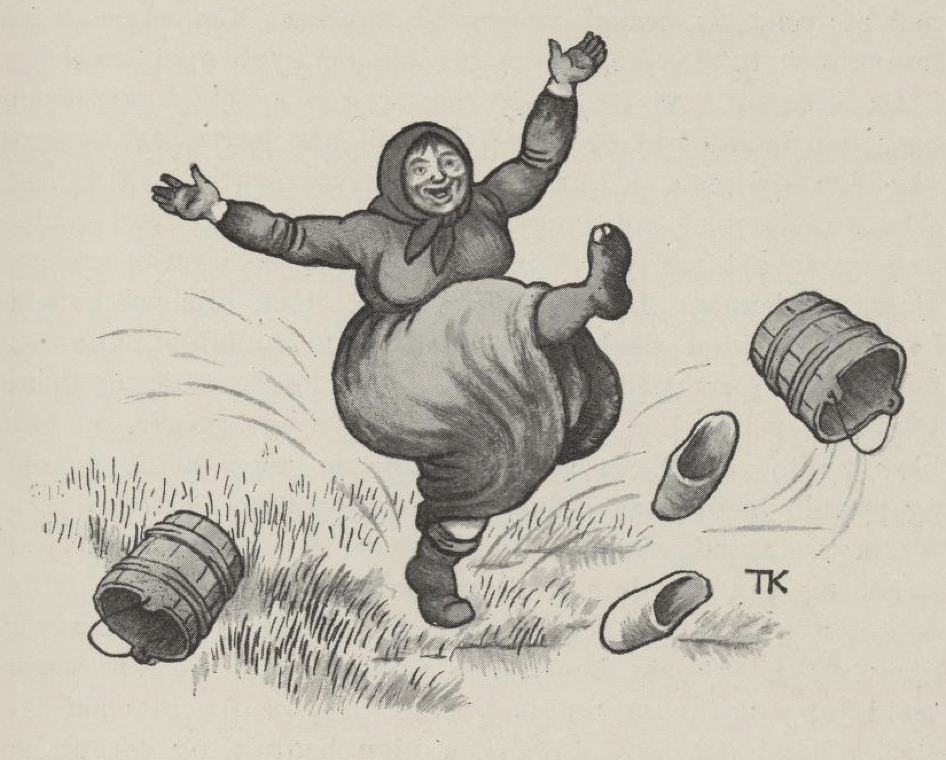

# Tre sitroner

Det var en gang tre brødre som hadde mistet foreldrene sine, og da der ikke var noe etter dem, måtte de ut i verden og friste lykken. De to eldste rustet seg ut så godt de kunne; men den yngste ham kalte de Tyrihans, fordi han alltid satt i peisen og holdt tyrilysen; ham ville de ikke ha med. De reiste ut i grålysninga om morgenen.

Men hvorledes de gikk eller ikke gikk, så var Tyrihans like så tidlig i kongsgarden som de andre. Da de var kommet dit, ba de om tjeneste. Kongen sa at han ikke hadde noe å la dem gjøre; men siden de var så nødige, fikk han vel skaffe dem noe, - der kunne alltid være noe å gjøre på slik en stor gård; de kunne slå spiker i veggen, og når de hadde gjort fra seg det, kunne de ta dem ut igjen. Når de var ferdig med det, skulle de bære ved og vann til kokken i kjøkkenet. Tyrihans var den flinkeste til å slå spiker i veggen og til å ta dem ut igjen, og den flinkeste var han til å bære ved og vann også. Derfor ble brødrene avindsyke på ham, og sa det, at han hadde sagt seg god for å skaffe kongen den vakreste prinsesse som fantes i tolv kongeriker; for kongen hadde mistet dronningen sin og var blitt enkemann. Da kongen fikk høre det, sa han til Tyrihans at han skulle gjøre det han hadde sagt; kunne han ikke det, skulle de legge ham på huggestabben og slå hodet av ham.

Tyrihans svarte at han hverken hadde sagt det eller tenkt det; men siden kongen var så streng, fikk han vel prøve. Så fikk han en nisteskreppa på nakken og gikk av gards.

Men han var ikke kommet langt på skogen, før han ble sulten og ville smake på nista de hadde gitt ham med fra kongsgarden. Da han vel hadde satt seg i ro og mag under en gran ved siden av veien, kom der hinkende en gammel kjærring og spurte, hva han hadde i skreppa si. «Kjøtt og flesk,» sa gutten; «er du sulten, så kom og få deg et stykke med, gamle mor!» Ja, hun takket og spiste, og sa hun skulle nok gjøre ham et morsstykke igjen, og så hinket hun bortimellom skogen. Da Tyrihans var god og mett, kastet han skreppa på nakken og la avsted igjen; men han var ikke kommet langt før han fant en pipe. Den syntes han kunne være moro å ha å blåse i på veien, og det varte ikke lenge før han fikk lyd i den, skal tro. Men da myldret der frem med småtroll, og de spurte i munnen på hverandre: «Hva har min herre å befale, hva har min herre å befale?»

Tyrihans sa, at han visste ikke noe om at han var herre over dem; men skulle han befale, så ville han at de skulle skaffe ham den vakreste prinsessen som fantes i tolv kongeriker. Ja det var ingen sak, mente småtrolla; de visste godt hvor hun var, og veien kunne de vise ham, så han kunne gå bort og ta henne selv, for de hadde ingen makt til å røre henne. De viste ham veien, og så kom han frem både godt og vel; der var ikke noen som la to stikker i kors for ham engang. Der var et trollslott, og der satt det tre deilige prinsesser; men da Tyrihans kom inn, ble de så rent tulla, at de rendte omkring hverandre som forskremte lam, og rett som det var, ble de til tre sitroner, som lå i vinduet. Tyrihans ble så ille ved og så rent ulykkelig over dette, at han ikke visste sin arme råd. Men da han hadde tenkt seg litt om, tok han og stakk sitronene i lommen; han trodde de kunne være gode å ha, om han skulle bli tørst på reisen; for han hadde hørt at sitroner skulle være sure.

Da han kom et stykke på veien, ble han så heit og tørst; vann var ingensteds å finne, og han visste ikke hva han skulle få å leske seg på. Så kom han til å tenke på sitronene og tok opp en av dem og bet hull på. Men inni den satt prinsessen til opp under armene og skreg: «Vann, vann!» Hvis hun ikke fikk vann, måtte hun dø, sa hun. Ja, gutten løp i ring og lette etter vann, som han var rent fra seg; men vann var der ikke, og vann fant han ikke, og rett som det var, så var hun død.

Da han hadde gått et stykke til, ble han endda mer heit og endda mer tørst, og da han ikke fant noe han kunne leske seg med, tok han den andre sitronen og bet hull på den. Inni den satt der også en prinsesse til opp under armene, og hun var endda deiligere enn den første. Hun skreg på vann, og sa at fikk hun ikke vann, døde hun på timen. Tyrihans for omkring og lette både under stein og mose, men vann fant han ikke, og så døde den prinsessen også.

Tyrihans syntes det ble verre og verre, og det ble det også, for dess lengre han kom, dess heitere ble det. Marken var så tørr og avsvidd, at der ikke fantes en vanndråpe, og det var ikke langt fra han nesten var halvdød av tørst. Han kvittet seg lenge for å bite hull på den sitronen han hadde igjen, men til sist var der ingen annen råd. Da han hadde bitt hull, satt der en prinsesse inni den også; hun var den deiligste i tolv kongeriker, og hun skreg at fikk hun ikke vann, så døde hun på timen. Tyrihans løp og skulle hente vann, og denne gangen møtte han kongens møller; han viste ham veien til mølledammen. Da han kom til dammen med henne og fikk gitt henne vann, kom hun helt ut av sitronen og var rent naken. Tyrihans måtte la henne få det plagget han hadde, og kaste om seg, og så gjemte hun seg i et tre, mens han gikk opp til kongsgarden og skulle skaffe henne klær, og fortelle kongen at han hadde fått henne, og hvorledes det var gått til alt sammen.

Mens dette stod på, kom kokkejenta ned til mølledammen og skulle hente vann. Da hun fikk se det deilige ansiktet som speila seg i dammen, trodde hun det var sitt eget, og hun ble så glad at hun tok på å sulle og danse, fordi hun var blitt så vakker. «Fanden bære vann, og ikke du som er så vakker!» sa hun og kastet vassbøttene. Men om litt fikk hun se at ansiktet i dammen hørte til prinsessen som satt i treet. Da ble hun så harm at hun rev henne ned av treet og kastet henne ut i dammen. Men selv slengde hun kjolen til Tyrihans omkring seg og krøp opp i treet.

Da kongen kom og fikk se den stygge svarte kokketøsa, ble han både rød og blek; men da han hørte, de sa hun var den deiligste i tolv kongeriker, så syntes han at han ikke kunne annet enn tro der var noe i det, og synd syntes han også det var på Tyrihans, som hadde hatt så mye å gå igjennom, før han fikk henne. Hun blir vel kanskje bedre med tiden, tenkte han også, når hun blir pyntet og får gilde klær på, og så tok han henne med seg hjem.

Der ble sendt bud etter parykmagere og sypiker, og hun ble pyntet og kledd som en prinsesse, men alt de vasket og pyntet henne, så ble hun svart og stygg likevel.

Om en stund skulle underkokken gå til dammen etter vann, og så fikk hun en stor sølvfisk i bøtta si. Hun bar den opp og viste kongen den, og han syntes den var gjev og gild; men den stygge prinsessen sa det var noe trollskap, og at de skulle brenne den opp, for hun skjønte straks hva det var. Ja fisken ble brent, og den andre morgenen fant de en sølvklump i aska. Det kom kokken opp og fortalte til kongen, og han syntes det var underlig; men prinsessen sa det var bare trollskap og ba dem grave det ned i møkdynga. Kongen ville nødig, men hun lot ham hverken ha ro eller fred, og så sa han til sist de fikk gjøre det. Men den andre dagen stod der en stor deilig lind der de hadde gravd sølvklumpen ned, og den linda hadde blader som glitret som sølv. Da de fortalte kongen det, syntes han at det var underlig; men prinsessen sa at det var ikke annet enn trollskap, og linda skulle de hugge ned straks. Kongen ville det nødig, men prinsessen plaget ham så lenge at til sist måtte han føye henne i det og så. Da jentene skulle ut og ta flisene av linda til å brenne på peisen, var det bare sølv. «Det er ikke verdt å si noe om det til kongen eller prinsessen igjen,» sa en av dem, «for så skal vel disse også brennes og smeltes; det er bedre vi gjemmer dem i dragkistene våre. Det kan være godt å ha, når der engang kommer et menneske, og vi skal gifte oss.» Ja, det ble de enig om. Men da de hadde båret på det en stund, ble det så forskrekkelie tungt. Da de skulle se etter, hva dette kunne komme av, var flisene blitt omgjort til et barn, og det varte ikke lenge før det var den deiligste prinsesse noen kunne se. Jentene kunne nok skjønne at dette ikke gikk riktig til; de skaffet henne klær, og fløy bort og fikk fatt på gutten som skulle hente den deiligste prinsesse i tolv kongeriker, og sa det til ham. Og da Tyrihans kom, fortalte hun ham hvorledes alt var tilgått, at kokken hadde revet henne ned i dammen, og at hun hadde vært både sølvfisken og sølvklumpen og linda og flisene, og at hun var den rette. Det var ikke så greit å få tak i kongen, for den stygge svarte kokken hang over ham både sent og tidlig; - men til sist fant de på å si, der var kommet krigsbud fra granekongen. Så fikk de ham ut, og da han fikk se den deilige prinsessen, ble han så inntatt i henne at han straks ville drikke bryllup, og da han fikk høre hvor ille den stygge svarte kokken hadde fart med henne, så sa han at henne skulle de ta og trille i en spikertønne. Så turet de bryllup, så det hørtes og spurtes over tolv kongeriker.

