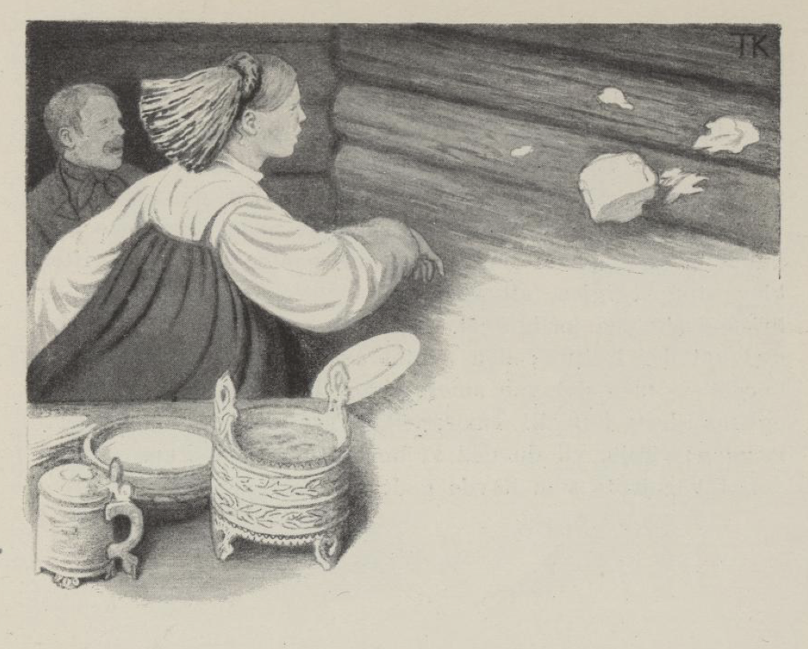

# «Tsju pus, vil du ned af bordet!»

Der var en gutt som skulle ut å fri en gang, det var langt borte i en avdal. Alting var gammeldags hos de folkene han gikk til; de bodde i en røgstue hvor all røken gikk opp og lyset kom ned gjennom ljoren, — som er en luke oppe i mønsåsen[^1]. Her var det en giftefærdig jente, som var så vakker at hun var navnspurt; men hun hadde en lyte, hun også.

De tok nokså vel mot frieren. Men mens de satte fram på bordet både lefser og flatbrød og spekebåter og rømmegrøt og bar fram et helt stort smørstykke, så var der gått en rift i et plagg, og den skulle nøstes sammen i en fart. Det skulle de ha en nål til, men der var ingen synål å finne. Så sa kjerringen i stuen: «Du får til å lete du og, datter min, du som har så godt av synet.»

Ja, hun til å lete både høyt og lavt. Til sist så glantet hun langs oppetter ljorestangen. «Der sitter den,» sa hun, «øverst oppe ved gluggen.» Der var ikke noe menneske som kunne se en synål der oppe. Nå, nålen kom ned, riften ble stoppet igjen, alt var godt og vel, og jenten gikk og frisket seg på jordgulvet. Men så hadde de en gulblommet katt der i stuen; den syntes hun hadde satt seg opp på bordet — men det var smørstykket hun tok for katten —, og så drev hun til smørstykket, så det sa klask borti veggen: «Tsju, vil du ned af bordet, pus!» sa hun.

Det var jente som hadde godt av synet det.

[^1]: Ljoren (ljaaren) åpnes og lukkes med en lang stang som kalles ljorestangen.
