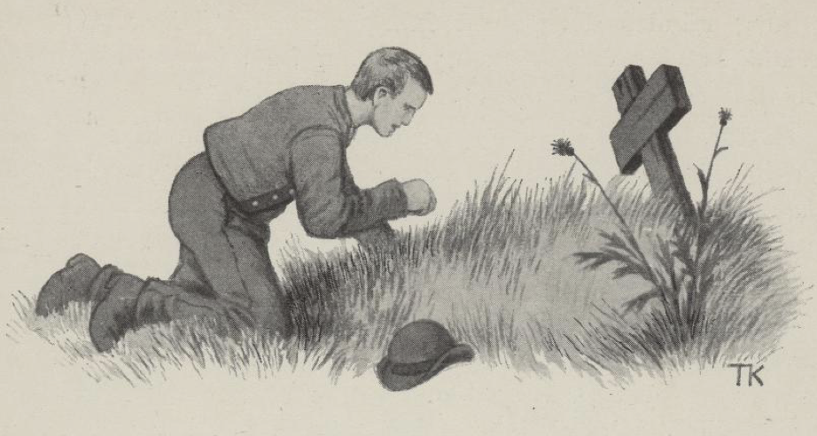

# Venner i liv og død

Det var en gang to karer, som var så gode venner at de svor hverandre til at de skulle ikke skilles, hverken i liv eller i død. Den ene ble ikke gammel, før han døde, og en stund etter fridde den andre til en gardmannsjente, fikk henne til kjæreste og skulle gifte seg. Da de bad til bryllup, gikk brudgommen selv til kirkegården, der vennen lå, banket på graven og ropte på ham. Nei, han kom ikke. Han banket igjen, og han ropte igjen; men der kom ingen. Tredje gangen banket han hardere, og ropte høyere at han skulle komme, så han kunne få snakke med ham. Langt om lenge hørte han det ruslet, og endelig kom dødningen opp av graven.

«Det var godt du kom nå,» sa brudgommen; «jeg har stått lenge her og banket og ropt på deg.»

«Jeg var langt unna herfra,» sa dødningen, «så jeg hørte det ikke riktig skjelig før den siste gangen.»

«Ja ja, i dag skal jeg stå brudgom,» sa gutten, «og du minnes vel vi snakket om det før, at vi skulle følges og komme i bryllupet til hverandre.»

«Jeg minnes det,» sa dødningen, «men du får stanse et grand, så jeg får flidd og stelt meg litt; jeg er ikke kledd til å komme i bryllupsfølge.»

Gutten hadde lite tid, for han skulle hjem til selskapet, og de skulle snart til kirken; men så måtte de gi litt tålmodighet og la den døde få et værelse for seg selv, som han bad om, så han kunne pynte seg og komme i kirkepynt som de andre, for han måtte være med i kirken.

Ja, dødningen fulgte ham både til kirken og fra kirken, men da det led så langt ut i bryllupet at de hadde tatt kronen av bruden, ville han reise. For gammelt kjennskap og vennskap ville brudgommen følge ham til graven igjen.

Som de gikk til kirkegården, spurte brudgommen om han hadde sett mye merkelig, eller slikt som kunne være gildt å vite.

«Ja, det har jeg,» sa dødningen; «mye og meget har jeg sett,» sa han.

«Det skulle være rart å se,» sa brudgommen; «jeg skulle ha lyst til å slå følge og få se det, jeg og,» sa han.

«Det kan du nok,» sa dødningen; «men det kan komme til å vare en stund du blir borte.»

Det fikk så være, mente brudgommen, og fulgte med igjennom graven. Men før de gikk ned i graven, tok dødningen og flekket en grastor av kirkegården og la på hodet av gutten; det bar langt bort igjennom stummende mørke, kjær og myrlendte, til de kom til en stor svær port, som lukket seg opp, da dødningen rørte ved den. Innenfor den tok det like som til å bli lysere, i først som måneskin, men til lengre de kom, til lysere ble det. Langt om lenge kom de frem et sted hvor det var slike grønne bakker med gildt fett gras, og der gikk en stor buskap som drev på og åt; men alt den åt, så kjørte de stygge, tomme og usle ut.

«Hva skal dette være for noe?» sa gutten som var brudgom, «at de er så magre og ser så ille ut, enda de eter som de hadde betaling for det?»

«Det er en lignelse på dem som aldri kan få nok, om de får og skraper sammen aldri så mye,» sa den døde.

Så reiste de langt og lengre enn langt, til noen fjellbeiter hvor det ikke var annet enn bare knauser og skarve fjell med en og annen liten grasflekk imellom. Her gikk der en stor buskap med dyr, som var så vakre og fete og blanke så det skinte i dem.

«Hva?» sa brudgommen; «disse som har så skrint beite og enda ser så godt ut, hva er det for noe?»

«Det er en lignelse på dem som er fornøyde med det vesle de har», sa dødningen.

Så gikk de langt og lengre enn langt igjen, til de kom til et stort vann. Der var det så lyst og så blankt at brudgommen ikke tålte å se på det.

«Nå får du sette deg her du, til jeg kommer igjen,» sa dødningen; «nå blir jeg borte en stund.»

Dermed reiste han av sted, og brudgommen satte seg ned, og som han satt, rendte søvnen på ham, og det var som alt ble borte for ham i en trygg og fast søvn.

Om en tid kom dødningen igjen.

«Det var bra, at du ble sittende, så jeg finner deg igjen her,» sa han. Men da brudgommen skulle lette på seg, var han overvokst med mose og busker, så han satt likesom i et kvistebol. Da han hadde greiet av seg dette, reiste de tilbake, og dødningen fulgte ham samme vei lige til graven. Der skiltes de og sa farvel til hverandre, og da brudgommen kom opp, gikk han bent hjem til bryllupsgården. Men da han kom frem dit han syntes det skulle være, kunne han ikke kjenne seg igjen. Han så seg om på alle kanter, og han spurte alle han møtte; men han fikk hverken hørt eller spurt brud eller bryllup eller slekt eller foreldre, ja han fikk ikke spurt noen som han kjente. Alle undret seg over denne skikkelsen som gikk der og så ut som et folkeskremme. Da han ikke kunne finne noen han kjente, tok han veien til presten og fortalte ham om skyldsfolkene sine, og hvordan det gikk til den tid han stod brudgom, og om at han var gått bort i bryllupet. Presten visste ingen ting om det, men da han hadde lett igjennom de gamle kirkebøkene sine, så fant han ut, at bryllupet hadde stått for lang, lang tid tilbake, og de folkene han talte om, hadde levd for fire hundre år siden.

Etter den tid var det vokst opp en stor, svær eik i prestegården. Da han fikk se den, kløv han opp i den og ville se seg om; men gamlegen som hadde sittet i himmerike og sovet i fire hundre år og var kommet hjem igjen, kom ikke vel ned av eika. Han var støl og stiv, som rimelig kunne være, og da han skulle ned igjen, famlet han, så han falt, brakk nakkebeinet og slo seg ihjel.
